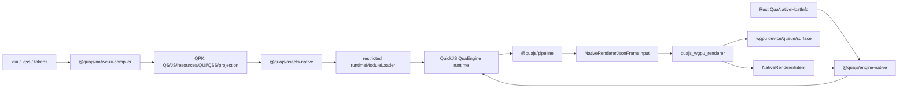

# Native Renderer 执行总计划

Last verified: 2026-07-05

## 结论

基于 wgpu + QuickJS 构建 QuaEngine native renderer 是可行的，但它必须是 `packages/native` 下的一条独立产品线，而不是 Web renderer 的移植层，也不是 Cocos renderer 的变体。

native 目标的职责边界是：

- QuickJS 运行 QuaEngine JS runtime、QS 编译产物和动态 QPK 内的 JS runtime modules。
- Rust/wgpu 只渲染 engine / compiler 已解析好的 projection JSON。
- QUI/QSS 是 native authoring DSL，解析、诊断、selector matching、cascade、style resolution、projection 编译都在 TS 工具链完成。
- native renderer 只做 projection，不持有剧情、存档、设置、菜单、音频意图、runtime package 或插件权威状态。
- Web / Cocos / Native 的 target core plugin 必须在打包入口物理隔离，不能先合并三端核心插件再过滤。

调研依据：

- wgpu 当前文档显示 `wgpu 30.0.0`，定位为跨 Vulkan / Metal / D3D12 / OpenGL / WebGPU / WebGL 的 safe Rust graphics API，适合做跨桌面 GPU 抽象。
- QuickJS 官方文档显示 `version 2026-06-04`，支持多数 ES2025，具备 runtime/context、memory handling、interrupt 等嵌入式宿主能力，但也有 C module / executable generation 能力，因此 QuaEngine 必须显式禁用动态 native module 入口。
- rquickjs 当前文档显示 `0.12.0`，`loader` feature 可用于自定义 ES module resolver/loader，`dyn-load` 会支持 so/dll/dylib native module，QuaEngine native runtime 必须禁止 `dyn-load`。
- VSCode language server extension 和 LSP 3.18 支持独立 server/client 模型，适合把 `.qui/.qss` 独立做成 native authoring 工具链。

参考链接：

- https://docs.rs/wgpu/latest/wgpu/
- https://bellard.org/quickjs/quickjs.html
- https://docs.rs/rquickjs/latest/rquickjs/
- https://microsoft.github.io/language-server-protocol/specifications/lsp/3.18/specification/
- https://code.visualstudio.com/api/language-extensions/language-server-extension-guide

## 非协商边界

### Projection-only

native renderer 不拥有任何影响回放、存档、分支或剧情推进的状态。允许的 renderer-local state 只有：

- GPU device / queue / surface / swapchain transient handles。
- Texture / decoded image / glyph atlas / audio handle / video frame queue。
- Pointer hover / press / focus / transient scroll offset。
- Animation handle、frame timer、resource cleanup disposer。
- Package-aware resource ledger，用于内存、unload blocker 和 host cleanup，不作为游戏状态来源。

所有用户输入都必须回到 `@quajs/pipeline`，例如 `choice/select`、`ui/intent`、overlay open/close/update intent。不能引入第二条 native event bus。

### Dynamic QPK Content Only

native dynamic small package 只允许：

- QS / compiled JS runtime module。
- QUI / QSS / tokens。
- images / sprites / fonts / audio / video / JSON / data resources。
- compiled native UI projection / style IR。

必须拒绝：

- `.dylib` / `.so` / `.dll` / `.framework` / `.node`。
- WASI/native executable、native scripting bridge、shell payload。
- Rust/C/C++/Objective-C/Swift/Kotlin/Java plugin binary。
- `nativeBinaries`、`nativePayloads`、`nativeEntry`、truthy 或缺失的 `nativeCode`。

native compatibility block 必须显式声明 `nativeCode: false`。缺失也按失败处理，不做默认放行。

### Target Core Must Not Mix

打包到 Web、Cocos、Native 工程时，核心插件只能由当前目标 resolver 注入一次：

| Target | 唯一 resolver | 可注入 core | 必须排除 |
| --- | --- | --- | --- |
| Web | `web-core-resolver` | Web assets / renderer / framework adapter / Web renderer plugin subentry | Cocos host / renderer、Native engine/assets/store/runtime/renderer |
| Cocos | `cocos-core-resolver` | Cocos host / renderer / Cocos renderer plugin subentry | Web renderer/framework adapter、Native engine/assets/store/runtime/renderer |
| Native | `native-core-resolver` | `@quajs/engine-native`、`@quajs/assets-native`、`@quajs/store-native`、native contracts metadata、Rust native app/runtime/renderer metadata | Web renderer/framework adapter、Cocos host / renderer |

这些 target core 不能进入普通 `plugins`、shared preset、project template、startup shell、debug/release shell、installer、updater、smoke runner、Runtime QPK executable dependency 或 third-party shared entry。

禁止实现：

- `resolveAllTargetCore()`。
- `createCorePluginsForAllTargets()`。
- 先构造 `[webCore, cocosCore, nativeCore]` 再按 target 过滤。
- 一个 shared project template 里带三端 core，再按参数删除。
- Runtime QPK 携带任一 target core dependency 或 renderer entry。

这里要按“打包到具体项目”的口径执行，而不是只看最终 manifest 字段。Web project、Cocos project、Native project 的项目生成器、模板、启动壳、debug/release shell、installer、updater、smoke runner 都不能 materialize 另外两端的 core plugin；它们也不能重新声明当前 active core。唯一允许携带 core plugin 的对象是当前目标 resolver 生成的 `TargetCoreSelection`，后续链路只能读取和复验 `target-bundle-manifest.json`。如果某条链路先拿到了 Web/Cocos/Native core union，再删掉 inactive core 输出项目，也必须作为串线失败处理。

即使最终 manifest 看起来只剩一个 target，只要中间 resolver graph / template graph / installer graph materialize 过其他 target core，也按 release blocker 失败。

## 目标工程结构

native 相关实现全部放在 `packages/native`：

```text
packages/native/
  Cargo.toml
  crates/
    quajs_native_runtime/
    quajs_wgpu_renderer/
    quajs_native_app/
  contracts/
  engine-native/
  assets-native/
  store-native/
  ui-compiler/
  language-server/
  vscode/
  benchmarks/
  test-fixtures/
```

包职责：

- `@quajs/native-contracts`：native host info、capability manifest、target bundle manifest、target isolation、QUI/QSS serializable contracts、runtime package native-code guard。
- `@quajs/engine-native`：QuaEngine 与 Rust native host 的插件适配层，读取 `QuaNativeHostInfo`，安装 native assets/store/runtime module loader/trust policy，桥接 Rust renderer intent 到 pipeline。
- `@quajs/assets-native`：QuaAssets native host byte/storage/crypto adapter。
- `@quajs/store-native`：QuaStore native host persistence adapter。
- `@quajs/native-ui-compiler`：QUI/QSS parse、validate、format、registry、QSS style resolution、QUI surface projection compile、compatibility metadata derivation。
- `@quajs/native-language-server`：独立 `.qui/.qss` LSP，不依赖 Web/Cocos/native runtime bootstrap。
- `packages/native/vscode`：独立 VSCode extension，贡献 `qua-ui` / `qua-style` 语言、语法、snippets、commands，并启动 native LSP。
- `@quajs/native-benchmarks`：native authoring/tooling/runtime smoke benchmark。
- Rust `quajs_native_runtime`：QuickJS host、restricted module loader、namespace registry、host API。
- Rust `quajs_wgpu_renderer`：wgpu projection renderer、JSON facade、resource ledger、hit test、texture sync、future media/audio backend hooks。
- Rust `quajs_native_app`：desktop app host、manifest validation、window/surface bootstrap、smoke runner、packaging hooks。

## Runtime 架构



关键数据流：

1. author 写 `.qui/.qss/tokens`。
2. native UI compiler 做 parse / diagnostics / QSS resolution / projection compile。
3. Quack 把 QS / JS / resources / QUI / QSS / tokens / projection 打进 QPK。
4. `@quajs/engine-native` 在 QPK 激活前检查 signature、native-code guard、native renderer compatibility、asset kind、QUI component、QSS feature。
5. QuickJS 只通过 restricted loader 读取 QPK 内 JS module asset，不读文件系统、URL、Blob 或 dynamic import。
6. engine/store 产生 view projection。
7. TS bridge 提交 resolved JSON 给 Rust JSON facade。
8. Rust facade 防御性校验 stage/layout/resource/id/color/text/style/number/provenance/metadata。
9. wgpu backend 绘制，并把 pointer intent 交回 host bridge。

## QUI 设计

QUI 是 native declarative template language，不是 HTML、不是 TSX、不是 Vue SFC。语法可以接近 Vue 模板的心智模型，但执行语义必须 deterministic、可静态分析、可投影到 Rust DTO。

### 必须支持

- 条件渲染：`if` / `else-if` / `else`，分支必须相邻，孤立 `else` 报错。
- 条件显示：`show`，只影响 resolved `visible`，不做 state authority。
- 循环渲染：`for: item in source`、`for: (item, index) in source`。
- 稳定 key：循环节点必须声明 `key`。
- props：字面量、readonly reference、受限表达式。
- class / style binding：只能进入 QSS selector / resolved style IR。
- named slot：slot 必须在 component registry 声明，重复 slot 报错。
- component import：导入的 composite 是 authoring-time 结构，投影前必须展开。
- declarative action descriptor：`ui.open(...)`、`ui.close(...)`、`choice.select(...)`、`save.load(...)`、`settings.update(...)`。

### 禁止支持

- 任意 JS 执行、assignment、mutation。
- `await`、function definition、`new`、imperative method。
- renderer 侧直接 store mutation。
- QUI 触发 QPK load/unload。
- Rust 侧解析 action string。

### 表达式子集

允许：

- `props.*`、`view.*`、`settings.*`、loop bindings。
- string / number / boolean / null literals。
- object / array literal。
- `== != < <= > >= && || ! ??`。
- ternary。

禁止：

- assignment / update expression。
- arbitrary call。
- member mutation。
- prototype / constructor access。
- global object access。

### 基础组件是否足够

第一阶段 base primitives 足够覆盖菜单 UI、设置面板、存档列表、对话框、抽屉、图库、成就、backlog、choice list 等上层 UI，因为这些都能由基础布局、文本、图片、按钮、面板、滚动和安全区组合出来。

基础组件清单：

- Structural：`Fragment`、`Stack`、`Row`、`Column`、`Grid`、`Layer`、`SafeArea`、`Spacer`。
- Surface：`Box`、`Panel`、`Backdrop`、`Divider`、`Scroll`。
- Text：`Text`、`RichText`。
- Interactive：`Button`。
- Media leaf：`Image`。

上层组件必须优先做 composite：

- `Dialog`
- `Drawer`
- `Modal`
- `SaveLoadPanel`
- `SettingsPanel`
- `GalleryPanel`
- `BacklogPanel`
- `AchievementBoard`
- `ConfirmDialog`
- `QuickMenu`

这些 composite 可以由开发者或官方包提供 `.qui/.qss`，但 compiler 必须在进入 Rust 前展开成 base primitives。Rust capability manifest 不应该声明 `Dialog` / `Drawer` 这类 composite，除非未来它们变成官方 primitive capability。

### 开发者扩展模型

开发者可以扩展：

- authoring-time composite component。
- project-local component registry metadata。
- QSS class / id / style part。
- tokens。
- declarative action metadata。
- runtime package UI surface。

开发者不能动态扩展：

- Rust primitive node kind。
- native host API。
- wgpu shader/native pipeline。
- native media decoder。

需要新增真正 primitive 时，必须通过官方 native renderer capability 版本发布，并随 signed native app release 分发，不能通过动态 QPK 下发 native code。

## QSS 兼容范围

QSS 是 CSS 子集 + native deterministic IR。Rust 不解析 QSS，不做 selector matching、cascade 或 inheritance。

### Selector P0/P1

P0：

- type selector：`Button`。
- class selector：`.primary`。
- id selector：`#main-menu`。
- descendant selector：`.menu Button`。
- child selector：`.menu > Button`。

P1：

- pseudo-state：`:hover`、`:pressed`、`:focus`、`:disabled`，映射 renderer transient input state。
- style part selector：`Button::label`、`Scroll::thumb` 这类由 component registry 声明的 part。

暂不承诺：

- 全量 browser cascade。
- `@media` 作为主布局方案。
- `@keyframes`。
- arbitrary CSS function。
- 浏览器 `url(...)` / remote URL。
- 依赖 browser box model 的复杂行为。

### Property P0/P1

当前 native resolved style 应兼容这些 CSS-like 字段：

- Color：`background-color`、`border-color`、`color`。
- Background asset：`background-image: asset("ui/panel.png")`。
- Background fit/origin：`background-size`、`background-position`。
- Border：`border-width`、`border-radius`、`border-style`。
- Text：`font-family`、`font-size`、`font-style`、`font-weight`、`letter-spacing`、`line-height`、`text-align`、`text-decoration`、`text-overflow`、`text-transform`、`white-space`。
- Geometry fallback：`left`、`top`、`right`、`bottom`、`inset`、`width`、`height`、`min-width`、`max-width`、`min-height`、`max-height`。
- Structural spacing：`gap`、`row-gap`、`column-gap`、`margin`、`margin-top`、`margin-right`、`margin-bottom`、`margin-left`，仅作为 TS compiler layout metadata 展开到 Row / Column / Grid 直系子节点 bounds。
- Box visual：`opacity`、`padding`、`padding-top`、`padding-right`、`padding-bottom`、`padding-left`。
- Visibility / clip：`display: none`、`visibility`、`overflow: visible|hidden`。
- Z order：`z-index`。
- Image fit：`object-fit`。

值约束：

- Color 只接受 safe native color literal：hex、comma-form `rgb(...)` / `rgba(...)`、`transparent`、`currentColor`、基础 named colors。
- `background-image` 只接受结构化 `asset(...)`，资源名必须包内相对路径。
- `background-size` 子集：`cover`、`contain`、`fill`、`none`、`scale-down`。
- `background-position` 子集：`left|center|right`、`top|center|bottom`、`0%..100%` 单轴/双轴百分比。
- `border-style` 子集：`solid` / `none`。
- `font-style` 子集：`normal` / `italic`。
- `text-decoration` 子集：`none` / `underline` / `line-through`。
- `text-overflow` 子集：`clip` / `ellipsis`。
- `text-transform` 子集：`none` / `uppercase` / `lowercase` / `capitalize`。
- `white-space` 子集：`normal` / `nowrap` / `pre` / `pre-line` / `pre-wrap`。
- `gap` / `margin` 子集：非负 logical px / unitless number；`gap` 支持一到两个值，`margin` 支持一到四个值；Rust 不解析这些 QSS 字段。
- numeric value 必须有限、非负或按字段约束在范围内。

必须诊断并禁止投影：

- URL / URI scheme。
- 绝对路径。
- `..` traversal。
- native payload suffix。
- arbitrary CSS color function。
- percentage RGB channel。
- non-finite / oversized number。
- 未白名单 property。

### QSS 验收

每个 property 都必须有三组 fixture：

- valid input -> normalized `NativeQssResolvedStyle` / node metadata。
- invalid input -> stable diagnostic code，如 `QSS_INVALID_VALUE`。
- projection output -> Rust JSON facade 可接受的 resolved JSON。

每个 selector 也要有：

- match fixture。
- no-match fixture。
- unsupported selector diagnostic。
- format idempotence。
- LSP completion / hover / documentLink / code action fixture。

动态 QPK 中的 QSS 还要进入 compatibility metadata：

- `qssFeatures`。
- QSS asset kinds。
- `nativeCode: false`。
- package provenance。

## Native Language Server 与 VSCode 插件

native `.qui/.qss` authoring 必须独立做：

- 不改造现有 QuaScript LSP。
- 不改造现有 QuaScript VSCode plugin。
- 不加载 Web/Cocos/native target core bootstrap。
- 不解析普通 game plugin array。

### `@quajs/native-language-server`

能力：

- diagnostics。
- formatting。
- completion。
- hover。
- semantic tokens。
- definition。
- references。
- rename。
- documentLink。
- code action。
- project index incremental sync。

QUI 侧：

- component / directive / prop / slot completion。
- registry hover。
- action descriptor diagnostics。
- `Image(src|image)` asset document links。
- conditional / loop / key diagnostics。

QSS 侧：

- selector completion。
- property completion。
- property value completion from shared registry。
- class / id references。
- `asset(...)` document links。
- unsupported property/value diagnostics。

Asset quick fix：

- `NATIVE_UI_ASSET_MISSING` / `QUI_INVALID_ASSET_REFERENCE` 可以提供 quick fix。
- `source.fixAll.quaNativeAssets` 只能移除无效引用。
- 不创建文件、不下载资源、不扫描 plugin graph、不触发 target bootstrap。

### VSCode Extension

Package：`packages/native/vscode`。

Language ids：

- `qua-ui` for `.qui`。
- `qua-style` for `.qss`。

至少提供：

- TextMate grammar。
- language configuration。
- snippets。
- start/restart LSP。
- validate / format command。
- apply `source.fixAll.quaNativeAssets` command。
- extension tests。

## Native Plugin Bridge

`@quajs/engine-native` 是 QuaEngine 与 Rust native host 的插件，不是 renderer state owner。

必须负责：

- 读取 Rust `QuaNativeHostInfo`。
- 暴露 readonly native runtime / renderer metadata。
- 安装 `@quajs/assets-native` / `@quajs/store-native`。
- 安装 restricted runtime module loader。
- 安装 native trust policy。
- 比对 `target-bundle-manifest.json.nativeRuntime` 与 Rust host info：
  - `quickjsVersion`
  - `nativeRuntimeVersion`
  - `assetAdapterVersion`
  - `storeAdapterVersion`
- runtime package activation 前检查：
  - renderer package / version range。
  - required / optional capability ids。
  - required / optional asset kinds。
  - required / optional QUI components。
  - required / optional QSS features。
  - `nativeCode: false`。
- Rust emitted intent -> pipeline：
  - `choice/select` -> existing choice event。
  - `ui/intent` -> generic UI intent。
  - conventional `open` / `close` / `update` -> overlay request shortcuts。
- runtime package unload 后释放 package-owned QuickJS namespace handles。

不得负责：

- 渲染。
- 游戏状态推进。
- save/load state authority。
- 任意 Rust API 透传。
- dynamic native code。
- Web/Cocos target core 注入。

## Existing Plugin Compatibility

每个现有插件都要给 native 建 compatibility fixture，结论分三类：

- `projection-compatible`：已有 engine projection 足够。
- `native renderer work required`：需要补 native renderer projection/资源/绘制/输入能力。
- `contract extension required`：需要先扩平台无关 contract，不能在 native 私自补状态。

| 插件 / 能力 | Native 目标 | 初始结论 |
| --- | --- | --- |
| background | image/layered background、video poster/fallback | projection-compatible + renderer work |
| audio | audio intent resource ledger、backend command plan，真实 playback 后升级 | native renderer work required |
| character / sprite | character projection、sprite atlas texture request | projection-compatible + renderer work |
| dialogue / choices | Text/RichText/Button/choice intent | projection-compatible |
| settings | composite QUI panel + engine/plugin state | projection-compatible |
| backlog | composite QUI list + voice replay intent | projection-compatible + media hooks |
| gallery | composite QUI grid + unlock projection | projection-compatible |
| achievement | composite QUI board + notification surface | projection-compatible |
| inventory | composite QUI list/detail surface | projection-compatible |
| fonts | font face projection、fallback text path | renderer work required |
| animation/effects | logical stage animation projection | renderer work required |
| UI menu/save-load | composite QUI over base primitives | projection-compatible |

第三方 plugin manifest 必须声明 target entries：

- `shared` entry 只能 import platform-neutral logic。
- `web` entry 只能 import Web target adapter。
- `cocos` entry 只能 import Cocos target adapter。
- `native` entry 只声明 compatibility/capability，不能是 native binary entry。

native metadata 推荐字段：

```json
{
  "renderer": "@quajs/native-renderer",
  "version": "^0.8.0",
  "capabilityIds": ["native-wgpu.ui.surface@1"],
  "assetKinds": ["qui", "qss", "tokens", "image"],
  "quiComponents": ["Box", "Text", "Button", "Panel"],
  "qssFeatures": ["background-color", "color", "font-size"],
  "nativeCode": false
}
```

## Media 能力计划

### Video

P0：

- background video projection 先做 poster/fallback。
- 记录 fallback reason。
- 记录 owner / required package provenance。
- 不声明真实 video playback capability。

P1：

- native video asset request / memory ledger / frame queue DTO。
- host capability 声明 decode backend 是否可用。

P2：

- desktop video decode backend，可选研究 GStreamer Rust bindings。
- decoded frame upload to wgpu texture。
- playback clock、seek、pause/resume 仍由 engine/plugin state 和 audio/video intent 驱动。

### Audio

P0：

- audio projection resource ledger。
- backend command plan：LoadAsset / StartTrack / UpdateTrack / StopTrack / ReleaseHandle。
- package unload cleanup。
- 不声明真实 `native-wgpu.audio@1` playback capability。

P1：

- native audio backend trait。
- mixer/device abstraction。
- memory and stream budget。

P2：

- 真实播放后端，候选 Kira / Rodio / CPAL。
- BGM / voice / SFX buses。
- fade / crossfade / volume。
- interruption handling。

真实 audio/video capability 只有在 Rust projection path、backend support、host capability、tests、benchmark 都落地后才能声明。

## 内存指标

native renderer 必须按 package-aware ledger 记录：

- QuickJS heap / namespace summary。
- UI AST。
- QSS style IR。
- tokens。
- textures。
- decoded images。
- glyph atlas / font face。
- audio buffer / stream / handle。
- video poster / decoded frame queue。
- transient backend handles。

每个 frame / smoke / benchmark 至少输出：

- total CPU bytes。
- total GPU bytes。
- memory by kind。
- memory by owner package。
- memory by dependent package。
- declarative memory by package：`UiAst` / `QssStyle` / `TokenTable`。
- audio memory by package。
- texture sync：pending / resident / orphaned resident。
- unload blocker count。
- host cleanup release count / failure count。

动态小包验收必须证明：

- 加载 package 后 declarative memory 增加可归因。
- 替换 package 后旧资源可释放或被 active frame blocker 拦截。
- unload 被当前 projection 引用时失败且保留 ledger。
- 强制 teardown 能清理 QuickJS namespace、texture、audio handle。

## Benchmark 计划

### Authoring / Compiler / LSP

指标：

- QUI parse + validate latency。
- QSS parse + validate latency。
- QSS style resolution latency。
- projection compile latency。
- compatibility derivation latency。
- format latency。
- completion / hover latency。
- documentLink / references / rename latency。
- project index build / incremental update latency。
- diagnostics count。
- document bytes / rule count / node count。
- heap / rss delta。

bench 必须：

- 无网络。
- 无随机输入。
- 不加载 target core bootstrap。
- 使用固定 fixtures。
- 输出 JSON Lines baseline。

### Runtime / Renderer

指标：

- native app cold start。
- QuickJS context/module load/eval。
- first projection frame。
- render bridge JSON parse/validation。
- stage layout resolve。
- render graph build。
- hit test。
- frame prepare/submit。
- texture upload pending/resident/orphan cleanup。
- audio command planning。
- package load/unload/replacement。
- memory by kind/package。

### Target Isolation Benchmark / Smoke

benchmark 和 smoke runner 不能成为 target core 注入点。它们只能读取已验证 manifest，且自己的 `projectGraphs` 必须是 platform-neutral，非 `post-bundle` graph 里连 active core 都不能出现。

## 打包、加固与分发

优先级：

1. macOS。
2. Windows。
3. Linux。

输出目录：

```text
dist/native/
  debug/<version>-<buildNumber>/<platform>/<arch>/
  release/<version>-<buildNumber>/<platform>/<arch>/
```

release 产物按 version/buildNumber/platform/arch 隔离且默认不可覆盖。debug 可重建，但必须重新写 manifest 和 smoke report。

必须写入 manifest：

- app name。
- bundleId / appId。
- version。
- buildNumber。
- icon source hash / generated icon hash。
- profile：debug / release。
- platform：macos / windows / linux。
- arch。
- target：native。
- `targetCoreResolver: native-core-resolver`。
- `selectedCorePluginFamily: native-core`。
- native renderer package / version / backend / declared backendVersion。
- capability ids / capability manifest hash。
- `nativeRuntime.quickjsVersion`。
- `nativeRuntime.nativeRuntimeVersion`。
- `nativeRuntime.assetAdapterVersion`。
- `nativeRuntime.storeAdapterVersion`。

平台产物：

- macOS：`.app` / `.dmg` / `.zip`、`.icns`、Info.plist、codesign、hardened runtime、notarization、staple。
- Windows：`.exe` / `.zip` / installer、`.ico`、Authenticode signing、publisher metadata、uninstaller identity。
- Linux：AppImage / `.deb` / `.rpm`、desktop entry、PNG icon sizes、optional signing/checksum。

Updater / installer：

- 只读取已验证 target manifest。
- 不重新声明 native core。
- Runtime QPK update 只能下发 QS / JS / resources / QUI / QSS / tokens。
- native binary update 走完整 signed app update，不走 dynamic QPK。

## 自动化验收

统一入口：

```bash
pnpm native:verify --no-bench --no-window
pnpm native:verify --ts-only --no-bench
pnpm native:verify --rust-only --no-bench --no-window
```

重点 suite：

- contracts：target bootstrap isolation、ordinary plugin isolation、target bundle manifest、native compatibility、native-code rejection。
- compiler：QUI/QSS parse/validate/format/projection/compatibility。
- LSP：process smoke、completion、hover、documentLink、references、rename、code action。
- VSCode：typecheck、build、extension smoke。
- runtime：QuickJS restricted loader、host info、manifest version comparison、namespace cleanup。
- Rust JSON facade：stage/layout/resource/id/color/text/style/metadata/z-order/audio/video number validation。
- renderer：render graph、hit test、texture sync、resource ledger、package release/unload blocker。
- packaging：macOS/Windows debug/release artifact、release immutability、icon/bundleId/version metadata。
- target isolation：Web/Cocos/Native 对称负例，包含 active core 二次声明、inactive core 串线、三端全集后过滤。

QSS 验收不能只靠 snapshot。每个 supported property 都要覆盖：

- valid values。
- invalid values。
- diagnostics code。
- resolved style IR。
- Rust JSON facade acceptance/rejection。
- LSP completion/hover。
- formatter idempotence。
- benchmark baseline。

QUI 验收必须覆盖：

- conditional chain。
- loop key。
- slot ownership。
- component import/flatten。
- content model。
- action descriptor normalization。
- asset reference validation。
- projection provenance。

## 分阶段落地

### P0: 基础闭环

目标：跑通 resolved projection -> Rust JSON facade -> wgpu/null backend -> intent bridge。

任务：

- 固定 `packages/native` workspace 结构。
- native contracts host info / capability / target bundle manifest。
- `@quajs/engine-native` host plugin。
- restricted QuickJS loader，不启用 native dyn-load。
- QUI/QSS compiler P0。
- base component projection。
- QSS P0 property subset。
- Rust JSON facade validation。
- Null backend smoke。
- target core isolation contracts tests。

验收：

- `.qui/.qss` 可诊断、格式化、编译 projection。
- native app 可读取 manifest 并提交一帧 resolved JSON。
- dynamic QPK native payload 被拒绝。
- Web/Cocos/Native target core 不串。

### P1: 产品 UI 可用

目标：菜单、设置、save/load、dialog、drawer、gallery/backlog/achievement 等 composite UI 可用。

任务：

- component registry 完善 content model / slots / style parts。
- composite library。
- LSP + VSCode 可日常 authoring。
- pointer intent / choice select / UI intent bridge。
- texture upload sync。
- bitmap text fallback / font ledger。
- QSS P1 selector / property subset。
- authoring benchmark baseline。

验收：

- base component 足以组合产品菜单。
- Dialog/Drawer 等不进入 Rust primitive。
- VSCode 独立编辑 `.qui/.qss`。
- package-scoped UI/QSS/tokens memory 可测。

### P2: Media 与真实窗口

目标：桌面窗口 smoke、纹理、音频/视频能力进入可演进阶段。

任务：

- real wgpu window smoke。
- surface resize / present recovery。
- audio backend trait + null/record backend。
- video poster/fallback metrics。
- media resource ledger。
- native-window smoke benchmark。

验收：

- macOS/Windows 上可以跑 window smoke。
- audio/video 未实现真实播放时不虚假声明 capability。
- memory / cleanup / unload blocker 指标稳定。

### P3: 打包发行

目标：macOS/Windows debug/release artifact 可验证。

任务：

- `createQuaProjectNativeArtifactPlans`。
- app icon generation。
- bundleId/version/buildNumber manifest。
- release immutability。
- signing/hardening/notarization/Authenticode plan。
- installer/updater manifest consumer。
- post-bundle graph validation。

验收：

- debug/release 分目录。
- release 按版本隔离且不可变。
- macOS/Windows manifest 完整。
- installer/updater 不注入 core。

### P4: 性能门禁

目标：从 smoke 变成 regression gate。

任务：

- authoring baseline。
- renderer/runtime baseline。
- package memory baseline。
- frame time / first frame / QuickJS eval thresholds。
- CI regression report。

验收：

- benchmark 可重复。
- regressions 有阈值。
- 内存按 package/kind 可追踪。

### P5: 扩展生态

目标：第三方 plugin 和动态 UI 包按 capability 安全扩展。

任务：

- third-party plugin manifest validation。
- active target entry selection。
- inactive target entry metadata-only。
- native compatibility helper。
- official composite component package。
- extension docs。

验收：

- plugin 可声明 Web/Cocos/Native 兼容性。
- native entry 不携带 native code。
- target core 串线负例对称覆盖三端。

## 开发规范更新

未来 engine 新能力迭代必须先回答：

- 平台无关 contract 是否应该进入 core/game/plugin shared entry。
- Web renderer 如何消费或 fallback。
- Cocos renderer 如何消费或 fallback。
- Native renderer 如何消费或 fallback。
- 是否需要新增 render-core projection 字段。
- 是否影响 Runtime QPK manifest / save-load required packages。
- 是否影响 target bundle manifest / plugin metadata / capability registry。
- 是否影响 memory ledger / package unload guard / benchmark。

Review blocker：

- 新能力只补 Web，没有写 Cocos/native 兼容结论。
- shared entry import Web/Cocos/Native target core。
- ordinary plugin / Runtime QPK 声明 target core executable dependency。
- native QPK 携带 native payload 或缺失 `nativeCode: false`。
- Rust renderer 解析 QUI/QSS source。
- Dialog/Drawer/SettingsPanel 作为 Rust primitive 下发。
- target project template / startup shell 重新声明 active core。

## 完成定义

native renderer 方案可以进入工程实施的最低定义：

1. 所有 native-specific 包在 `packages/native`。
2. QUI/QSS 独立 compiler、LSP、VSCode extension 有测试入口。
3. Rust renderer 只消费 resolved projection JSON。
4. base components 能组合菜单/设置/save-load/dialog/drawer 等产品 UI。
5. QSS supported subset 有 property-by-property 验收。
6. Dynamic QPK 只允许 QS/JS/resources/QUI/QSS/tokens。
7. `@quajs/engine-native` 对接 Rust host info，并校验 QuickJS/native/assets/store versions。
8. Existing plugins 有 native compatibility fixture。
9. benchmark 覆盖 compiler/LSP/runtime/renderer/memory。
10. macOS/Windows packaging metadata、icon、bundleId、version、debug/release 隔离和 release immutability 进入验收。
11. Web/Cocos/Native target core 隔离对称覆盖，且任何串线都是 release blocker。
