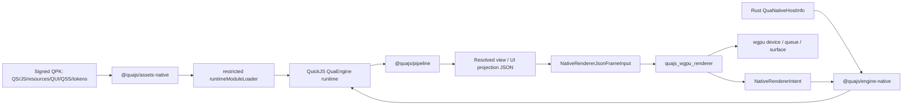

# Native Renderer 生产化路线图

Last verified: 2026-07-05

这份文档把 native renderer 从“可行性方案”收束成“可实现、可验收、可发布”的路线图。详细背景仍以本目录其他文档为准：

- [execution-plan.md](./execution-plan.md)
- [architecture.md](./architecture.md)
- [qui-qss.md](./qui-qss.md)
- [tooling-testing.md](./tooling-testing.md)
- [release-packaging.md](./release-packaging.md)
- [target-core-isolation.md](./target-core-isolation.md)
- [development-guidelines.md](./development-guidelines.md)

## 结论

QuickJS + wgpu 可以作为 QuaEngine native renderer 的基础，但实现口径必须非常清楚：

- QuickJS 运行受限 QuaEngine JS runtime、QS 编译产物和动态 QPK 内 JS runtime modules。
- Rust/wgpu 只渲染 engine / compiler 已解析的 projection JSON。
- QUI/QSS 是 native authoring DSL，解析、selector matching、cascade、diagnostics、format、LSP 和 projection compile 都在 TS 工具链，不进入 Rust renderer。
- Native renderer 只做 projection，不拥有剧情、存档、设置、菜单、音频意图、runtime package 或插件权威状态。
- 动态小包只允许 QS/JS/resources/QUI/QSS/tokens，不允许任何 native code。
- Web、Cocos、Native 的 target core bootstrap 必须三端物理隔离，不能先合并后过滤。

## 外部调研基线

本轮复核的外部技术点：

- `wgpu` 最新 docs.rs 页面显示 `30.0.0`，定位是跨 Vulkan / Metal / D3D12 / OpenGL 以及 WebGPU / WebGL 的 safe Rust graphics API，入口模型是 `Instance -> Adapter -> Device -> Surface`。当前仓库 `quajs_wgpu_renderer` 仍 pin `wgpu = 29.0.3`，短期应保持 pin 并通过独立升级 PR 迁移到 30.x。
- `winit` 最新 docs.rs 页面显示 `0.30.13`，职责是跨平台窗口和 event loop，不负责绘制。Native product loop 应让 winit 负责窗口、输入、scale factor、resize，wgpu 负责真实 surface / device / queue。
- QuickJS 官方文档显示版本 `2026-06-04`，支持多数 ES2025，并提供 memory limit、stack limit、interrupt handler。它也支持 native ES6 modules 和 `qjsc` C/executable generation，因此 QuaEngine 必须主动封死 native module / dyn-load / executable 路径。
- `rquickjs` 最新 docs.rs 页面显示 `0.12.0`。`loader` feature 可接自定义 ES module resolver/loader，适合对接 QuaAssets bytes；`dyn-load` 会加载 so/dll/dylib，QuaEngine native runtime 必须禁用。
- VSCode 官方 language server 指南建议 client / server 分进程模型，LSP 3.18 已包含 inline completion 等新增能力。QUI/QSS 应使用独立 native language-server 和独立 VSCode extension，不改造 QuaScript LSP。
- `glyphon` 是 wgpu 2D text 方案，基于 `cosmic-text` 做 shaping / layout / rasterization 并写入 texture atlas，是未来真实字体后端候选。
- `Vello` 是 wgpu 2D/vector renderer，可作为后续 vector/text/shape backend 的调研候选，但 P0 不应把它引入为硬依赖。
- `Taffy` 实现 CSS Block / Flexbox / Grid layout，可作为未来 TS 编译期或 Rust layout backend 参考；当前 Rust renderer 不能因此变成 QSS parser。
- `Lightning CSS` 是高性能 CSS parser/transformer，可作为 QSS parser 前端候选，但必须用 allowlist 拒绝 unsupported CSS，而不是接受浏览器 CSS 全集。
- `Kira` 适合 game audio mixer / tween / effects；`CPAL` 是低层跨平台 audio I/O；`GStreamer Rust bindings` 可作为桌面 video decode 候选。真实 audio/video capability 必须等 backend、host capability、tests、benchmark 都完成后再公开。

参考链接：

- [wgpu docs.rs](https://docs.rs/wgpu/latest/wgpu/)
- [winit docs.rs](https://docs.rs/winit/latest/winit/)
- [QuickJS official docs](https://bellard.org/quickjs/quickjs.html)
- [rquickjs docs.rs](https://docs.rs/rquickjs/latest/rquickjs/)
- [VSCode language server guide](https://code.visualstudio.com/api/language-extensions/language-server-extension-guide)
- [LSP 3.18 specification](https://microsoft.github.io/language-server-protocol/specifications/lsp/3.18/specification/)
- [glyphon](https://github.com/grovesNL/glyphon)
- [Vello](https://docs.rs/vello/latest/vello/)
- [Taffy](https://github.com/DioxusLabs/taffy)
- [Lightning CSS](https://lightningcss.dev/)
- [Kira](https://docs.rs/kira/latest/kira/)
- [CPAL](https://docs.rs/cpal/latest/cpal/)
- [GStreamer Rust bindings](https://docs.rs/gstreamer/latest/gstreamer/)

## 工程结构

Native 独立产品线固定在 `packages/native`：

```text
packages/native/
  Cargo.toml
  crates/
    quajs_native_runtime/
    quajs_wgpu_renderer/
    quajs_native_app/
  contracts/
  engine-native/
  assets-native/
  store-native/
  ui-compiler/
  language-server/
  vscode/
  benchmarks/
  test-fixtures/
```

职责分配：

- `@quajs/native-contracts`: host info、capability、target bundle manifest、target isolation、QUI/QSS contracts、runtime package native-code guard。
- `@quajs/engine-native`: QuaEngine 与 Rust host 的 native plugin，读取 host info，安装 native assets/store/module loader/trust policy，并把 Rust renderer intent 翻译回 pipeline。
- `@quajs/assets-native`: QuaAssets native bytes/storage/crypto adapter。
- `@quajs/store-native`: QuaStore native persistence adapter。
- `@quajs/native-ui-compiler`: QUI/QSS parse、validate、format、registry、QSS resolve、surface projection compile、compatibility metadata derivation。
- `@quajs/native-language-server`: `.qui/.qss` 独立 LSP。
- `packages/native/vscode`: `qua-ui` / `qua-style` VSCode extension。
- `@quajs/native-benchmarks`: deterministic authoring/tooling/runtime smoke benchmarks。
- Rust `quajs_native_runtime`: QuickJS host、restricted loader、namespace registry、host API。
- Rust `quajs_wgpu_renderer`: wgpu projection renderer、JSON facade、resource ledger、hit test、texture sync、future media/audio backend hooks。
- Rust `quajs_native_app`: desktop app host、manifest validation、window/surface bootstrap、smoke runner、packaging hooks。

这些包可以依赖平台无关 core/game/contracts，但 authoring tooling、benchmark、LSP、VSCode extension 不能依赖 Web/Cocos/native target core bootstrap，也不能解析普通 game plugin array。

## Runtime 架构



实现要点：

- `@quajs/engine-native` 读取 signed Rust host 的 native runtime / renderer versions，QPK 不可覆盖。
- QuickJS loader 只从 QuaAssets 读取 QPK 声明的 JS module asset bytes，不读 filesystem、URL、Blob、Node resolution 或 dynamic import。
- Rust JSON facade 做防御性校验，拒绝 malformed resolved JSON，但不解析 QUI/QSS source。
- Pointer、choice、UI intent 只通过 `@quajs/pipeline` 回 engine。
- Resource ledger 可记录 transient GPU/audio/video/UI resources、memory、unload blocker 和 cleanup，不得成为 game state authority。

## QUI 语法

QUI 是 declarative template language，语法心智接近 Vue template，但不是 HTML / TSX / SFC。

P0 必须支持：

- 条件渲染：`if` / `else-if` / `else`，分支必须相邻。
- 条件显示：`show`，编译为 resolved `visible`，不销毁权威状态。
- 循环渲染：`for: item in source` 和 `for: (item, index) in source`。
- 稳定 key：循环节点必须声明 `key`。
- props / class / style binding 的受限表达式。
- named slot，slot 必须由 component registry 声明。
- component import，imported composite 必须在 projection 前展开。
- declarative action descriptor，不能把 action 字符串留给 Rust 解析。

表达式允许：

- `props.*`、`view.*`、`settings.*`、loop bindings。
- string / number / boolean / null。
- object / array literal。
- `== != < <= > >= && || ! ??`。
- ternary。

表达式禁止：

- assignment / update expression / mutation。
- arbitrary function call / function definition / `new` / `await`。
- prototype / constructor / global object access。
- 任何直接 store mutation 或 QPK load/unload。

## QUI 组件策略

第一批 base primitives 足够支撑菜单、dialog、drawer、save/load、settings、gallery、backlog、achievement 和 quick menu：

- Structural: `Fragment`、`Stack`、`Row`、`Column`、`Grid`、`Layer`、`SafeArea`、`Spacer`。
- Surface: `Box`、`Panel`、`Backdrop`、`Divider`、`Scroll`。
- Text: `Text`、`RichText`。
- Interactive: `Button`。
- Media leaf: `Image`。

上层组件必须优先作为 `.qui/.qss` composite：

- `Dialog`
- `Drawer`
- `Modal`
- `SaveLoadPanel`
- `SettingsPanel`
- `GalleryPanel`
- `BacklogPanel`
- `AchievementBoard`
- `ConfirmDialog`
- `QuickMenu`

Compiler 必须把 composite 展开成 base primitives 后再输出 `NativeUiSurfaceProjection`。Rust DTO 和 native-wgpu capability manifest 不应出现 `Dialog` / `Drawer` / `SaveLoadPanel` 等 authoring 名称，除非未来它们被正式提升为官方 primitive capability。

开发者扩展只允许：

- project-local `.qui` component。
- package-local composite import。
- tokens / QSS class / id / style part。
- declarative action metadata。
- runtime package UI surface。

开发者不能通过动态包新增 Rust primitive、host API、wgpu shader、native pipeline、audio/video decoder 或 native code。

## QSS CSS 子集

QSS 是 CSS 子集加 deterministic native IR。TS 工具链负责 selector、cascade、diagnostics、format 和 style resolution；Rust 只消费 resolved style JSON。

Selector P0：

- type selector: `Button`
- class selector: `.primary`
- id selector: `#main-menu`
- descendant selector: `.menu Button`
- child selector: `.menu > Button`

Selector P1：

- pseudo-state: `:hover`、`:pressed`、`:focus`、`:disabled`
- style part selector: `Button::label`、`Scroll::thumb`

Property P0/P1：

- Color: `background-color`、`border-color`、`color`
- Background: `background-image: asset(...)`、`background-size`、`background-position`
- Border: `border-width`、`border-radius`、`border-style`
- Text: `font-family`、`font-size`、`font-style`、`font-weight`、`letter-spacing`、`line-height`、`text-align`、`text-decoration`、`text-overflow`、`text-transform`、`white-space`
- Geometry fallback: `left`、`top`、`right`、`bottom`、`inset`、`width`、`height`、`min-width`、`max-width`、`min-height`、`max-height`
- Structural layout metadata: `gap`、`row-gap`、`column-gap`、`margin`、`margin-*`、`position: relative|absolute`
- Box visual: `opacity`、`padding`、`padding-*`
- Visibility / clip: `display: none`、`visibility`、`overflow: visible|hidden`
- Z order: `z-index`
- Image: `object-fit`

Value subset：

- Color 只接受 hex、comma-form `rgb(...)` / `rgba(...)`、`transparent`、`currentColor` 和基础 named colors。
- `background-image` 只接受 package-relative `asset("path")` 或 `asset("path", "assetKind")`。
- `background-size`: `cover`、`contain`、`fill`、`none`、`scale-down`。
- `background-position`: keyword origin 或 `0%..100%` 单轴/双轴百分比。
- `border-style`: `solid` / `none`。
- `font-style`: `normal` / `italic`。
- `text-decoration`: `none` / `underline` / `line-through`。
- `text-overflow`: `clip` / `ellipsis`。
- `text-transform`: `none` / `uppercase` / `lowercase` / `capitalize`。
- `white-space`: `normal` / `nowrap` / `pre` / `pre-line` / `pre-wrap`。
- numbers 必须 finite，并按字段要求非负、正数或 `0..=1`。

必须诊断并禁止投影：

- browser `url(...)`、remote URL、URI scheme。
- 绝对路径、backslash、`..` traversal。
- native payload suffix。
- arbitrary CSS color function、percentage RGB channel。
- non-finite / oversized number。
- 未白名单 property 或 selector。

## QSS 验证和验收

QSS 验收不能只靠 snapshot。每个支持属性必须有三组 fixture：

- valid input -> normalized `NativeQssResolvedStyle` 或 node metadata。
- invalid input -> stable diagnostic code，例如 `QSS_INVALID_VALUE`。
- projection output -> Rust `NativeRendererJsonFrameInput` accepts / rejects as expected。

每个 selector 必须覆盖：

- match fixture。
- no-match fixture。
- unsupported selector diagnostic。
- format idempotence。
- LSP completion / hover / documentLink / code action。

动态 QPK 中的 QSS 还要验收：

- `qssFeatures` 派生准确。
- `assetKinds` 派生准确。
- `nativeCode: false` 固定存在。
- `contentPackageId` / `requiredRuntimePackages` provenance 写入 projection。
- `UiAst` / `QssStyle` / `TokenTable` memory 进入 package-aware ledger。

## LSP 与 VSCode

必须独立实现：

- `packages/native/language-server`
- `packages/native/vscode`

语言 ID：

- `.qui` -> `qua-ui`
- `.qss` -> `qua-style`

LSP 能力：

- diagnostics、formatting、completion、hover、semantic tokens。
- definition、references、rename、documentLink。
- QUI component/directive/prop/slot/action descriptor diagnostics。
- QSS selector/property/value diagnostics。
- package-relative asset reference index。
- `NATIVE_UI_ASSET_MISSING` / `QUI_INVALID_ASSET_REFERENCE` quick fix。
- `source.fixAll.quaNativeAssets`，只删除问题引用，不创建文件、不下载资源、不扫描 plugin graph。
- process smoke: package bin 默认 stdio 启动，覆盖 initialize、didOpen diagnostics、completion、hover、documentLink、references。

Source import / dependency isolation tests 必须证明 LSP、VSCode、benchmark、UI compiler 不依赖 Web/Cocos/native runtime bootstrap。

## 现有插件兼容计划

每个现有插件都要有 native compatibility fixture，结论只能是三类之一：

- `projection-compatible`
- `native renderer work required`
- `contract extension required`

初始矩阵：

| 插件 / 能力 | Native 目标 | 初始结论 |
| --- | --- | --- |
| background | image/layered background、video poster/fallback | projection-compatible + renderer work |
| audio | audio intent resource ledger、backend command plan，真实 playback 后升级 | native renderer work required |
| character / sprite | character projection、sprite atlas / texture request | projection-compatible + renderer work |
| dialogue / choices | Text/RichText/Button/choice intent | projection-compatible |
| settings | composite QUI panel + engine/plugin state | projection-compatible |
| backlog | composite QUI list + voice replay intent | projection-compatible + media hooks |
| gallery | composite QUI grid + unlock projection | projection-compatible |
| achievement | composite QUI board + notification surface | projection-compatible |
| inventory | composite QUI list/detail surface | projection-compatible |
| fonts | font face projection、fallback text path | renderer work required |
| animation/effects | logical stage animation projection | renderer work required |
| UI menu/save-load | composite QUI over base primitives | projection-compatible |

`contract extension required` 必须改 owning plugin contract，不能让 native renderer 私自引入状态字段。

## 第三方插件兼容声明

第三方插件可以声明多目标 entry，但 shared entry 必须平台无关，active artifact 只能 materialize active target entry。

Native metadata 推荐形态：

```json
{
  "renderer": "@quajs/native-renderer",
  "version": "^0.8.0",
  "capabilityIds": ["native-wgpu.ui.surface@1"],
  "assetKinds": ["qui", "qss", "tokens", "image"],
  "quiComponents": ["Box", "Text", "Button", "Panel"],
  "qssFeatures": ["background-color", "color", "font-size"],
  "nativeCode": false
}
```

Native entry 是 compatibility declaration，不是 native binary entry。插件想扩展 UI，必须提供 `.qui/.qss` source、compiled projection 或 style IR。需要新增 Rust primitive 时，必须随 official native renderer capability 和 signed native app release 发布。

## 动态小包和安全边界

允许动态 QPK 包含：

- QS / compiled JS runtime modules。
- QUI / QSS / tokens。
- images / sprites / fonts / audio / video / JSON / data resources。
- compiled native UI projection / style IR。

必须拒绝：

- `.dylib` / `.so` / `.dll` / `.framework` / `.bundle` / `.node`。
- WASI/native executable、shell、FFI、Rust callback、native scripting bridge。
- Rust/C/C++/Objective-C/Swift/Kotlin/Java plugin binary。
- `nativeBinaries`、`nativePayloads`、`nativeEntry`。
- missing / truthy `nativeCode` in native compatibility block。

Guard 层级：

1. Quack 打包时扫描 bundle manifest、runtime package manifest、UI/media/resource metadata。
2. `@quajs/engine-native` runtime trust policy 在 QuickJS evaluation 前复验。
3. Rust QuickJS request validation 在 evaluator dispatch 前复验 module asset refs 和 bytes limit。
4. Runtime package unload 释放 package-owned QuickJS namespaces、textures、audio handles，并遵守 active projection unload blockers。

## Native Bridge Plugin

`@quajs/engine-native` 必须实现并保持为 adapter：

- 读取 `QuaNativeHostInfo`。
- 暴露 readonly native app/runtime/renderer metadata。
- 安装 `@quajs/assets-native` / `@quajs/store-native`。
- 安装 restricted runtime module loader。
- 安装 native trust policy。
- 比对 `target-bundle-manifest.json.nativeRuntime` 和 host info:
  - `quickjsVersion`
  - `nativeRuntimeVersion`
  - `assetAdapterVersion`
  - `storeAdapterVersion`
- runtime package activation 前检查 renderer version、capabilities、asset kinds、QUI components、QSS features、intent events、`nativeCode: false`。
- Rust emitted intent -> pipeline:
  - `choice/select` -> existing choice event。
  - `ui/intent` -> generic UI intent。
  - conventional `open` / `close` / `update` -> overlay request shortcuts。
- runtime package unload 后释放 package-owned QuickJS namespace handles。

它不得负责渲染、游戏状态推进、save/load authority、任意 Rust API 透传、dynamic native code、Web/Cocos target core 注入。

## Assets / Store Native Versions

Native artifact manifest 和 runtime host info 必须携带并逐项比较：

- `nativeRuntime.quickjsVersion`
- `nativeRuntime.nativeRuntimeVersion`
- `nativeRuntime.assetAdapterVersion`
- `nativeRuntime.storeAdapterVersion`

这些版本是 signed native runtime contract 的一部分，不是普通 npm 依赖装饰字段。Runtime QPK 不能覆盖，只能声明兼容范围。

## Audio / Video 能力路线

Video：

- P0: background video projection 只做 poster/fallback，记录 fallback reason、owner package、required package，不声明真实 playback capability。
- P1: video asset request、memory ledger、frame queue DTO、host decode capability metadata。
- P2: desktop video decode backend，可选 GStreamer；decoded frame upload to wgpu texture；clock / seek / pause / resume 仍由 engine/plugin state 和 intent 驱动。

Audio：

- P0: resource ledger、backend command plan、package unload cleanup，不声明真实 `native-wgpu.audio@1`。
- P1: native audio backend trait、mixer/device abstraction、memory / stream budget。
- P2: real backend，候选 Kira / Rodio / CPAL；BGM / voice / SFX buses、fade / crossfade / volume / interruption。

真实 audio/video capability 只有在 Rust projection path、backend、host capability、tests、benchmark 和 package cleanup 全部落地后才能公开。

## 内存指标

Native renderer 必须按 package-aware ledger 输出：

- QuickJS heap / namespace summary。
- UI AST / QSS style IR / tokens。
- textures / decoded images。
- glyph atlas / font face。
- audio buffer / stream / handle。
- video poster / decoded frame queue。
- transient backend handles。

每个 frame / smoke / benchmark 至少记录：

- total CPU bytes / GPU bytes。
- memory by kind。
- memory by owner package。
- memory by dependent package。
- declarative memory by package: `UiAst` / `QssStyle` / `TokenTable`。
- audio memory by package。
- texture sync: pending / resident / orphaned resident。
- unload blocker count。
- host cleanup release count / failure count。

动态包验收必须证明 package load、replace、unload、force teardown 对 declarative resources、textures、audio handles、QuickJS namespaces 的 memory 和 cleanup 都可归因。

## Benchmark 计划

Authoring / compiler / LSP：

- QUI parse + validate latency。
- QSS parse + validate latency。
- QSS style resolution latency。
- projection compile latency。
- compatibility derivation latency。
- format latency。
- completion / hover latency。
- documentLink / references / rename latency。
- project index build / incremental update latency。
- diagnostics count、document bytes、rule count、node count。
- heap / rss delta。

Runtime / renderer：

- native app cold start。
- QuickJS context/module load/eval。
- first projection frame。
- render bridge JSON parse/validation。
- stage layout resolve。
- render graph build。
- hit test。
- frame prepare/submit。
- texture upload pending/resident/orphan cleanup。
- audio command planning。
- package load/unload/replacement。
- memory by kind/package。

规则：

- fixture 固定、无网络、无随机输入。
- benchmark 和 smoke runner 不加载 Web/Cocos/native target core bootstrap，不解析普通 game plugin array。
- 先建立 baseline，再设 regression gate。
- 输出 JSON Lines，记录 schemaVersion、suite、bench、profile、platform、backend、packageVersion、iterations、elapsedMs、memory、metrics。

## 打包、加固与分发

优先级：

1. macOS
2. Windows
3. Linux

目录：

```text
dist/native/
  debug/<version>-<buildNumber>/<platform>/<arch>/
  release/<version>-<buildNumber>/<platform>/<arch>/
```

Release 产物按 version/buildNumber/platform/arch 隔离且默认不可覆盖。Debug 可重建，但必须重新写 manifest 和 smoke report。

Manifest 必须写入：

- app name。
- bundleId / appId。
- version。
- buildNumber。
- icon source hash / generated icon hash。
- profile: debug / release。
- platform: macos / windows / linux。
- arch。
- target: native。
- `targetCoreResolver: native-core-resolver`。
- `selectedCorePluginFamily: native-core`。
- native renderer package / version / backend / declared backendVersion。
- capability ids / capability manifest hash。
- `nativeRuntime.quickjsVersion`。
- `nativeRuntime.nativeRuntimeVersion`。
- `nativeRuntime.assetAdapterVersion`。
- `nativeRuntime.storeAdapterVersion`。

平台产物：

- macOS: `.app` / `.dmg` / `.zip`、`.icns`、Info.plist、codesign、hardened runtime、notarization、staple。
- Windows: `.exe` / `.zip` / installer、`.ico`、Authenticode signing、publisher metadata、uninstaller identity。
- Linux: AppImage / `.deb` / `.rpm`、desktop entry、PNG icon sizes、optional signing/checksum。

Updater / installer 只读取已验证 target manifest 和 release metadata，不重新声明 native core。Runtime QPK update 仍只允许 QS / JS / resources / QUI / QSS / tokens；native binary update 走完整 signed app update。

## Web / Cocos / Native 核心插件隔离

打包到 Cocos、Web、Native 项目时，核心插件不能串线。唯一合规模型是 target-first：

1. 先确定 target。
2. 创建唯一 `TargetCoreSelection`。
3. 只调用当前目标 resolver:
   - Web -> `web-core-resolver`
   - Cocos -> `cocos-core-resolver`
   - Native -> `native-core-resolver`
4. 再解析普通 game/plugin。
5. 再选择 active third-party target entry。
6. 再 bundle/tree-shake。
7. 再 emit and validate `target-bundle-manifest.json`。
8. Runtime startup 再复验。

禁止：

- `resolveAllTargetCore()` 或任何三端全集 helper。
- `[webCore, cocosCore, nativeCore]` 后过滤。
- shared preset / ordinary plugin list 携带 target core。
- Runtime QPK executable dependency 或 renderer entry 指向任一 target core root / subentry。
- project template、startup shell、debug/release shell、installer、updater、smoke runner 二次声明 active core。
- 只让 native 严格，Web/Cocos 放宽。

验收必须三端对称：

- Web artifact 出现 Cocos / Native core，失败。
- Cocos artifact 出现 Web / Native core，失败。
- Native artifact 出现 Web / Cocos core，失败。
- 非 `post-bundle` `projectGraphs` 出现任何 target core，失败，包括 active core。
- `post-bundle` graph 出现 inactive core，失败。
- `specifier` 与 `packageName` 都要归一化检查 bare subentry、`npm:`、query/hash suffix、Windows path、`node_modules`、pnpm `.pnpm` path。

## 自动化验收命令

首选总入口：

```bash
rtk pnpm native:verify --no-bench --no-window
rtk pnpm native:verify --ts-only --no-bench
rtk pnpm native:verify --rust-only --no-bench --no-window
```

关键分包：

```bash
rtk pnpm --filter @quajs/native-contracts test -- --run
rtk pnpm --filter @quajs/engine-native test -- --run
rtk pnpm --filter @quajs/assets-native test -- --run
rtk pnpm --filter @quajs/store-native test -- --run
rtk pnpm --filter @quajs/native-ui-compiler test -- --run
rtk pnpm --filter @quajs/native-language-server test -- --run
rtk pnpm -C packages/native/vscode typecheck
rtk pnpm -C packages/native/vscode build
rtk pnpm -C packages/native/benchmarks test
rtk pnpm --filter @quajs/native-benchmarks bench:smoke
rtk cargo test --manifest-path packages/native/Cargo.toml --workspace
```

Cargo-heavy work 前先检查磁盘，并使用项目内 target dir：

```bash
rtk df -h . $HOME/.cargo
rtk env CARGO_TARGET_DIR=/Volumes/BRData/projects/QuaEngine/.codex-tmp/native-cargo-target cargo test --manifest-path packages/native/Cargo.toml --workspace
```

## 分阶段落地

### P0: 基础闭环

目标：resolved projection -> Rust JSON facade -> null/real wgpu smoke -> intent bridge。

任务：

- 固定 native contracts / target isolation / target bundle manifest。
- `@quajs/engine-native` host plugin。
- restricted QuickJS loader，禁用 native dyn-load。
- QUI/QSS compiler P0。
- base component projection。
- QSS P0 property subset。
- Rust JSON facade validation。
- Null backend smoke。
- target core isolation contracts tests。

验收：

- `.qui/.qss` 可诊断、格式化、编译 projection。
- native app 可读取 manifest 并提交一帧 resolved JSON。
- dynamic QPK native payload 被拒绝。
- Web/Cocos/Native target core 不串。

### P1: 产品 UI 可用

目标：菜单、设置、save/load、dialog、drawer、gallery/backlog/achievement composite UI 可用。

任务：

- component registry 完善 content model / slots / style parts。
- official composite library。
- LSP + VSCode 日常 authoring。
- pointer intent / choice select / UI intent bridge。
- texture upload sync。
- bitmap text fallback / font ledger。
- QSS P1 selector / property subset。
- authoring benchmark baseline。

验收：

- base component 足以组合产品菜单和常见面板。
- `Dialog` / `Drawer` 等不进入 Rust primitive。
- VSCode 独立编辑 `.qui/.qss`。
- package-scoped UI/QSS/tokens memory 可测。

### P2: Media 与真实桌面发布

目标：macOS / Windows 可发布，Linux 结构稳定，audio/video backend 分能力公开。

任务：

- real audio backend。
- video decode candidate spike and backend gate。
- glyphon/cosmic-text 或等价 text backend。
- macOS / Windows signing / installer / release immutability。
- updater consumes verified manifest only。
- runtime benchmark baselines。

验收：

- macOS / Windows debug/release artifact 通过 manifest 和 target isolation。
- release version overwrite blocker 生效。
- audio/video capability 只在真实 backend 可用时声明。
- memory / benchmark regression gate 生效。

### P3: 生态和兼容

目标：第三方插件可以声明 native renderer compatibility，并且 Web/Cocos/Native 三端演进不互相污染。

任务：

- plugin manifest validation fixture。
- existing plugin compatibility matrix 固化。
- capability versioning policy。
- target entry selection docs and examples。
- multi-target package acceptance fixtures。

验收：

- shared entry 保持平台无关。
- active target entry 独立选择。
- inactive target entry 不 eager。
- Runtime QPK 不携带 target core executable dependency。
