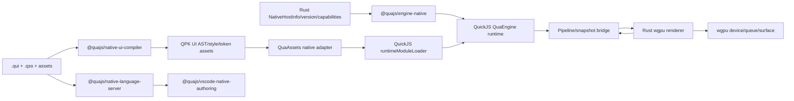

# Native WGPU + QuickJS Renderer, QUI, QSS, And Native Authoring Plan

Date: 2026-06-24

## Conclusion

A native QuaEngine renderer built on QuickJS + wgpu is feasible, but it should be planned as its own native product surface under `packages/native`.

The native track should not be scattered across `packages/build`, `packages/render`, or the existing QuaScript VSCode tooling. Native runtime, native renderer, QUI/QSS contracts, compiler, language server, VSCode extension, fixtures, and tests should live under `packages/native`.

The target is "Web-renderer-comparable QuaEngine projection rendering," not browser compatibility. QuaEngine keeps authoritative game/runtime state in the existing engine model. QuickJS hosts the TypeScript engine and QPK runtime modules. Rust/wgpu renders engine-owned projections. QUI/QSS describe native product UI surfaces declaratively and compile into QPK-managed package assets.

## Non-Negotiable Boundaries

- Renderer remains a projection layer only.
- Engine/store own scene, story, save/load, choices, variables, UI overlays, settings, audio intent, and runtime package state.
- Renderer emits user intents only through `@quajs/pipeline`.
- Web, Cocos, and native package outputs must select exactly one target bootstrap. Their target core adapters/plugins are mutually exclusive and must not be bundled together.
- Target core plugins are release-blocking isolation boundaries, not optional lint hints. A Web package must never carry Cocos/native core adapters, a Cocos package must never carry Web/native core adapters, and a native package must never carry Web/Cocos core adapters.
- Web, Cocos, and native core bootstrap plugins are product-target roots, not ordinary game plugins. They must not live in one shared `corePlugins` array, umbrella preset, Runtime QPK dependency list, or runtime plugin resolver path that later chooses a target dynamically.
- Runtime content remains Quack-built QPK Runtime Packages mounted through QuaAssets and activated by `RuntimeContentManager`.
- Native renderer supports dynamic small packages, but native dynamic package payloads are restricted to QuaScript/compiled JS runtime modules and resources. Resources include images, sprites, audio, fonts, data JSON, compiled QUI AST, QSS style IR, and theme/token manifests.
- Native dynamic packages must not contain or activate native code of any kind: no dynamic libraries, no Rust/C/C++/Objective-C/Swift/Kotlin/Java modules, no platform plugin binaries, no native scripting bridges, no WASI/native executable payloads.
- No loose push path for generated scripts, assets, UI styles, renderer resources, sprites, audio, animations, or UI surfaces.
- Runtime JS loading must go through injected `runtimeModuleLoader` and trust policy.
- wgpu textures, glyph atlases, decoded images, native windows, hover/focus/press state, scroll offsets, text cursor state, and animation handles are transient renderer implementation state.
- All game-facing coordinates stay in logical stage units. Native pixels, surface size, DPR, and platform safe areas are projection details.
- QUI/QSS cannot mutate engine/store state, decide progression, load QPKs, construct ad hoc asset URLs, or bypass pipeline intents.

## Research Basis

- wgpu provides a safe Rust graphics API over Vulkan, Metal, D3D12, OpenGL, WebGPU, and WebGL. Sources: https://github.com/gfx-rs/wgpu, https://docs.rs/wgpu/
- winit handles cross-platform windows and input, but not rendering. Source: https://github.com/rust-windowing/winit
- QuickJS is embeddable, supports ES modules, and exposes runtime limits such as memory/stack configuration. Source: https://bellard.org/quickjs/quickjs.html
- `rquickjs` exposes QuickJS to Rust with async/context integration. Source: https://docs.rs/rquickjs
- Vello is a wgpu-backed 2D/vector renderer. Sources: https://docs.rs/vello, https://github.com/linebender/vello
- glyphon renders text with wgpu using `cosmic-text`. Source: https://github.com/grovesNL/glyphon
- `cosmic-text` provides shaping, fallback, bidi layout, and rasterization support. Source: https://github.com/pop-os/cosmic-text
- Taffy implements CSS Block, Flexbox, and Grid layout algorithms in Rust. Source: https://github.com/DioxusLabs/taffy
- Lightning CSS is a Rust CSS parser/transformer that can be used as a parser front end while rejecting unsupported CSS. Sources: https://github.com/parcel-bundler/lightningcss, https://lightningcss.dev/
- VS Code's language-server extension model supports a separate language client and server over LSP. Source: https://code.visualstudio.com/api/language-extensions/language-server-extension-guide
- Kira is a game-oriented audio library with mixers, tweens, clocks, effects, and streaming/static sound data. Source: https://docs.rs/kira/
- CPAL is the low-level cross-platform Rust audio I/O layer; Rodio is a higher-level playback library built for common decode/playback use cases. Sources: https://docs.rs/cpal/, https://docs.rs/rodio/
- GStreamer Rust bindings expose a safe API for media pipelines and are a practical candidate for desktop video decode behind an optional native media backend. Source: https://docs.rs/gstreamer/

## Target Repository Layout

All native-specific code goes under `packages/native`.

```text
packages/native/
  Cargo.toml
  crates/
    quajs_native_runtime/
      Cargo.toml
      src/
        quickjs_host.rs
        module_loader.rs
        asset_adapter.rs
        store_adapter.rs
        host_bridge.rs
        pipeline_bridge.rs
        storage.rs
        trust.rs
    quajs_wgpu_renderer/
      Cargo.toml
      src/
        renderer.rs
        stage_layout.rs
        resources.rs
        render_graph.rs
        input.rs
        audio/
          engine.rs
          mixer.rs
          decoder.rs
          capabilities.rs
        media/
          video.rs
          decoder.rs
          frame_upload.rs
          sync.rs
        ui/
          ast.rs
          registry.rs
          style.rs
          layout.rs
          hit_test.rs
          widgets.rs
    quajs_native_app/
      Cargo.toml
      src/
        main.rs
        packaging.rs
        updates.rs
        hardening.rs

  contracts/
    package.json
    src/
      index.ts
      native-host.ts
      ui-ast.ts
      style-ir.ts
      manifest.ts
      actions.ts
      diagnostics.ts

  engine-native/
    package.json
    src/
      index.ts
      native-host-plugin.ts
      compatibility.ts
      runtime-package-guards.ts

  assets-native/
    package.json
    src/
      index.ts
      fetcher.ts
      storage.ts
      crypto.ts
      bytes.ts

  store-native/
    package.json
    src/
      index.ts
      persistence.ts
      migrations.ts

  ui-compiler/
    package.json
    src/
      parser/
      qss/
      analyzer/
      formatter/
      manifest/
      fixtures/
      vite-plugin.ts
      quack-plugin.ts

  language-server/
    package.json
    src/
      server.ts
      project-index/
      languages/
        qui/
        qss/
      protocol.ts
      settings.ts

  vscode/
    package.json
    src/extension.ts
    syntaxes/qui.tmLanguage.json
    syntaxes/qss.tmLanguage.json
    snippets/qui.json
    snippets/qss.json
    language-configuration.qui.json
    language-configuration.qss.json

  benchmarks/
    package.json
    src/
      compiler-bench.ts
      lsp-bench.ts
      runtime-scenarios.ts
      media-bench.ts
      report.ts
    fixtures/
      scenes/
      ui/
      packages/

  test-fixtures/
    qui/
    qss/
    projects/
    render/
    plugin-compat/
    benchmarks/
```

Workspace changes required when implementation starts:

- Add `packages/native/*` to `pnpm-workspace.yaml`.
- Add `packages/native/*` to root `package.json` workspaces if that list remains in use.
- Keep Rust workspace rooted at `packages/native/Cargo.toml`.
- Native packages may depend on existing Qua packages, but existing QuaScript language server and VSCode plugin should not be refactored for native authoring.
- Dynamic small-package validation belongs in native contracts/compiler/Quack integration and must reject native-code payloads before activation.

Recommended package names:

- `@quajs/native-contracts`
- `@quajs/engine-native`
- `@quajs/assets-native`
- `@quajs/store-native`
- `@quajs/native-ui-compiler`
- `@quajs/native-language-server`
- `@quajs/vscode-native-authoring`

## Top-Level Native Architecture



Runtime split:

- `winit` + wgpu run on the main thread.
- QuickJS/QuaEngine runs on a dedicated engine thread.
- JS sends serialized projection snapshots and asset revision notices to Rust.
- Rust sends renderer user intents and lifecycle events to JS.
- Rendering uses the newest committed snapshot and never blocks the frame loop on JS execution.

## Target Core Plugin Isolation

QuaEngine packages must treat Web, Cocos, and native as three mutually exclusive target bootstraps. Shared engine/game/plugin logic may be reused, but target core adapters and target renderer entries must not be mixed in the same packaged application.

Core target plugins are any package or built-in module that installs target runtime adapters, renderer controllers, host bridges, platform asset/store adapters, or target renderer plugin entries. They are different from platform-neutral engine/game plugins. A package can be multi-target in source, but every emitted app artifact has exactly one active target core plugin set.

Target core plugins must be grouped as three disjoint plugin families: `web-core`, `cocos-core`, and `native-core`. A packaged application must record exactly one selected family in its bootstrap metadata and `target-bundle-manifest.json`; seeing two families in one artifact is a packaging failure even when the package graph also contains a valid entry for the requested target. This applies to official core plugins, official renderer plugin subentries, target bootstrap presets, third-party renderer entries, and executable Runtime QPK dependencies.

The packager must resolve the target before it resolves core plugins. A Web, Cocos, or native project must not start from a shared "all renderers" preset and prune later at runtime; target selection is the build graph root. Each target owns its own bootstrap package, platform asset/store adapters, renderer core, renderer plugin entry selection, and runtime startup assertion. Shared engine/game/plugin code may be imported only through platform-neutral entries that do not eagerly import any target adapter. This prevents a Cocos project from accidentally carrying Web renderer plugins, a Web project from carrying native host adapters, or a native project from carrying Cocos host/runtime code.

The isolation rule applies to all package outputs:

- **Web project output** selects the Web bootstrap only. It may include `@quajs/assets-web`, `@quajs/renderer-web`, Web framework renderers such as Vue/React/Svelte adapters, and Web renderer plugin subentries. It must not include `@quajs/cocos-host`, `@quajs/renderer-cocos`, `@quajs/engine-native`, `@quajs/assets-native`, `@quajs/store-native`, native host contracts as runtime adapters, or Rust native renderer metadata.
- **Cocos project output** selects the Cocos bootstrap only. It may include `@quajs/cocos-host`, `@quajs/renderer-cocos`, and Cocos renderer/host plugin entries. It must not include Web renderer/framework adapters, native engine/assets/store adapters, `@quajs/native-contracts` as a runtime dependency, or Rust native renderer metadata.
- **Native project output** selects the native bootstrap only. It may include `@quajs/engine-native`, `@quajs/assets-native`, `@quajs/store-native`, `@quajs/native-contracts`, built-in Rust native renderer capability metadata, and native UI compiler outputs. It must not include `@quajs/assets-web`, `@quajs/renderer-web`, Vue/React/Svelte Web adapters, `@quajs/cocos-host`, or `@quajs/renderer-cocos`.

Build-time validators may use shared schema packages, but emitted runtime artifacts must be checked after bundling/tree-shaking so build-only imports do not mask leaked target core plugins. Runtime startup must repeat the exclusive-target assertion before engine init, because hand-built bundles can bypass Quack.

`@quajs/native-contracts` is allowed as a build-time validation/schema source for target-bundle manifest generation, but it must not leak into Web or Cocos runtime bundles. If a Web/Cocos artifact needs target-isolation data, the packager should emit a serialized `target-bundle-manifest.json` and tree-shake/remove the validator package from the runtime graph.

Release-blocking checks:

- `validateExclusiveTargetBootstrap` runs before packaging starts, after dependency graph resolution, after tree-shaking/bundling, and during runtime startup.
- `validateTargetBootstrap` runs for the selected target and reports both missing required core plugins and forbidden cross-target core plugins.
- Dependency graph checks normalize subentries to package roots, so `@quajs/renderer-web/plugins/audio`, `@quajs/renderer-vue/plugins/ui`, and `@quajs/renderer-cocos/plugins/audio` cannot hide behind subpath imports.
- Multi-target plugin packages must expose separate `web`, `cocos`, and `native` entries. Packaging selects only the active entry and fails if source-level exports eagerly import inactive target entries.
- Runtime QPK compatibility blocks for inactive targets are metadata only. They are ignored by the active target and must not pull executable dependencies or renderer entries for another target into the package graph.
- Native dynamic QPKs may request built-in native capability ids and declarative QUI/QSS surfaces, but they cannot install a native core plugin or override Rust native renderer metadata.

Target packaging gate:

1. **Source selection gate**: Quack or the native packager receives exactly one target: `web`, `cocos`, or `native`. The selected bootstrap may import only that target's core adapters. Do not create an umbrella bootstrap that registers Web, Cocos, and native adapters and then chooses at runtime.
2. **Renderer entry gate**: third-party and official plugins may publish multiple target entries, but the packager resolves only the active target entry. Shared plugin entries must stay platform-neutral and must not import `@quajs/renderer-web`, `@quajs/renderer-cocos`, `@quajs/engine-native`, `@quajs/assets-native`, or `@quajs/store-native`.
3. **Post-bundle graph gate**: every debug and release artifact emits `target-bundle-manifest.json` after bundling/tree-shaking. The manifest records `target`, `profile`, `platform`, `app.bundleId`, `app.version`, `selectedCoreAdapters`, normalized dependency roots, selected renderer entries, included QPK ids, and native renderer capability hash when applicable. Packaging fails if `validateTargetBundleManifest` from `@quajs/native-contracts` fails on the post-bundle graph; that helper runs `validateExclusiveTargetBootstrap`, target-specific forbidden/missing checks, explicit selected core adapter checks, app/runtime renderer entry target checks, and Runtime QPK executable dependency/renderer entry checks from the same target manifest data.
4. **Runtime startup gate**: app startup repeats the exclusive-target assertion before engine initialization. This catches manually assembled bundles and debug shells that skipped Quack validation.
5. **Runtime QPK gate**: Runtime packages may carry compatibility metadata for Web, Cocos, and native, but activation evaluates only the active target block. Executable dependencies and renderer entries on target core adapters are forbidden in QPK manifests; native QPKs may include QS/compiled JS/resources/QUI/QSS IR only.

Per-target expectations:

- Web artifacts include Web asset/runtime adapters and at most the selected Web framework renderer path. They fail if any Cocos host/renderer package or native engine/assets/store package appears in the emitted dependency graph.
- Cocos artifacts include Cocos host/assets/renderer packages only for the target core path. They fail if DOM/Web renderer packages or native QuickJS/wgpu adapters appear.
- Native artifacts include `@quajs/engine-native`, `@quajs/assets-native`, `@quajs/store-native`, `@quajs/native-contracts`, and Rust app/renderer metadata only for the target core path. They fail if Web renderer/framework adapters or Cocos host/renderer packages appear.

Target-specific bootstrap ownership:

- `web` builds own Web bootstrap, `@quajs/assets-web`, Web renderer/framework adapters, and Web renderer plugin subentries only.
- `cocos` builds own Cocos bootstrap, Cocos host/asset bridge, `@quajs/renderer-cocos`, and Cocos renderer plugin subentries only.
- `native` builds own native bootstrap, `@quajs/engine-native`, `@quajs/assets-native`, `@quajs/store-native`, Rust host/renderer metadata, and built-in native capability ids only.
- A target output may consume platform-neutral packages such as engine, pipeline, render-core contracts, assets core, store core, game plugins, and shared plugin logic. Those packages must not import target adapters from their root entry.
- Runtime QPKs may declare compatibility for multiple targets, but executable dependencies, renderer entries, and target-specific assets selected into a packaged artifact must be filtered to the active target. Inactive target compatibility blocks are metadata only.

Debug builds may include extra diagnostics and source maps, but the target-core isolation rule is identical for debug and release. Release promotion must compare the recorded `target-bundle-manifest.json` against the immutable release manifest before signing/notarization/installer generation.

### Target Core Plugin Partition Contract

Packaging to Web, Cocos, and native must never share one "universal" core plugin bundle. The packager resolves one active target first, then selects only that target's bootstrap plugin, platform adapters, renderer entrypoints, renderer-plugin entries, and target-specific project metadata. Other target blocks may remain as inert compatibility metadata in package manifests, but they must not become imports, runtime dependencies, bootstrap registrations, or executable QPK modules.

| Partition | Web package output | Cocos package output | Native package output |
| --- | --- | --- | --- |
| Bootstrap plugin | Web bootstrap only | Cocos bootstrap only | Native bootstrap only |
| Asset/store adapters | `@quajs/assets-web` plus platform-neutral store adapters | `@quajs/assets-cocos`/Cocos host storage adapters | `@quajs/assets-native` and `@quajs/store-native` |
| Renderer core | `@quajs/renderer-web` and one selected Web framework adapter if needed | `@quajs/renderer-cocos` and `@quajs/cocos-host` | Rust `quajs_wgpu_renderer`, `@quajs/engine-native`, and native capability metadata |
| Renderer plugin entries | Web subentries such as `@quajs/renderer-web/plugins/*` or framework Web wrappers | Cocos subentries such as `@quajs/renderer-cocos/plugins/*` | Built-in native capability ids plus declarative QUI/QSS/assets; no dynamic native code |
| Forbidden leakage | Cocos and native core packages | Web and native core packages | Web and Cocos core packages |
| Build-only validators | May run target isolation schemas during packaging, then remove them from runtime graph | May run target isolation schemas during packaging, then remove them from runtime graph | May ship `@quajs/native-contracts` because native bootstrap reads host/capability contracts |

Partition checks are required at five separate points:

1. **Source dependency selection**: a project target resolves exactly one target core plugin set. Shared packages may appear only if they are platform-neutral and import no target adapter.
2. **Renderer entry selection**: official and third-party plugins may publish `web`, `cocos`, and `native` entries, but the selected artifact includes only the active target entry. Inactive target entries are rejected if they are reachable through eager imports.
3. **Post-bundle dependency graph**: debug and release artifacts emit `target-bundle-manifest.json` after tree-shaking. The manifest must prove that normalized dependency roots contain the active target core set and none of the other two target core sets. Its `selectedCoreAdapters` field must exactly match the active target core set after package-root normalization, and app/runtime renderer entry records with `target` metadata must match the artifact target.
4. **Validator package pruning**: Web and Cocos runtime graphs must reject `@quajs/native-contracts` after bundling even though packaging may use it in Node/build tooling. Native runtime graphs may include it because native bootstrap reads host and capability contracts from that package.
5. **Runtime startup and QPK activation**: app startup asserts exactly one registered target core adapter set before engine initialization. Runtime QPK activation evaluates only the active target compatibility block and rejects executable dependencies or renderer entries on any Web/Cocos/native core adapter.

The rule is symmetric. A native packaging check that rejects Web/Cocos leakage is not enough; Web builds must also reject Cocos/native leakage, and Cocos builds must reject Web/native leakage. These checks should be implemented from the same target manifest data so the three paths cannot drift.

The target bundle manifest is the handoff contract between source selection, bundling, release packaging, and runtime startup. It must be generated after tree-shaking for each output, not copied from project source metadata. A release or debug artifact is invalid when any of these fields disagree: `target`, `selectedCorePluginFamily`, `selectedCoreAdapters`, normalized runtime dependency roots, selected renderer entries, Runtime QPK executable dependencies, and app/runtime renderer entry target metadata.

Core plugin family validation must be explicit:

- Web release/debug artifacts must set `selectedCorePluginFamily: "web-core"` and may not include any `cocos-core` or `native-core` package root, renderer entry, bootstrap registration, or Runtime QPK executable dependency/renderer entry.
- Cocos release/debug artifacts must set `selectedCorePluginFamily: "cocos-core"` and may not include any `web-core` or `native-core` package root, renderer entry, bootstrap registration, or Runtime QPK executable dependency/renderer entry.
- Native release/debug artifacts must set `selectedCorePluginFamily: "native-core"` and may not include any `web-core` or `cocos-core` package root, renderer entry, bootstrap registration, or Runtime QPK executable dependency/renderer entry.
- The packager must fail before signing/release promotion when `target`, `selectedCorePluginFamily`, and `selectedCoreAdapters` disagree. For example, `target: "native"` with a Web renderer entry is invalid even if all native adapters are also present.
- Runtime startup must repeat the same assertion from the serialized manifest before installing engine plugins. A manually assembled shell must not be able to register Web and native adapters together and choose one later at runtime.

### Core Plugin Packaging Resolver Contract

Web, Cocos, and native packaging must have separate target-core resolver contexts. The build code may share schema helpers and validation functions, but it must not share one mutable plugin list and then filter it late. The selected target decides the bootstrap first, and that bootstrap owns the only allowed target-core adapters for the artifact.

Implementation contract:

- `resolveWebCorePlugins()` may return only Web bootstrap, Web assets/store adapters, Web renderer/framework adapters, and Web renderer plugin entries.
- `resolveCocosCorePlugins()` may return only Cocos bootstrap, Cocos host/assets/store adapters, Cocos renderer, and Cocos renderer plugin entries.
- `resolveNativeCorePlugins()` may return only native bootstrap, `@quajs/engine-native`, `@quajs/assets-native`, `@quajs/store-native`, `@quajs/native-contracts`, and signed Rust native runtime/renderer metadata.
- Shared engine/game/plugin resolution runs only after one target-core resolver has completed, and shared entries must be platform-neutral.
- Third-party plugin resolution receives the already-selected target and may choose `shared` plus that target entry only. It must not inspect all target entries and leave inactive entries reachable.
- Runtime QPK activation receives the active artifact target from startup metadata. It must ignore inactive compatibility blocks and reject any `executableDependencies` or `rendererEntries` that normalize to Web, Cocos, or native target-core adapter roots.
- Debug, release, updater, and installer jobs must all consume the emitted `target-bundle-manifest.json`; no packaging path may bypass the same `validateTargetBundleManifest` gate.

Concrete failure cases that must stay release-blocking:

- A Web artifact includes `@quajs/renderer-cocos`, `@quajs/cocos-host`, `@quajs/engine-native`, `@quajs/assets-native`, `@quajs/store-native`, `quajs_native_runtime`, or `quajs_wgpu_renderer`.
- A Cocos artifact includes `@quajs/renderer-web`, `@quajs/renderer-vue`, `@quajs/renderer-react`, `@quajs/renderer-svelte`, `@quajs/engine-native`, `@quajs/assets-native`, `@quajs/store-native`, `quajs_native_runtime`, or `quajs_wgpu_renderer`.
- A native artifact includes `@quajs/assets-web`, `@quajs/renderer-web`, `@quajs/renderer-vue`, `@quajs/renderer-react`, `@quajs/renderer-svelte`, `@quajs/cocos-host`, or `@quajs/renderer-cocos`.
- Web or Cocos runtime artifacts retain `@quajs/native-contracts` after bundling. They may use it from Node/build tooling only.
- A plugin package exposes Web/Cocos/native target entries from one eager runtime entrypoint.
- A project config lists Web/Cocos/native core plugins in one array and relies on runtime branching.
- A Runtime QPK declares any Web/Cocos/native target-core adapter or target renderer package as an executable dependency or renderer entry.

### Project Target Core Plugin Resolution

Project packaging must resolve target core plugins through a target-specific resolver before normal game/plugin resolution starts. This applies equally to Web, Cocos, and native outputs; native packaging cannot be stricter than the other two targets.

The resolver order is:

1. Normalize the project target from Quack/project config: `web`, `cocos`, or `native`.
2. Select exactly one bootstrap preset for that target.
3. Materialize only that target's platform adapters, renderer core, renderer plugin entries, and target-owned host bridge.
4. Resolve platform-neutral engine/game plugins.
5. Resolve third-party plugin target entries through `validateTargetPluginManifest`, selecting only `shared` plus the active target entry.
6. Bundle and tree-shake.
7. Emit `target-bundle-manifest.json` from the emitted dependency graph.
8. Run `validateTargetBundleManifest` before debug output is accepted or release signing starts.
9. Repeat the exclusive-target assertion at runtime startup from the serialized manifest.

Target core plugin selection must not be implemented by importing every target and branching in runtime code. The following forms are invalid even for debug builds:

- A single bootstrap that imports `@quajs/renderer-web`, `@quajs/renderer-cocos`, and `@quajs/engine-native` and then chooses one with `if (target)`.
- A project config that lists Web, Cocos, and native core plugins in one plugin array and expects the packager to remove inactive entries later.
- A Runtime QPK that declares a target core adapter or target renderer package as an executable dependency or renderer entry.
- A third-party package root that eagerly exports Web, Cocos, and native target entries from the same runtime entrypoint.
- A native shell that starts QuickJS/engine before asserting the emitted `target-bundle-manifest.json`.

Concrete target-core ownership:

| Build target | Core plugin family | Required core adapters | Runtime graph must reject |
| --- | --- | --- | --- |
| `web` | `web-core` | `@quajs/assets-web`, `@quajs/renderer-web`, selected Web framework adapter when used | `@quajs/cocos-host`, `@quajs/renderer-cocos`, `@quajs/engine-native`, `@quajs/assets-native`, `@quajs/store-native`, native Rust package roots |
| `cocos` | `cocos-core` | `@quajs/cocos-host`, `@quajs/assets-cocos`, `@quajs/renderer-cocos` | Web renderer/framework adapters, `@quajs/engine-native`, `@quajs/assets-native`, `@quajs/store-native`, native Rust package roots |
| `native` | `native-core` | `@quajs/engine-native`, `@quajs/assets-native`, `@quajs/store-native`, `@quajs/native-contracts`, signed Rust native runtime/renderer metadata | `@quajs/assets-web`, `@quajs/renderer-web`, Vue/React/Svelte renderer adapters, `@quajs/cocos-host`, `@quajs/renderer-cocos` |

`@quajs/native-contracts` is a special case: Web and Cocos packaging may use it in Node/build tooling to validate target manifests, but their emitted runtime graphs must not retain it. Native may keep it because native bootstrap reads native host/capability contracts at runtime.

Target isolation must be tested as a matrix, not only as native rejection tests:

- Web pass fixture: Web core adapters plus platform-neutral plugins only.
- Web fail fixtures: add Cocos renderer, native engine/assets/store, or `@quajs/native-contracts` in the emitted runtime graph.
- Cocos pass fixture: Cocos host/assets/renderer plus platform-neutral plugins only.
- Cocos fail fixtures: add Web renderer/framework adapter or native engine/assets/store.
- Native pass fixture: native engine/assets/store/contracts plus Rust native runtime/renderer metadata.
- Native fail fixtures: add Web renderer/framework adapter or Cocos host/renderer.
- Multi-target third-party plugin fixture: source declares `web`, `cocos`, and `native` entries, but each output bundles only the active target entry plus shared logic.
- Runtime QPK fixture: inactive target compatibility blocks are preserved as metadata, while executable dependencies on any Web/Cocos/native core adapter fail before activation.

Target isolation should be encoded as data, not scattered across build scripts:

```ts
type QuaBuildTarget = 'web' | 'cocos' | 'native'

type TargetPackageRole =
  | 'shared-runtime'
  | 'engine-adapter'
  | 'asset-adapter'
  | 'store-adapter'
  | 'host-adapter'
  | 'renderer'
  | 'framework-renderer'
  | 'renderer-plugin-entry'
  | 'build-tooling'

interface TargetBootstrapManifest {
  target: QuaBuildTarget
  corePluginFamily: 'web-core' | 'cocos-core' | 'native-core'
  corePluginFamilyRoots: readonly string[]
  requiredCoreAdapters: readonly string[]
  allowedCoreAdapters: readonly string[]
  forbiddenCoreAdapters: readonly string[]
  selectedRendererEntries: readonly string[]
  rejectedRendererEntries: readonly string[]
  normalizedDependencyRoots: readonly string[]
}

interface TargetPackageRoleManifest {
  packageRoot: string
  role: TargetPackageRole
  target: 'shared' | QuaBuildTarget
  allowedInTargets: readonly QuaBuildTarget[]
  mayAppearInRuntimeQpk: boolean
}
```

Implementation rules:

- `@quajs/native-contracts` should own the shared `TargetBootstrapManifest` schema and validation helpers.
- `validateExclusiveTargetBootstrap` should assert that a packaged dependency set registers exactly one Web, Cocos, or native target bootstrap before target-specific validation runs.
- `validateTargetBootstrap` should validate the active target's required and forbidden core adapter roots after the exclusive bootstrap check selects or confirms the target.
- `validateTargetPluginManifest` should validate third-party and official plugin source metadata before bundle entry selection. It must ensure shared entries import no target core adapter, selected entries match the active target, inactive target entries are not eagerly imported, and target entries do not import another target's core adapters.
- `validateTargetBundleManifest` should validate emitted `target-bundle-manifest.json` files after tree-shaking for Web, Cocos, and native outputs. It must inspect selected core adapters, normalized runtime dependencies, renderer entries, and Runtime QPK executable dependencies together so the three packaging paths cannot drift.
- Target isolation has three separate layers and all three must be validated: application bootstrap core adapters, target-specific renderer/plugin entries, and Runtime QPK renderer compatibility metadata. Passing one layer must not imply the others are safe.
- `TargetPackageRoleManifest` should classify known Qua package roots and third-party declared target entries. Shared runtime packages may appear in every target only when they do not import target adapters.
- Quack packaging should emit one bootstrap manifest per build target and fail if zero or multiple target bootstraps are selected.
- Dependency graph validation should normalize package subentries to package roots, so `@quajs/renderer-web/plugins/audio` is still considered Web core and `@quajs/renderer-cocos/plugins/audio` is still considered Cocos core.
- Shared plugin/package entries must not import Web, Cocos, or native core adapters. Target entries may import their own target adapters and shared logic only.
- Plugin compatibility metadata may declare entries for multiple targets in source packages, but packaging selects only the entry for the active target and rejects accidental imports of other target entries.
- Runtime package manifests may declare compatibility for Web, Cocos, and native, but activation uses only the active target compatibility block.
- Runtime QPKs must not list target core adapters as executable dependencies or renderer entries. They may declare compatibility with the active target and ship target-scoped declarative assets, but they cannot install or activate Web/Cocos/native bootstrap plugins.
- Native QPKs may reference native renderer capability ids and declarative QUI/QSS surfaces, but they cannot carry native executable payloads or dynamically load native renderer code.
- Web builds must reject native/cocos target entries even when the package also contains a valid Web entry; Cocos builds must reject Web/native entries; native builds must reject Web/Cocos entries.
- Startup should assert that exactly one target core adapter set registered with the engine. This catches hand-built bundles that bypass Quack validation.

Minimum target isolation fixtures:

- Web bundle with Web adapters passes; adding Cocos or native core adapters fails.
- Cocos bundle with Cocos adapters passes; adding Web or native core adapters fails.
- Native bundle with native adapters passes; adding Web or Cocos core adapters fails.
- A plugin package declaring `web`, `cocos`, and `native` renderer metadata packages only the selected target entry.
- A shared plugin entry that imports `@quajs/renderer-web`, `@quajs/renderer-cocos`, or `@quajs/engine-native` fails package metadata lint.
- A target subentry import such as `@quajs/renderer-web/plugins/audio` is rejected in Cocos/native output after package-root normalization.
- A Runtime QPK that declares `@quajs/renderer-web`, `@quajs/renderer-cocos`, `@quajs/assets-web`, `@quajs/cocos-host`, `@quajs/engine-native`, `@quajs/assets-native`, or `@quajs/store-native` as an executable dependency or renderer entry fails before activation.
- Runtime startup fails if more than one core target adapter is registered.
- Web/Cocos post-bundle manifests fail when `@quajs/native-contracts` remains in the runtime dependency graph; that package is allowed for build-time validation only outside native artifacts.

Current contracts-layer implementation status:

- `@quajs/native-contracts` owns `web-core`, `cocos-core`, and `native-core` family metadata, `validateExclusiveTargetBootstrap`, `validateTargetBootstrap`, and `validateTargetBundleManifest`.
- `packages/native/contracts/test/bootstrap.test.ts` covers exact Web/Cocos/native bootstrap sets, subentry normalization, missing adapters, forbidden adapters, no-target output, unexpected-target output, and mixed-target output.
- `packages/native/contracts/test/plugin-targets.test.ts` covers multi-target plugin source metadata, active-target entry selection, missing target entries, inactive eager entries, shared entry target-core imports, and foreign core-adapter imports from active target entries.
- `packages/native/contracts/test/target-bundle.test.ts` covers clean Web/Cocos/native target-bundle manifests, required `selectedCorePluginFamily`, target/family mismatches, cross-family package leakage, cross-target core adapter leakage for all three targets, native artifacts containing Web/Cocos renderer entries, Web/Cocos artifacts retaining `@quajs/native-contracts` in their runtime graph, Runtime QPK executable dependencies on target core adapters, incomplete/extra selected core adapters, and renderer entry target mismatches.
- Next Quack/native-packager work must emit a real post-bundle `target-bundle-manifest.json` for Web, Cocos, and native debug/release artifacts and feed it into `validateTargetBundleManifest`. Source-level package metadata checks are not enough; validation must run on the emitted dependency graph after tree-shaking.
- `@quajs/engine-native` exposes `checkNativeTargetBootstrap` / `assertNativeTargetBootstrap`, `checkNativeTargetBundleManifest` / `assertNativeTargetBundleManifest`, and `NativeHostPlugin` can receive either `targetBootstrapPackages` or the emitted `targetBundleManifest` to reject mixed Web/Cocos/native startup package roots before reading native host info.
- `@quajs/native-contracts` and Rust `quajs_native_runtime` expose `evaluateQuickJsModule` host bridge contracts so restricted runtime module requests can cross the TS/Rust boundary with structured QuickJS evaluation responses.
- `@quajs/native-contracts`, Rust `quajs_native_runtime`, and `@quajs/engine-native` expose package-aware QuickJS namespace cleanup contracts: `releaseQuickJsModuleNamespace`, `releaseQuickJsPackageNamespaces`, `getQuickJsNamespaceSummary`, and `getQuickJsPackageNamespaceSummary`. These are resource-ledger APIs, not module export APIs.
- Rust `quajs_native_runtime` owns a package-aware QuickJS module namespace registry with per-namespace package/asset/kind/byte accounting plus namespace, package, and full clear release paths. Real native hosts must dispatch QuickJS evaluation/release requests through a persistent registry, such as `dispatch_native_host_api_request_with_quickjs_registry`, so runtime package unload can release package-owned namespace handles and verify post-unload memory summaries. One-shot bridge dispatch remains useful for tests and unsupported runtimes but cannot prove cross-call cleanup.
- `@quajs/engine-native` exposes `createNativeRuntimeModuleLoader` and `createNativeHostQuickJsModuleEvaluator`. The restricted loader resolves runtime-package-declared `assetName` values through QuaAssets script assets and delegates evaluation to an injected Rust/QuickJS evaluator. The host QuickJS evaluator requires an explicit module namespace resolver before returning a real engine module object, so a `moduleNamespaceId` is never treated as executable module exports by itself. The loader rejects missing asset names, URLs, absolute paths, and `..` escapes instead of using filesystem, network, Web Blob, or dynamic import paths.
- `@quajs/engine-native` also exposes small host cleanup helpers for releasing/querying QuickJS namespace handles by id or package id. These helpers intentionally do not own engine state; they only call optional native host APIs and are intended to be wired into Runtime Package unload/teardown after dependency guards pass.
- Rust `quajs_wgpu_renderer` now records frame-managed declarative UI resources as package-aware ledger entries: `UiAst`, `QssStyle`, and `TokenTable` requests receive deterministic labels plus conservative CPU-byte estimates so memory pressure, renderer resource metrics, frame sync summaries, package release summaries, package unload summaries, and budget checks can account for compiled QUI/QSS/token data. Asset planning, frame metrics, renderer resource metrics with package breakdowns, frame resource sync summaries, and package release summaries classify those resources as declarative asset/resource events, which lets benchmarks and package-load tests separate QUI/QSS/token resident memory, load, release, and unload-block pressure from image/audio/media loads. Host/backend-reported resource memory is still preserved when it exists, so these estimates do not overwrite measured values.
- Rust `quajs_wgpu_renderer` now has an audio projection/resource tracking and backend-command skeleton. It maps engine-owned audio tracks to package-aware `AudioBuffer`, `AudioStream`, and `AudioHandle` ledger records, reports audio sync summaries during `prepare_frame`, exposes audio asset request plans for buffer/stream resources, preserves backend-provided memory when projection estimates are absent, emits host cleanup records when tracks disappear, blocks package unload while active audio projections still reference package-owned resources, derives `LoadAsset`/`StartTrack`/`UpdateTrack`/`StopTrack`/`ReleaseHandle` command plans for a future `NativeAudioBackend`, lets `NativeRenderer` explicitly apply those plans to an injected backend, sends `StopTrack`/`ReleaseHandle` teardown plans before renderer clear when an audio backend is present, sends package-scoped `StopTrack`/`ReleaseHandle` teardown plans before releasing inactive package-owned audio resources, and reports audio-specific resource counts/memory/package metrics plus renderer-local active backend track diagnostics from the resource ledger and backend command state. `NullNativeAudioBackend` records these plans for tests only. This is not real audio playback yet and must not be advertised as `native-wgpu.audio@1` until a decoder/mixer/device backend exists.
- Rust `quajs_wgpu_renderer` video support is currently poster/fallback only. Prepared frame metrics and backend submissions report total fallback count, video fallback count, fallback counts by pipeline, and fallback counts by reason so tests and benchmarks can assert deterministic degradation before a real decode backend exists.
- Rust `quajs_wgpu_renderer` capability manifest tests are split under `src/capabilities/tests.rs` and explicitly guard current media boundaries: `native-wgpu.video@1` remains poster/fallback only, `native-wgpu.audio@1` is omitted until real playback exists, and UI/QSS/pointer capability sets stay aligned with the implemented foundational projection surface.
- Native shell/bootstrap work still must pass the real emitted `target-bundle-manifest.json` into `NativeHostPlugin` and add an app-level smoke test proving startup fails before engine initialization when more than one target core adapter set is registered.

## Native Engine Bridge, Assets, And Store Adapters

QuaEngine needs a native integration layer, but engine core should not import Rust/native details directly. The bridge should be modeled as platform adapters and an engine plugin installed by the native app bootstrap.

Required packages:

- `@quajs/engine-native`: TypeScript engine plugin and compatibility helpers for native host integration.
- `@quajs/assets-native`: QuaAssets adapter backed by Rust host byte/storage/crypto APIs.
- `@quajs/store-native`: Store persistence adapter backed by Rust host storage APIs.
- `@quajs/native-contracts`: shared serializable contracts for host info, renderer capabilities, compatibility diagnostics, QUI/QSS manifests, and native package guards.
- `quajs_native_runtime`: Rust QuickJS host implementing the actual native host APIs and exposing them to JS.

### Native Host Contract

Rust should expose one stable host object to QuickJS. The JS side wraps it in `@quajs/engine-native`; game code should not call it directly.

```ts
interface QuaNativeHostInfo {
  app: {
    name: string
    bundleId: string
    version: string
    buildNumber: string
    profile: 'debug' | 'release'
    platform: 'macos' | 'windows' | 'linux'
    arch: string
  }
  renderer: {
    packageName: '@quajs/native-renderer'
    version: string
    backend: 'wgpu'
    backendVersion?: string
    capabilities: readonly RendererTargetCapability[]
  }
  runtime: {
    quickjsVersion: string
    nativeRuntimeVersion: string
    assetAdapterVersion: string
    storeAdapterVersion: string
  }
}

interface QuaNativeHostApi {
  getHostInfo(): QuaNativeHostInfo
  readAssetBytes(request: NativeAssetReadRequest): Promise<Uint8Array>
  listMountedBundles(): Promise<NativeMountedBundleInfo[]>
  readStorage(key: string): Promise<Uint8Array | undefined>
  writeStorage(key: string, value: Uint8Array): Promise<void>
  deleteStorage(key: string): Promise<void>
  hashBytes(bytes: Uint8Array, algorithm: 'sha256'): Promise<string>
  verifySignature(request: NativeSignatureVerifyRequest): Promise<boolean>
  emitRendererIntent(event: NativeRendererIntent): void
}
```

Host API rules:

- The host object is injected by `quajs_native_runtime`, not imported from engine core.
- Rust `quajs_native_runtime::NativeHostInfoBuilder` owns the app/runtime/renderer host info shape and serializes with camelCase fields matching `QuaNativeHostInfo`.
- Rust `quajs_wgpu_renderer::native_wgpu_capabilities()` owns the built-in native renderer capability manifest, including projection keys, intent events, supported asset kinds, QSS features, QUI base components, and fallback policy.
- Host methods are capability checked and should be minimal; do not expose arbitrary filesystem, shell, network, dynamic library loading, or Rust callbacks.
- Host info is read by `@quajs/engine-native` during engine bootstrap and published to the RuntimeContentManager compatibility checks.
- Renderer version/capability data comes from Rust native renderer build metadata, not from QPK packages.
- Debug builds may expose extra diagnostics, but release builds must keep the same compatibility data shape.

### `@quajs/engine-native`

`@quajs/engine-native` should be an engine plugin/adapter package installed only by native app bootstrap:

```ts
import { QuaEngine } from '@quajs/engine'
import { NativeHostPlugin, createNativeRuntimeAdapters } from '@quajs/engine-native'

const native = createNativeRuntimeAdapters(globalThis.__QUA_NATIVE_HOST__)

const engine = new QuaEngine({
  assets: native.assets,
  storage: native.store,
  runtimeModuleLoader: native.runtimeModuleLoader,
  trustPolicy: native.trustPolicy,
})

engine.use(new NativeHostPlugin(native.host))
```

Responsibilities:

- Read `QuaNativeHostInfo` from Rust.
- Register native renderer package version and capability registry with the engine runtime.
- Provide runtime package compatibility hooks used before script/plugin activation.
- Provide typed diagnostics for native capability mismatch, missing native renderer version, native-code payload rejection, and optional fallback.
- Expose readonly native environment metadata to plugins that need compatibility checks.
- Route native renderer intents through `@quajs/pipeline`, not a second event bus.

Non-responsibilities:

- It does not own game state.
- It does not render.
- It does not decode media or manage GPU/audio resources.
- It does not allow dynamic native code loading.
- It does not expose Rust APIs to arbitrary game scripts.

### Plugin Compatibility Flow

Runtime package activation should check native compatibility as part of `RuntimeContentManager` before evaluating JS modules:

1. Quack emits package renderer compatibility metadata.
2. QuaAssets mounts the QPK but does not publish executable modules yet.
3. RuntimeContentManager validates integrity/signature and package dependencies.
4. `@quajs/engine-native` supplies active native renderer version and capability registry.
5. RuntimeContentManager checks plugin/runtime package compatibility:
   - engine version range
   - native renderer package/version range
   - required native capability ids and major versions
   - optional native capability fallback declarations
   - forbidden native-code declarations or payloads
6. Required mismatch rejects activation before QuickJS module evaluation.
7. Optional mismatch records a warning and fallback policy.
8. Only then may declared JS modules/plugins/migrations be evaluated.

This keeps compatibility authority in engine/runtime package lifecycle while the actual renderer implementation stays projection-only.

### `@quajs/assets-native`

`@quajs/assets-native` adapts `@quajs/assets` to Rust native host services:

- Native file/package byte reads through `QuaNativeHostApi.readAssetBytes`.
- Native persistent cache/storage through host-scoped storage paths.
- Native crypto/hash/signature verification through host APIs.
- QPK mount/unmount using the same QuaAssets dynamic bundle ranking rules.
- No browser `Blob`, object URLs, `fetch`, IndexedDB, or WebCrypto.
- No Node `fs`/`Buffer` assumptions in engine core.

The adapter must preserve:

- bundle priority/version/loadedAt ranking
- locale fallback
- provider change events
- `contentPackageId` and dependency candidates
- side-by-side runtime QPK mounting
- guarded unload behavior

### `@quajs/store-native`

`@quajs/store-native` adapts `@quajs/store` persistence to native storage:

- Profile saves, settings, checkpoints, and engine store snapshots persist through host storage APIs.
- Storage keys are scoped by app `bundleId`, profile id, save namespace, and environment profile.
- Debug and release profiles must not share storage roots by default.
- Store migrations remain engine/plugin-owned and idempotent.
- Native storage paths are Rust host details; engine/store receives a platform-neutral persistence adapter.
- Save/load metadata must preserve required runtime packages and native compatibility diagnostics when a save cannot be restored.

Store-native must not:

- expose arbitrary filesystem paths to game scripts
- let runtime packages overwrite player progress outside declared migrations
- let renderer-local UI state become authoritative game/store state

### Version Ownership

Native version information is owned by the native app binary:

- `@quajs/native-renderer` version is stamped into the Rust app build and surfaced through `QuaNativeHostInfo.renderer.version`.
- `@quajs/engine-native` reads that version at runtime and supplies it to engine compatibility checks.
- Runtime QPKs may declare compatible native renderer ranges, but they cannot define or override the active renderer version.
- Release artifacts must include the native renderer version/capability manifest alongside app version/build metadata.

## Native Dynamic Small Package Policy

Native renderer must support dynamic small packages because QuaEngine runtime content is QPK-based. The constraint is that native dynamic packages are content packages, not native extension packages.

Allowed dynamic package contents:

- QuaScript source and compiled JS runtime modules produced by the normal QuaScript/build pipeline.
- Scene script modules, engine plugin JS modules, and store migration JS modules declared in `manifest.runtimePackage`, loaded only through injected `RuntimeModuleLoader` and trust policy.
- Images, character sprites, sprite manifests, expression diffs, UI skins, backgrounds, gallery/backlog/achievement thumbnails, and other visual assets.
- Audio assets for BGM/SFX/voice/ambient.
- Font assets and font registration metadata.
- Data JSON/manifests for story graph deltas, settings defaults, gallery/achievement/inventory definitions, and package metadata.
- Compiled QUI AST assets, QSS style IR assets, theme/token manifests, and native UI surface manifests.

Forbidden dynamic package contents:

- Native dynamic libraries: `.dylib`, `.so`, `.dll`, `.framework`, `.a`, `.lib`.
- Rust/C/C++/Objective-C/Swift/Kotlin/Java native modules.
- Platform plugin binaries.
- Native executable payloads or helper processes.
- WASI/native executable payloads.
- Runtime-downloaded renderer plugins with native entrypoints.
- Any package manifest field that requests native code activation.

Validation rules:

- Quack native target validation must reject forbidden native-code file extensions and manifest declarations.
- Native runtime package activation must re-check package manifests before loading scripts/assets through `checkNativeRuntimePackageGuard` / `assertNativeRuntimePackageGuard` from `@quajs/native-contracts`.
- Native engine bootstrap should install `createNativeRuntimeTrustPolicy` from `@quajs/engine-native`; this policy runs the content-only native package guard even when development permits unsigned QPKs, and delegates signed package verification to `QuaNativeHostApi.verifySignature`.
- Renderer plugin manifest entries for native target are capability declarations only; they cannot point to native binary assets.
- Production activation requires hash/signature verification before QuickJS module evaluation or resource publication.
- Development may allow unsigned QPKs only through explicit trust policy, but still must reject native-code payloads.

Loading flow:

1. QuaAssets mounts the QPK side-by-side.
2. RuntimeContentManager validates compatibility, dependencies, integrity, and signature.
3. Native dynamic package guard rejects forbidden native payloads.
4. QuickJS `RuntimeModuleLoader` loads only declared JS modules.
5. Renderer receives projections and declarative UI/style/resource revisions.
6. wgpu renderer resolves resources through package-aware asset lookup.

Unload requirements:

- Remove package-owned QUI surfaces, QSS styles, token tables, and compiled UI AST resources.
- Release package-owned textures, glyph/font faces, audio handles, sprite atlas resources, and cached decoded data.
- Keep save/load dependencies authoritative in engine state, not renderer cache.
- Reject default unload if current projections/checkpoints/save metadata still require the package.

Dynamic package tests:

- Valid QPK with QS + image/audio/font/data/QUI/QSS activates.
- QPK containing `.dylib`, `.so`, `.dll`, `.framework`, executable files, or native plugin manifest fails before activation.
- Unsigned valid QPK fails under production trust policy.
- Package unload releases renderer resources and drops memory back within the configured budget tolerance.

## QuickJS Runtime Plan

Use `rquickjs` first.

Host responsibilities:

- Load the boot ESM bundle for QuaEngine, app bootstrap, and built-in plugins.
- Inject the stable `QuaNativeHostApi` object consumed by `@quajs/engine-native`, `@quajs/assets-native`, and `@quajs/store-native`.
- Implement native `RuntimeModuleLoader` for QPK script, scene, engine-plugin, and store-migration modules.
- Resolve module bytes only from trusted QPK bundle assets.
- Expose host APIs for asset bytes, persistent storage, clock/timers, console, hashing/signature verification, and pipeline/snapshot bridge.
- Expose native renderer version/capability manifest from Rust build metadata.
- Provide only minimal required polyfills, likely `AbortController`, `TextEncoder`, `TextDecoder`, timers, and microtask scheduling.
- Keep DOM, `window`, `document`, Blob/object URLs, IndexedDB, browser `fetch`, and WebCrypto out of engine core.

Trust/resource policy:

- Verify package hash/signature before evaluating runtime JS in production.
- Validate native renderer version/capability requirements before evaluating runtime package JS in production and debug.
- Set QuickJS memory and stack limits.
- Install an interrupt/execution budget for runtime modules.
- Treat unsigned packages as development/test-only.
- Do not support arbitrary dynamic native renderer plugins in the initial milestones. Runtime packages may provide declarative UI/style manifests and assets, not native code.

## WGPU Renderer Plan

Core crates:

- `winit` for window/input.
- `wgpu` for GPU rendering.
- `image` for PNG/JPEG/WebP decode.
- `glyphon` + `cosmic-text` for text shaping/rendering.
- `taffy` for UI layout.
- `vello` optionally for vector paths, rounded panels, clips, strokes, and shadows.
- Native audio library, with Kira as the first candidate for game-style mixing/tweens/effects and CPAL/Rodio as fallback lower-level/simple playback options.
- Native media backend for video decode, initially optional and capability-gated because wgpu uploads frames but does not decode codecs.

Render planes mirror Web renderer semantics:

1. `scene`: background/video/layered background.
2. `subject`: character and sprite projections.
3. `stage`: stage-space effects and custom layers.
4. `safe`: dialogue, choices, and safe-area UI.
5. `overlay`: engine-owned overlay panels.
6. `screen`: full-window UI scenes and HUD.

Frame loop:

1. Resolve stage layout from `QuaViewProjection.layout` plus native surface size.
2. Build a transient render scene from the latest engine snapshot.
3. Resolve package-aware assets.
4. Decode/upload textures as transient GPU resources.
5. Layout QUI trees through Taffy in logical stage units.
6. Generate draw commands for images, nine-slice skins, vector panels, text, masks/clips, and effects.
7. Submit wgpu render passes.

Port `resolveStageLayout`, `clientPointToStageLogical`, and `stageLogicalToClientPoint` semantics to Rust with golden tests against TypeScript fixtures.

wgpu renders decoded pixels; it does not decode video or mix audio. Native media and audio must therefore be explicit renderer subsystems that consume engine-owned projections and own only transient decode/playback handles.

## Native Video Rendering Plan

Native video support is required for Web-renderer-comparable background and UI media parity, but it should ship after the static image/layered background renderer is stable.

Ownership boundary:

- `@quajs/plugin-background` owns video background projection: asset name, fit/origin, loop, muted, playback intent, transitions, package provenance, and dependency metadata.
- Native renderer owns transient media resources only: decoder instance, decoded frame queue, GPU texture, frame pacing timers, seek handles, and cleanup disposers.
- Video playback state that affects save/load, branching, replay, or story progress must stay in engine/plugin projection. Renderer-local frame clocks must never become authoritative.

Target capabilities:

- Background video through existing `@quajs/plugin-background` projection.
- Declarative UI video components through QUI `Video`, `Poster`, and `MediaControls` components when selected by a native UI surface.
- Loop, mute, volume multiplier, poster frame, fit/origin, opacity, z-index, basic transition, and best-effort seek.
- Optional playback rate only when the backend can do it predictably.
- Unsupported codec/capability should warn once, render poster/fallback, and keep the engine projection intact.

Backend strategy:

- Milestone A: no real decode; render poster/fallback for video projections with a stable capability warning and frame metrics for fallback count/reason/pipeline.
- Milestone B: desktop decode backend behind `native-media-video` feature. Evaluate GStreamer first for Linux/Windows/macOS coverage, and allow platform decoder adapters later if bundle size or deployment is unacceptable.
- Milestone C: platform-specialized backends if needed: AVFoundation on macOS/iOS, Media Foundation on Windows, GStreamer on Linux, Android MediaCodec if a mobile native target appears.
- Codec policy should be driven by Quack `assetTargets` and runtime capability metadata, not by renderer guessing. Initial recommended native target outputs are MP4/H.264/AAC for broad desktop decode and WebM/VP9/Opus only when backend support is confirmed.

Frame pipeline:

1. Resolve video asset bytes/path through package-aware QuaAssets native adapter.
2. Verify the asset belongs to an active package and record `contentPackageId`/dependencies in the resource ledger.
3. Open backend decoder as a renderer-local handle.
4. Decode into a bounded frame queue.
5. Convert frames to an uploadable pixel format, preferably RGBA/BGRA or NV12 with a shader path if worthwhile.
6. Upload current frame into a wgpu texture or texture ring.
7. Composite the texture in the same render plane as image backgrounds/UI media.
8. Pace frames against projection playback intent and renderer frame clock.
9. On projection change/unload, stop decoder, drop queued frames, release textures, and clear package ledger entries.

Memory and performance requirements:

- Decoder frame queue must have a fixed cap per video surface.
- Video texture memory must be counted separately from static image textures.
- Runtime package unload must release decoder handles, queued frames, and GPU textures for the unloaded package unless another active projection depends on the same package.
- Benchmarks must measure decode throughput, upload time, frame queue depth, dropped frames, CPU decoded frame memory, GPU texture memory, seek latency, and transition/frame pacing under layered backgrounds.

Testing requirements:

- Projection tests: video projection renders poster/fallback without decoder.
- Capability tests: unsupported codec/backend warns once and does not mutate engine state.
- Resource tests: repeated video load/unload returns memory to tolerance.
- Render graph tests: video surfaces emit expected texture draw commands without requiring real decode.
- Optional media tests: short generated clips verify decode, loop, seek, mute, and upload pacing on labeled CI/local machines.

## Native Audio Playback Plan

Native audio is required for `@quajs/plugin-audio` parity. It should not reuse WebAudio assumptions and should not invent renderer-side audio authority.

Current status: the renderer has a resource-ledger foundation and backend command planner for projected audio tracks. `NativeRendererState::prepare_frame` now derives backend-local command plans from engine-owned audio projection changes, and `NativeRenderer` can explicitly apply those plans to an injected `NativeAudioBackend`. `NullNativeAudioBackend` can record those plans in tests. There is still no decoder, mixer, device callback, seek, fade, ended-event, or real backend playback implementation. The native capability manifest must continue to omit `native-wgpu.audio@1` until the backend can satisfy the playback contract below.

Ownership boundary:

- `@quajs/plugin-audio` owns BGM, voice, SFX, ambient, buses, gain, EQ/automation projection, settings integration, and package provenance.
- Native renderer owns transient playback resources only: decoded buffers, stream handles, mixer nodes, clock/scheduler state, fade tweens, voice handles, device handles, and cleanup disposers.
- Audio ended/progress events go back to engine through `@quajs/pipeline`; renderer must not directly mutate audio intent state.
- Browser autoplay policy does not apply in native. Native may still report device/backend capability warnings.

Backend recommendation:

- Start with Kira for game audio because its mixer, tween, and clock model maps well to BGM/voice/SFX/ambient, fades, crossfades, and future automation.
- Keep an internal `NativeAudioBackend` trait so CPAL/Rodio or a platform backend can replace Kira if packaging, latency, or codec support becomes a blocker.
- Decode policy should align with Quack native asset targets. Recommended first formats: OGG/Vorbis or Opus for packaged assets where supported, AAC/M4A/MP3 only when decoder licensing/platform support is clear, WAV/FLAC for tests and high-quality local assets.

Target capabilities:

- BGM, voice, SFX, and ambient channels.
- Master/bgm/voice/sfx/ambient buses.
- Per-bus and per-track gain.
- Fade in/out, crossfade release, loop, pause/resume, stop, seek where backend supports it.
- Voice interruption and voice replay refs for backlog.
- `audio/ended` events and deterministic cleanup on projection removal.
- EQ and fine-grained automation are staged behind backend capability flags; unsupported features warn/no-op rather than changing engine state.

Playback pipeline:

1. Consume engine-owned audio projection snapshot.
2. Diff projected tracks against current renderer-local handles.
3. Resolve assets through package-aware QuaAssets.
4. Decode or stream according to asset size and policy.
5. Attach tracks to native buses.
6. Apply gain/fade/loop/seek intent.
7. Emit ended/error/capability events through typed pipeline helpers.
8. Release handles when tracks disappear, package unloads, or the renderer shuts down.

Memory requirements:

- Audio buffers, stream windows, mixer handles, and decoded metadata must be tracked in the per-package resource ledger.
- Current renderer metrics expose audio resource count, buffer/stream/handle counts, audio CPU/GPU memory, and package ownership/dependency breakdown from the ledger; real backend work must extend those estimates with decoder/stream-window memory when playback exists.
- Renderer teardown paths with an audio backend must apply `StopTrack` and `ReleaseHandle` command plans before clearing renderer state and host cleanup records, so backend-local handles do not outlive the renderer facade.
- Large BGM/ambient tracks should prefer streaming when supported; short voice/SFX can use decoded buffers.
- Repeated load/unload tests must prove package-owned audio resources do not remain after unload.
- Audio memory metrics must report decoded bytes, streaming buffer bytes, active handle count, and post-GC/cleanup retained memory.

Testing requirements:

- Projection fixture tests for BGM/voice/SFX/ambient diffing.
- Pipeline tests for ended events and user volume/settings intents.
- Package provenance tests for voice replay/backlog refs.
- Capability tests for unsupported EQ/automation/seek.
- Audio load/unload memory tests.
- Optional backend integration tests with short deterministic audio clips and latency/mixing benchmarks.

## Existing Plugin Compatibility Plan

Native compatibility should be measured against existing QuaEngine plugins and game packages, not only against renderer primitives. The native renderer must consume the same engine-owned projections and plugin projections that Web/Cocos consume, while keeping plugin state in the engine/plugin layer.

Future engine and plugin capabilities must be designed as multi-target features from the start. Web, Cocos, and native do not need identical implementation mechanisms, but they must share platform-neutral engine projections, package provenance, pipeline intent semantics, and explicit capability declarations.

Compatibility has three levels:

- **Projection-compatible**: native can consume existing engine/plugin projection data without new plugin APIs.
- **Native renderer work required**: engine/plugin data is usable, but native needs a Rust/wgpu/audio/text/UI implementation.
- **Contract extension required**: existing projection lacks platform-neutral metadata needed by native. Extend the owning plugin contract, not renderer-only state.

Native renderer entry metadata should be planned, but it should remain declarative at first:

```ts
export const AUDIO_NATIVE_RENDERER_ENTRY = '@quajs/native-renderer/plugins/audio' as const
```

This identifier is a capability/plugin-selection marker, not permission to dynamically load arbitrary native code from a QPK. Initial native renderer plugins are built into `quajs_wgpu_renderer`; Runtime Packages may provide declarative UI/style/assets and engine/plugin modules through QPK, but not native dynamic libraries.

Third-party plugin compatibility must be declared in package metadata and runtime package manifests. A plugin that claims native compatibility must declare the native renderer capability ids and version ranges it supports; the native runtime validates those declarations before activating renderer-facing metadata.

Recommended third-party plugin package metadata:

```json
{
  "name": "@studio/plugin-weather-ui",
  "version": "1.4.0",
  "qua": {
    "plugin": {
      "id": "studio.weather-ui",
      "engine": "^0.8.0",
      "renderers": {
        "web": {
          "renderer": "@quajs/renderer-web",
          "version": "^0.8.0",
          "entry": "@studio/plugin-weather-ui/web"
        },
        "cocos": {
          "renderer": "@quajs/renderer-cocos",
          "version": "^0.8.0",
          "entry": "@studio/plugin-weather-ui/cocos"
        },
        "native": {
          "renderer": "@quajs/native-renderer",
          "version": "^0.8.0",
          "capabilities": [
            "native-wgpu.ui.surface@1",
            "native-wgpu.image@1",
            "native-wgpu.text@1"
          ],
          "quiComponents": ["Panel", "Button", "Text"],
          "qssFeatures": ["background-color", "border-radius", "font-size"],
          "nativeCode": false
        }
      }
    }
  }
}
```

Runtime package manifest extension:

```ts
interface RuntimePackageRendererCompatibility {
  target: 'web' | 'cocos' | 'native'
  rendererPackage?: string
  rendererVersion?: string
  capabilityIds?: readonly string[]
  minCapabilityVersions?: Record<string, string>
  required?: boolean
}

interface RuntimePackageNativeCompatibility {
  nativeRenderer?: {
    packageName: '@quajs/native-renderer'
    versionRange: string
    capabilities: readonly string[]
    quiComponents?: readonly string[]
    qssFeatures?: readonly string[]
    nativeCode: false
  }
}
```

Native compatibility validation rules:

- `nativeCode` must be `false`; any `true`, missing, or native binary entry is rejected for dynamic QPKs.
- `rendererVersion`/`versionRange` must match the app-bundled native renderer version read through `@quajs/engine-native`.
- Required `capabilityIds` must be present in the native capability registry with compatible major versions.
- Required `quiComponents` and `qssFeatures` must be present in the native capability registry before package activation. Legacy `uiSurfaces` and `qssTargets` remain compatibility aliases for existing manifests.
- Missing optional capabilities produce deterministic warnings and fallback rendering.
- Missing required capabilities reject package activation before QuickJS module evaluation.
- Third-party plugin renderer metadata may select built-in native capabilities and declarative UI surfaces, but may not load native code.
- Plugin packages should publish a compatibility matrix for Web, Cocos, and native in their README/skill docs.

### Compatibility Matrix

| Package / Feature | Current ownership | Native requirement | Initial target |
| --- | --- | --- | --- |
| `@quajs/character` | Engine-owned character/dialogue projection helpers | Render character presence, position, expression, movement, dialogue avatar metadata | Full |
| `@quajs/plugin-background` | Engine-owned background projection | Image/layered backgrounds, fit/origin/opacity/transform/blend/filter/mask subset; video poster/fallback first, decode backend staged | Full for image/layered; staged for video |
| `@quajs/plugin-sprite` | Sprite manifests, expression diffs, UI skin metadata | Sprite manifest resolver, package-aware expression diffs, atlas/slice/mask support, UI skin resolution | Full for static sprites/skins; advanced mask/filter gated |
| `@quajs/plugin-animation` | Engine/plugin animation definitions and projected track values | Interpolate/apply projected transforms/opacities/colors in logical stage units; no renderer-owned animation authority | Full for projection tracks; CSS keyframes rejected |
| `@quajs/plugin-audio` | Engine-owned audio intent projection | Native audio runtime for BGM/SFX/voice/ambient, buses, gain, fade/crossfade, seek, ended events | Core audio full; EQ/automation staged |
| `@quajs/plugin-fonts` | Font registration/projection | Package-aware font asset loading, family fallback, glyph atlas integration through glyphon/cosmic-text | Full for TTF/OTF/WOFF/WOFF2 supported by stack |
| `@quajs/plugin-settings` | Engine/plugin settings schema and player/developer scopes | QUI settings forms generated from projected schemas; emit settings intents only | Full |
| `@quajs/plugin-backlog` | Backlog projection and voice replay refs | QUI backlog list/detail, voice replay intent, package-aware avatars/voice refs | Full |
| `@quajs/plugin-gallery` | Gallery catalog/projection/unlock state | QUI gallery grid/detail/lightbox, package-aware thumbnails/content refs | Full |
| `@quajs/plugin-achievement` | Achievement/group/progress/projection | Toasts, board UI, icons, notification timing as transient renderer state | Full |
| `@quajs/plugin-inventory` | Engine/plugin inventory definitions and profile quantities | Optional QUI inventory panel/list/detail components; no renderer state authority | UI support staged |
| `@quajs/story-graph` | Story metadata, graph deltas, chapter select projection | Optional native chapter/story map surface, package-aware thumbnails | Staged |
| Engine dialogue/choices/effects/scene/input/ui | Engine/render-core projections and pipeline intents | Dialogue, choices, scene transition, simple effects, input mapping, render-only surfaces | Full |

### Plugin Compatibility Tasks

1. Add native renderer entry constants to plugin contracts when a plugin exposes renderer metadata today.
2. Extend package metadata tests to expect `native` renderer entries where applicable.
3. Build a native plugin capability registry in `@quajs/native-contracts`:

```ts
interface NativeRendererPluginCapability {
  id: string
  packageName: string
  projectionKeys: readonly string[]
  rendererFeatureFlags: readonly string[]
  runtimePackageAware: boolean
}
```

4. Implement Rust-side built-in modules for each native renderer feature under `quajs_wgpu_renderer`.
5. Implement `@quajs/engine-native` compatibility helpers so RuntimeContentManager can check active native renderer version/capabilities before plugin activation.
6. For each plugin, add a compatibility fixture under `packages/native/test-fixtures/plugin-compat/<plugin>/`.
7. Each fixture should include:
   - engine/plugin setup script or serialized projection snapshot
   - required assets and runtime package metadata
   - native host info fixture with renderer version/capabilities
   - expected normalized render graph snapshot
   - expected resource lifecycle behavior on package unload
   - expected pipeline intents for interactive UI
8. If native needs new projection metadata, update the owning plugin contract and skill docs in the same feature change.

### Plugin Acceptance Criteria

A plugin is "native compatible" only when:

- It has a native capability entry or is explicitly marked engine-only/no-renderer-needed.
- Its native renderer version/capability requirements pass `@quajs/engine-native` compatibility checks.
- Its projection can be rendered from serialized snapshots without engine mutation.
- Its package-owned assets resolve through QuaAssets with `contentPackageId`/`requiredRuntimePackages`.
- Runtime package unload releases native transient resources and does not leave stale draw commands.
- Runtime package unload releases package-owned memory according to the native memory ledger.
- Save/load and replay do not depend on native renderer caches.
- Interactive UI emits existing pipeline intents or declared native action descriptors.
- Tests cover base package assets and at least one Runtime QPK package contribution when the plugin supports runtime package content.

### Plugin-Specific Notes

- Background: video decode is deferred; video projections render poster/fallback with a warning until native media decode lands.
- Sprite: expression-only runtime packages must not duplicate base art; native asset lookup must preserve package candidates.
- Audio: browser autoplay policy does not exist in native; native audio still reports capability warnings for unsupported EQ/automation rather than mutating engine state.
- Fonts: font registration is engine-owned; native renderer owns only loaded font faces/glyph atlas resources.
- Settings/backlog/gallery/achievement/inventory: product browsing state such as selected row, scroll offset, and search text is renderer-local only.
- Animation: projected animation values are consumed by native renderer, but animation definitions/playback authority remains plugin/engine-owned.

## Multi-Target Development Governance

Once native becomes an official target, QuaEngine feature work needs a three-target compatibility review by default:

- Web: browser/Web renderer stack and framework adapters.
- Cocos: Creator/native host projection runtime.
- Native: QuickJS + wgpu renderer under `packages/native`.

The rule is not "implement every target in the same PR." The rule is that every new engine/plugin/render-core capability must define ownership, projection shape, fallback semantics, and compatibility metadata for all three targets before the API is considered stable.

### Feature Design Checklist

For any new engine, plugin, renderer contract, asset type, QuaScript decorator, QPK manifest field, settings scope, or UI surface:

1. Identify the authoritative state owner.
2. Define the platform-neutral projection or pipeline intent in `@quajs/render-core` or the owning plugin contract.
3. Define package provenance fields: `contentPackageId` and `requiredRuntimePackages` when assets/projections can come from QPKs.
4. Define logical-stage coordinate units or explicitly name a different unit.
5. Define Web behavior and whether it belongs in `@quajs/renderer-web` root or a `plugins/*` sub-entry.
6. Define Cocos behavior and whether it needs optional `CocosHost` capability fields.
7. Define native behavior and whether it needs a built-in native capability id, QUI component, QSS feature gate, media/audio backend support, or Rust renderer work.
8. Define fallback/no-op/warn/reject behavior per target.
9. Define test fixtures for Web, Cocos, and native, or explicitly mark a target unsupported with a reason and diagnostic.
10. Update the owning `.codex/skills/*/SKILL.md`, package README/API docs, and compatibility manifest/schema in the same change.

### Capability Registry

`@quajs/render-core` should remain the universal contract package, while native-specific capability details live in `@quajs/native-contracts`.

Shared capability metadata should include:

```ts
interface RendererTargetCapability {
  id: string
  target: 'web' | 'cocos' | 'native'
  version: string
  ownerPackage: string
  projectionKeys: readonly string[]
  intentEvents?: readonly string[]
  assetKinds?: readonly string[]
  qssFeatures?: readonly string[]
  quiComponents?: readonly string[]
  fallback: 'render-empty' | 'warn-once' | 'reject-package' | 'no-op'
}
```

Native capability ids should be versioned independently from package versions, for example:

- `native-wgpu.stage-layout@1`
- `native-wgpu.image@1`
- `native-wgpu.video@1`
- `native-wgpu.audio@1`
- `native-wgpu.ui.surface@1`
- `native-wgpu.qss.filters@1`
- `native-wgpu.save-preview@1`

Compatibility rules:

- Major capability version changes are breaking and require manifest/schema updates.
- Minor renderer package releases may add optional capabilities.
- Runtime packages can require capabilities by id and major version.
- App startup should publish the active native renderer package version and capability registry to QuickJS so plugin activation can validate against it.
- LSP and Quack should use the same registry to flag unsupported native UI/QSS/plugin declarations before packaging.

### Target Plugin Isolation

Web, Cocos, and native builds must not cross-wire their target bootstrap plugins. Shared engine/game plugins may be reused, but target core adapters are mutually exclusive.

Target-specific core plugin sets:

| Target | Allowed target core packages | Forbidden target core packages |
| --- | --- | --- |
| Web | `@quajs/assets-web`, `@quajs/renderer-web`, Web framework adapters such as `@quajs/renderer-vue`, Web-only renderer plugins, Vite/PWA helpers | `@quajs/cocos-host`, `@quajs/renderer-cocos`, `@quajs/engine-native`, `@quajs/assets-native`, `@quajs/store-native`, `@quajs/native-contracts` at runtime, Rust native host packages |
| Cocos | `@quajs/cocos-host`, `@quajs/renderer-cocos`, Cocos Creator host bridge, Cocos asset sync/hybrid config | `@quajs/assets-web`, `@quajs/renderer-web`, Web framework adapters, `@quajs/engine-native`, `@quajs/assets-native`, `@quajs/store-native`, `@quajs/native-contracts` at runtime, Rust native host packages |
| Native | `@quajs/engine-native`, `@quajs/assets-native`, `@quajs/store-native`, `@quajs/native-contracts`, Rust `quajs_native_runtime`, Rust `quajs_wgpu_renderer` | `@quajs/assets-web`, `@quajs/renderer-web`, Web framework adapters, `@quajs/cocos-host`, `@quajs/renderer-cocos`, Cocos Creator bridge packages |

Packaging target rules:

- Web project packaging uses the Web bootstrap only: Web assets, `@quajs/renderer-web`, and exactly one selected Web framework adapter when the app uses Vue/React/Svelte. It must not include Cocos host packages or native host/renderer packages.
- Cocos project packaging uses the Cocos bootstrap only: `@quajs/cocos-host`, Cocos asset target output, and `@quajs/renderer-cocos`. It must not include DOM/Web renderer packages, native QuickJS/wgpu packages, or `@quajs/native-contracts` in the runtime graph.
- Native project packaging uses the native bootstrap only: `@quajs/engine-native`, `@quajs/assets-native`, `@quajs/store-native`, `@quajs/native-contracts`, and the signed Rust native runtime/renderer compiled into the app binary. It must not include Web renderer/framework adapters or Cocos host/renderer adapters.
- Target-specific renderer plugin subentries are selected only for their target. A Web renderer plugin entry, a Cocos renderer plugin entry, and a native built-in capability marker are not interchangeable even when they implement the same feature.
- Shared plugin logic should live in platform-neutral package entries. Target entries should import shared logic, not import each other.
- Runtime QPKs may carry target compatibility metadata and declarative QUI/QSS/assets, but they cannot bring another target's core adapter into the package graph through executable dependencies or renderer entries.

Shared packages that may appear in all targets:

- `@quajs/engine`
- `@quajs/render-core`
- `@quajs/assets` core
- `@quajs/store` core
- `@quajs/pipeline`
- platform-neutral game/plugin packages such as character, background, audio, settings, backlog, gallery, achievement, story graph, inventory, animation, and fonts

Bootstrap rules:

- Each target has exactly one bootstrap preset: Web, Cocos, or native.
- Web bootstrap installs Web assets/renderer/runtime plugins only.
- Cocos bootstrap installs Cocos host/renderer plugins only.
- Native bootstrap installs `@quajs/engine-native`, `@quajs/assets-native`, `@quajs/store-native`, and native renderer capability metadata only.
- Web and Cocos bootstrap validation may import native-contract schemas in build tooling, but packaged Web/Cocos runtime bootstraps must not retain `@quajs/native-contracts`.
- Target bootstrap validation is contract-backed by `@quajs/native-contracts`. `validateExclusiveTargetBootstrap` must fail when zero or multiple target core adapter sets are registered, and `validateTargetBootstrap` must report both `missing` required target core adapters and `forbidden` cross-target core adapters for the active target.
- Bootstrap validation must normalize package subentries before checking isolation. For example `@quajs/renderer-web/plugins/audio` counts as `@quajs/renderer-web`, and `@quajs/renderer-vue/plugins/preset` counts as `@quajs/renderer-vue`.
- Runtime QPKs may declare target compatibility, but they cannot force-load another target's core adapter through executable dependencies or renderer entries.
- A plugin that ships target-specific renderer entries must expose separate subentries and target metadata; package roots should not auto-import all target adapters.
- Quack/Vite/native packaging should fail if a target bundle includes forbidden target core packages.

Validation approach:

- Add dependency graph checks for release builds.
- Add bootstrap manifest snapshots per target.
- Add unit tests for `validateTargetBootstrap` covering exact Web/Cocos/native core sets, missing required adapters, Web framework adapter leakage, Cocos adapter leakage, native adapter leakage, and package subentry normalization.
- Add unit tests for `validateExclusiveTargetBootstrap` covering exactly one selected target, no selected target, mixed Web/Cocos/native target core adapters, and requested-target mismatches.
- Add package metadata lint that rejects Web/Cocos/native adapter imports from the wrong target entry.
- Add runtime startup assertions that detect multiple target core adapters and fail before engine init.
- Add Quack/project build tests for `--target web`, `--target cocos`, and `--target native` that inspect emitted dependency manifests and fail if any forbidden target core adapter is present.
- Emit a target bundle manifest for every debug and release artifact with `target`, `profile`, `app.version`, `app.bundleId`, selected core adapters, renderer package/version, native capability hash when applicable, and included QPK ids. Release promotion must compare this manifest against `validateExclusiveTargetBootstrap` and `validateTargetBootstrap`.

### Third-Party Plugin Compatibility Policy

Third-party plugins can support native in three ways:

- **Engine-only plugin**: no renderer requirement; declare no native renderer capability.
- **Declarative native plugin**: ships JS engine/plugin modules plus QUI/QSS/assets and requires built-in native capabilities.
- **Native app plugin**: requires Rust/native code and must be compiled into a custom signed app build. This is never a dynamic QPK update.

Third-party dynamic QPKs may only use the first two modes. If a plugin requires new native code, the project must create a new native app release that includes that code in the signed app binary.

Plugin package requirements:

- Declare supported QuaEngine version range.
- Declare Web/Cocos/native renderer support separately.
- Declare native renderer package version range.
- Declare required and optional native capability ids.
- Declare whether QUI/QSS surfaces are provided.
- Declare renderer fallback behavior when optional capabilities are unavailable.
- Include compatibility fixtures or snapshots for each claimed target.
- Include release notes when compatibility ranges change.

Native runtime requirements:

- Validate plugin compatibility before activation.
- Reject required native capability mismatches before evaluating plugin JS.
- Preserve package unload behavior for plugin-provided surfaces/assets.
- Emit diagnostics with plugin id, required capability, active native renderer version, and fallback/rejection reason.

### Development Documentation Updates

The native initiative should update development guardrails before implementation work leaves the spike phase:

- Add Web/Cocos/Native target review items to root `AGENTS.md`.
- Add a new `.codex/skills/qua-native-renderer/SKILL.md`.
- Update `quaengine-development-guardrails` with native target rules, capability declarations, and third-party plugin compatibility requirements.
- Update `quaengine-runtime-packages` with native renderer capability validation and native-code rejection rules.
- Update `quack-configuration` with `native` asset target, native app metadata, and dynamic QPK native compatibility fields.
- Update package-specific plugin skills when a plugin claims native support.

### CI And Release Gates

After native packages exist, CI should enforce:

- Renderer contract changes must run render-core tests plus target-specific compatibility fixtures for Web/Cocos/native when touched.
- Plugin packages claiming native support must include native fixture snapshots and compatibility metadata tests.
- Runtime QPK fixture tests must cover native capability match, optional fallback, required mismatch rejection, and native-code payload rejection.
- Release builds must include a native renderer version/capability manifest.
- Quack must fail release packaging if a package declares native compatibility outside the app-bundled native renderer range.

## QUI Language Design

QUI is a declarative template language for native renderer UI surfaces. It is not HTML, TSX, Vue SFC, QuaScript, or a general-purpose scripting language.

QUI should intentionally support Vue-like template capabilities:

- Conditional rendering.
- Conditional visibility.
- List rendering.
- Keyed repeated children.
- Dynamic props/classes/styles.
- Named slots for built-in composite controls.
- Event/action descriptors.

It should not support arbitrary JavaScript execution, user-defined imperative methods, async logic, direct store mutation, or renderer-side progression decisions.

### Canonical Syntax

Element invocation:

```qui
Button.primary(id: "save", action: save.request(props.slotId)) {
  Icon(name: "save")
  Text { "Save" }
}
```

Conditional rendering:

```qui
Stack.section(if: props.tab == "audio") {
  AudioSettingsForm(values: props.audio)
}

Stack.section(else-if: props.tab == "display") {
  DisplaySettingsForm(values: props.display)
}

Stack.section(else) {
  Text.muted { "No settings available." }
}
```

Conditional visibility without destroying local widget state:

```qui
Tooltip(show: state.hovered) {
  Text { props.description }
}
```

Loop rendering:

```qui
SaveSlot(
  for: slot in props.slots,
  key: slot.id,
  slot: slot,
  action: save.request(slot.id)
)
```

Loop with index:

```qui
Choice(
  for: (choice, index) in view.choices.items,
  key: choice.id,
  index: index,
  choice: choice,
  action: choice.select(choice.id)
)
```

Dynamic class:

```qui
Button(
  class: ["tab", props.tab == "audio" ? "selected" : ""],
  action: ui.update({ tab: "audio" })
) {
  Text { "Audio" }
}
```

Dynamic inline style should be limited and should normalize into the same style IR as QSS:

```qui
Box(style: { opacity: props.disabled ? 0.4 : 1 }) {
  Text { props.label }
}
```

Named slots:

```qui
Panel.modal {
  slot header {
    Text.title { props.title }
  }

  slot body {
    Text { props.body }
  }

  slot footer {
    Button(action: ui.close()) { Text { "Close" } }
  }
}
```

Imports:

```qui
import style "./settings.qss";
import tokens "./theme.tokens.json";
import component "./shared/Panel.qui";
```

### Expression Subset

Allowed:

- Path reads: `props.tab`, `view.ui.overlays`, `settings.audio.master`.
- Local loop bindings: `slot.id`, `index`.
- Renderer-local state reads: `state.hovered`, `state.focused`.
- Literals: string, number, boolean, null.
- Arrays/objects for props and classes.
- Operators: `==`, `!=`, `<`, `<=`, `>`, `>=`, `&&`, `||`, `!`, `??`.
- Ternary for prop/text/class/style binding.

Rejected:

- Assignment/update expressions.
- Function declarations.
- Arbitrary function calls except allowlisted action/helper calls.
- `new`, `this`, `await`, `yield`, dynamic import.
- Imperative loops.
- Mutation of `props`, `view`, `settings`, or engine state.

### Action Descriptors

Actions compile into serializable intent descriptors.

Built-ins:

- `ui.close()`
- `ui.open("settings")`
- `ui.update({ tab: $value })`
- `settings.set("scope.key", $value)`
- `settings.reset("scope.key")`
- `save.request(slotId)`
- `load.request(slotId)`
- `choice.select(choiceId)`
- `flow.advance()`
- `flow.auto.start()`
- `flow.auto.stop()`
- `flow.skip.start()`
- `flow.skip.stop()`
- `backlog.open()`
- `gallery.open(entryId?)`

Custom actions may be allowed only if registered in native contracts as typed pipeline intent mappings. They still emit through pipeline; they do not run arbitrary JS in the renderer.

## QUI Component System

The native renderer should provide a small, stable base component set plus a larger official composite library. Dialog, drawer, save/load panels, settings forms, gallery boards, and similar product UI should be authored as QUI/QSS composites over base components, not hard-coded Rust widgets.

The core rule:

- **Base components** are implemented by the native renderer and may produce native layout, input, media, text, or draw commands.
- **Composite components** are shipped as `.qui/.qss` libraries and compile into normal QUI AST/style IR.
- **Product components** such as VN chrome or plugin panels should be composites unless they need a genuinely new renderer primitive.
- Adding a new base component is a renderer/app release decision, not a dynamic package convenience.

### Base Layout Components

- `Fragment`: groups children without a layout node.
- `Box`: basic layout/draw node.
- `Stack`: vertical stack by default.
- `Row`: horizontal flex row.
- `Column`: vertical flex column.
- `Grid`: grid layout.
- `Scroll`: scroll container with renderer-local scroll position.
- `SafeArea`: constrains children to stage safe area.
- `Overlay`: absolute overlay layer.
- `Portal`: mounts children into named planes such as `screen` or `overlay`.
- `Spacer`: flexible empty space.
- `Divider`: semantic line/separator.

### Base Text And Media Components

- `Text`: plain text.
- `RichText`: engine rich-text projection.
- `Span`: inline rich-text span.
- `Icon`: icon from packaged icon set or renderer built-ins.
- `Image`: package asset image.
- `Video`: package asset video surface with poster/fallback, fit/origin, loop/mute/play intent, and capability-gated seek/playbackRate.
- `Poster`: image fallback associated with a video/media asset.
- `VolumeMeter`: read-only projected level/volume visualization when a renderer/backend can provide it; falls back to static value when unsupported.
- `Sprite`: sprite/character package asset projection.
- `NineSlice`: UI skin panel/control rendering.
- `Avatar`: dialogue/backlog avatar image helper.
- `Progress`: progress bar for flow/audio/settings.

`MediaControls`, `AudioControl`, and `Timeline` should be official composites built from `Button`, `IconButton`, `Slider`, `Progress`, `Text`, and media action descriptors. They should not be primitive renderer nodes unless a later profiling pass proves that a base timeline/media-control primitive is necessary.

### Base Input And Control Components

- `Button`
- `IconButton`
- `Toggle`
- `Checkbox`
- `RadioGroup`
- `Radio`
- `Slider`
- `Stepper`
- `Select`
- `Menu`
- `MenuItem`
- `Tabs`
- `Tab`
- `TextInput`
- `TextArea`
- `SearchInput`
- `List`
- `ListItem`
- `VirtualList`
- `VirtualGrid`

Text input and IME support can be phased. `TextInput` should exist in contracts early, but native implementation may initially support ASCII/basic editing and mark IME as partial.

Virtualized lists/grids are part of the component contract because backlog, gallery, save slots, achievements, and inventory can be large. Virtualization state such as visible range and scroll offset is renderer-local only and cannot affect save/load or game progression.

### Base Overlay, Focus, And Surface Components

- `Panel`
- `Layer`
- `Backdrop`
- `PopoverAnchor`
- `FocusScope`
- `FocusTrap`
- `Shortcut`
- `SurfaceHost`

`Panel`, `Layer`, `Backdrop`, and `PopoverAnchor` are base building blocks for overlays. `Modal`, `Drawer`, `Popover`, `Tooltip`, `ToastHost`, `Toast`, `Toolbar`, `SegmentedControl`, `Pagination`, `EmptyState`, and `ConfirmDialog` should be official composites authored with these base nodes.

`FocusScope`, `FocusTrap`, and `Shortcut` are declarative focus/navigation helpers, not imperative event listeners. They compile into focus graph metadata and allowed action descriptors. `SurfaceHost` renders a registered surface by `surface.key` plus serializable props and is useful for shell layouts that host package-provided panels.

### Official Composite Library Components

These components should be provided by Qua packages as source/compiled QUI/QSS composites. They are part of the official UI library, but not native renderer primitives:

- `Modal`
- `Drawer`
- `Popover`
- `Tooltip`
- `ToastHost`
- `Toast`
- `Toolbar`
- `SegmentedControl`
- `Pagination`
- `EmptyState`
- `ConfirmDialog`
- `AudioControl`
- `MediaControls`
- `Timeline`
- `DialogueBox`
- `SpeakerName`
- `DialogueText`
- `DialogueAvatar`
- `ChoiceList`
- `Choice`
- `QuickMenu`
- `FlowControls`
- `SaveSlot`
- `SaveLoadPanel`
- `SettingsForm`
- `SettingsGroup`
- `SettingsField`
- `BacklogList`
- `BacklogEntry`
- `GalleryGrid`
- `GalleryEntry`
- `AchievementToast`
- `AchievementBoard`

Composite library requirements:

- Each composite is written in QUI/QSS using only base components and other composites.
- Each composite publishes prop, slot, action, style-part, and token schemas.
- Composite internals can be overridden by slots and themed with QSS tokens/style parts.
- Composite components may be packaged in base app QPKs or dynamic QPKs as AST/style IR.
- Composite components cannot add new draw commands, native media backends, native layout nodes, or native event handlers.
- If a composite cannot be implemented without Rust changes, the missing capability must be promoted to a base component proposal with benchmark and target-compatibility justification.

### Completeness Criteria

The MVP component set is complete only when these can be written entirely in QUI/QSS:

- Default dialogue box with speaker, avatar, typewriter text, and quick controls.
- Choice list with disabled/unavailable choice presentation.
- Settings panel for plugin-settings projections.
- Save/load panel with slot grid and preview image placeholder.
- Backlog list with voice replay action hook.
- Gallery grid/detail/lightbox projection.
- Achievement toast and board projection.
- Modal/confirm UI scene controlled by `surface.key` and serializable props.
- Video background fallback panel and a declarative video scene surface with poster and controls.
- Audio settings/player controls for BGM, voice replay, SFX test playback, volume sliders, and mute toggles.
- Large backlog/gallery/inventory surfaces using `VirtualList`/`VirtualGrid` without custom Rust layout code.
- Keyboard/gamepad focus traversal for modal, menu, settings, and save/load surfaces.
- A package-authored custom panel built by composing built-in components, imported from another `.qui` file, styled by imported `.qss`, and validated by the LSP/compiler.

If a product panel needs a new Rust-only layout node, that is a sign the component set is incomplete unless the need is clearly GPU/media-specific.

### Component Sufficiency Matrix

The current component plan is sufficient for the first official native target only if it covers four layers:

| Layer | Examples | Author | Dynamic QPK allowed | Native code allowed |
| --- | --- | --- | --- | --- |
| Base renderer components | `Box`, `Text`, `Image`, `Video`, `Button`, `Scroll`, `VirtualList`, `Layer`, `FocusScope` | Qua native renderer | selected by QPK AST | no, built into app binary |
| Composite library components | `Modal`, `Drawer`, `SaveLoadPanel`, `SettingsForm`, `GalleryGrid`, `MediaControls` | Qua packages or app shell | yes, as compiled QUI AST/QSS IR | no |
| Project-authored components | `MainMenuPanel`, `CodexTerminalSkin`, `PhoneChatLog` | game/app developers | yes, as `.qui/.qss` compiled assets | no |
| Native capability components | future GPU-only charts/effects/capture surfaces | Qua native app/runtime | only referenced declaratively | yes, but only shipped in signed app binary, never in dynamic QPK |

This means normal developers can extend UI composition freely through QUI/QSS, and official product UI should be built the same way. Adding a new base renderer component is an app/native renderer release, not a runtime content update.

### Developer Extension Model

QUI extension must be declarative and schema-driven:

```qui
component AudioSettingsForm(props: {
  values: AudioSettingsProjection,
  disabled?: boolean
}) {
  Stack.form {
    SettingsField(label: "Master") {
      Slider(value: props.values.master, action: settings.set("audio.master", $value))
    }
  }
}
```

Supported developer extension forms:

- Local components declared in `.qui`.
- Imported components from package-local `.qui` files.
- Surface modules compiled into QPK native UI assets.
- Composition of official composites such as `Modal`, `Drawer`, `SettingsForm`, or `MediaControls`.
- Named slots on built-in/composite components.
- Typed props with default values and readonly binding expressions.
- Styling through imported `.qss`, token files, and package assets.
- Custom actions only through registered typed pipeline intent descriptors.

Rejected extension forms:

- Native-code components in dynamic QPKs.
- Arbitrary renderer plugins loaded from runtime packages.
- Declaring a product panel as a native primitive when it can be built from base components.
- Direct Rust callbacks, FFI, shell commands, WASI, dylib/so/dll/framework entrypoints.
- Arbitrary JS execution inside QUI expressions.
- Component code that mutates engine/store state or owns progression state.

### Component Registry And Schema

`@quajs/native-contracts` should expose a serializable component registry used by compiler, LSP, renderer, and tests:

```ts
interface QuiComponentSchema {
  name: string
  kind: 'base' | 'composite' | 'project' | 'capability'
  props: Record<string, QuiPropSchema>
  slots?: Record<string, QuiSlotSchema>
  events?: Record<string, QuiActionSchema>
  states?: readonly QuiStatePseudoClass[]
  styleParts?: readonly string[]
  assetProps?: readonly string[]
  capabilityFlags?: readonly string[]
  rendererTargets: readonly ('native-wgpu' | 'preview')[]
}
```

Registry requirements:

- Compiler validates element names, props, slots, actions, asset refs, and target capabilities against the registry.
- LSP completions/hover/diagnostics read the same registry.
- Rust renderer includes a generated or schema-compatible registry snapshot for base/capability components.
- Composite/project components compile to normal QUI AST and cannot add new native draw commands.
- `styleParts` define QSS-addressable subparts without exposing browser pseudo-elements.
- `assetProps` drive Quack collection and package provenance.
- Capability flags gate features such as `native-wgpu.video`, `native-wgpu.audio-levels`, `native-wgpu.filters`, or `native-wgpu.virtualization`.

### Theming And Styling Hooks

Each component must document:

- Stable type selector name.
- Supported classes and variants.
- Supported pseudo-states.
- Named style parts if any.
- Token paths used by default themes.
- Layout contract: whether children are flex/grid/absolute/slot-based.
- Asset props and expected package provenance.

This is how developers can make custom menus and skins without relying on undocumented Rust widget internals.

## QSS CSS Subset

QSS uses CSS-like syntax but is compiled and validated as Qua UI style. It must not silently accept unsupported CSS.

Parser strategy:

- Use Lightning CSS as a syntax parser where practical.
- Convert parsed CSS into a Qua-specific style IR.
- Reject unsupported selectors, at-rules, values, and properties with deterministic diagnostics.
- Do not rely on browser cascade behavior at runtime. The compiler resolves a deterministic selector/property model consumed by Rust and preview tools.

### Selectors

Supported:

- Type: `Button`, `Text`, `Stack`.
- Class: `.primary`, `.panel`.
- ID: `#saveButton`.
- Compound: `Button.primary:focus`.
- Component part: `Slider::part(track)` only if normalized into a Qua style-part selector and declared by the component registry.
- Child: `.panel > Button`.
- Descendant: `.panel Text`, limited to depth 3 by default.
- Attribute equality: `[variant="danger"]`, `[tab="audio"]`.
- Attribute presence: `[disabled]`.
- State pseudo-classes: `:hover`, `:active`, `:focus`, `:focus-visible`, `:disabled`, `:enabled`, `:checked`, `:selected`, `:open`.
- Grouping: `Button, IconButton`.

Rejected:

- Browser pseudo-elements: `::before`, `::after`, `::marker`.
- Browser structural selectors: `:nth-child`, `:has`, `:not` in milestone 1.
- Sibling selectors: `+`, `~`.
- Universal selector except optional reset-only `*`.
- Deep descendant chains beyond configured limit.
- Component parts not declared in the component registry.

### At-Rules

Supported:

- `@theme name { token.path: value; }`
- `@tokens "./theme.tokens.json";`
- `@font-face` with package asset URLs only.
- `@media (orientation: landscape|portrait)`
- `@media (min-width: 1200px)` and `@media (max-width: 1200px)` where width is logical stage width.
- `@media (min-height: 720px)` and `@media (max-height: 720px)` where height is logical stage height.
- `@supports renderer(wgpu)` and `@supports renderer(preview)` for target-specific style blocks.
- `@supports native-feature(video|audio-levels|filters|blend-modes|virtualization|focus-navigation)` as an alias to registry/capability flags.

Rejected:

- Network `@import`.
- Browser feature `@supports`.
- Container queries in milestone 1.
- Keyframes in milestone 1. Qua animation should use engine/plugin animation projection, not browser CSS animation semantics.
- Print/speech media.

### Units

Supported:

- `px`: logical stage pixels.
- `%`: relative to parent layout box for sizes/insets; relative to own box for transforms where CSS commonly does.
- `fr`: grid tracks.
- `auto`.
- Unitless numbers for opacity, flex, line-height, scale, z-index.
- `deg`, `rad`, `turn` for rotate.
- `ms`, `s` only in future transition metadata, not CSS animation runtime in milestone 1.

Rejected initially:

- `em`, `rem`, `vw`, `vh`, `vmin`, `vmax`, `dvh`, `svh`, `lvh`.
- Physical units: `cm`, `mm`, `in`, `pt`, `pc`.
- CSS env variables. Native safe area comes through explicit layout variables/tokens.

Possible Qua-specific units should be postponed until a clear need exists:

- `stagew`
- `stageh`
- `safew`
- `safeh`

### Layout Properties

Supported:

- `display: none | block | flex | grid`.
- `position: relative | absolute`.
- `inset`, `left`, `right`, `top`, `bottom`.
- `width`, `height`, `min-width`, `max-width`, `min-height`, `max-height`.
- `box-sizing: border-box`.
- `padding`, `padding-*`.
- `margin`, `margin-*`.
- `gap`, `row-gap`, `column-gap`.
- Flex: `flex-direction`, `flex-wrap`, `flex-grow`, `flex-shrink`, `flex-basis`, `flex`, `align-items`, `align-self`, `align-content`, `justify-content`.
- Grid: `grid-template-columns`, `grid-template-rows`, `grid-auto-rows`, `grid-auto-columns`, `grid-column`, `grid-row`, `justify-items`, `align-items`.
- `overflow: visible | hidden | scroll`.
- `z-index`.

Rejected:

- `float`, `clear`.
- `display: table`, `inline`, `inline-block`, `contents`.
- CSS multicolumn.
- Sticky/fixed positioning.
- Browser scroll snap in milestone 1.

### Visual Properties

Supported:

- `color`.
- `background-color`.
- `background-image: asset("images/ui/panel.png")`.
- `background-size: cover | contain | fill | none | <length-percentage>{1,2}`.
- `background-position`.
- `background-repeat: no-repeat | repeat | repeat-x | repeat-y`.
- `border-color`, `border-width`, `border-style: none | solid`.
- `border-radius`.
- `opacity`.
- `visibility: visible | hidden`.
- `box-shadow` with limited shadow count and blur/spread caps.
- `clip-path: inset(...) | round-rect(...)` as a Qua subset.
- `filter: blur(...) | brightness(...) | contrast(...) | grayscale(...) | opacity(...)` only after wgpu implementation exists; otherwise the validator reports target unsupported.
- `mix-blend-mode: normal | multiply | screen | overlay | darken | lighten` only after render pipeline support exists.

Rejected initially:

- Gradients unless backed by a first-class vector paint implementation.
- Multiple background layers in one declaration. Use nested QUI nodes instead.
- CSS masks beyond explicit future `mask-image: asset(...)`.
- Backdrop filters.

### Text Properties

Supported:

- `font-family`.
- `font-size`.
- `font-weight`.
- `font-style`.
- `line-height`.
- `letter-spacing`.
- `text-align: left | center | right | start | end`.
- `vertical-align` only for inline rich-text spans if implemented.
- `white-space: normal | nowrap | pre | pre-wrap`.
- `text-overflow: clip | ellipsis`.
- `text-wrap: wrap | nowrap | balance` where supported by text layout.
- `text-shadow` with limited count.
- `text-decoration: none | underline | line-through`.

Rejected initially:

- Complex OpenType feature syntax.
- CSS writing modes.
- Browser text decoration thickness/skip/ink details.

### Transforms

Supported:

- `transform: translate(...) scale(...) rotate(...)`.
- `transform-origin`.
- `translate`, `scale`, `rotate` longhands may be accepted if easy to normalize.

Rejected initially:

- 3D transforms.
- Perspective.
- Matrix transforms.

### Tokens And Functions

Supported:

```qss
@theme default {
  color.panel: #10141f;
  color.text: #f4f7fb;
  radius.panel: 8px;
  spacing.3: 12px;
}

.panel {
  background-color: token(color.panel);
  border-radius: token(radius.panel);
  padding: token(spacing.3);
}
```

- `token(path)` resolves against project/package theme tables.
- Runtime theme switching uses a bounded token table selected by engine/player settings projection.
- Token definitions may be package-scoped and must carry `contentPackageId`/dependencies.
- `asset("...")`.
- `rgb()`, `rgba()`, `hsl()`, `hsla()`, hex colors.
- `min()`, `max()`, `clamp()` for numeric length/percentage values.
- Simple `calc()` with `+`, `-`, `*`, `/` over compatible units.

Rejected:

- Browser-compatible arbitrary custom properties with inheritance.
- `var(...)` in milestone 1 unless it aliases to `token(...)` with strict validation.
- Network `url(...)`.
- Complex CSS math nesting that cannot be normalized deterministically.
- Browser image functions.

## QSS Validation, Acceptance, And Automated Testing

QSS validation must be implemented as a compiler feature, not only as LSP lint.

### Validation Pipeline

1. Parse CSS syntax into a raw stylesheet AST.
2. Lower raw CSS into QSS style IR.
3. Validate selectors against the supported selector grammar.
4. Validate at-rules against the QSS at-rule matrix.
5. Validate property names against the target compatibility table.
6. Parse and normalize property values into typed values.
7. Resolve `token(...)` against token tables.
8. Resolve `asset(...)` against project/Quack asset roots.
9. Match selectors against known QUI components/classes in project context.
10. Gate target-specific features through capability flags such as `native-wgpu.filters`.
11. Emit normalized style table snapshots.

Diagnostic codes should be stable. Examples:

- `QSS_PARSE_ERROR`
- `QSS_UNSUPPORTED_SELECTOR`
- `QSS_UNSUPPORTED_AT_RULE`
- `QSS_UNSUPPORTED_PROPERTY`
- `QSS_UNSUPPORTED_VALUE`
- `QSS_UNSUPPORTED_UNIT`
- `QSS_UNKNOWN_TOKEN`
- `QSS_UNKNOWN_ASSET`
- `QSS_UNKNOWN_ELEMENT`
- `QSS_SELECTOR_NEVER_MATCHES`
- `QSS_TARGET_UNSUPPORTED_FEATURE`
- `QSS_COMPLEXITY_LIMIT_EXCEEDED`

### Acceptance Criteria

QSS is acceptable for milestone use only when all criteria pass:

- Every supported feature above has at least one positive fixture.
- Every rejected feature class above has at least one negative fixture.
- Diagnostics include exact source ranges.
- Normalized style IR snapshots are deterministic.
- Selector specificity/order is deterministic and documented.
- Token and asset resolution work across package-local and workspace roots.
- Target capability gates can mark a declaration unsupported for native-wgpu while still allowing preview-only features if explicitly scoped.
- Component type selectors and style parts validate against the same component registry used by QUI.
- Media, virtualization, focus, filter, and blend declarations are gated by target capabilities and have deterministic fallback behavior.
- LSP diagnostics and compiler diagnostics come from the same validator.
- Quack build fails on QSS errors and warns on configured warning-level rules.
- Formatting does not change normalized style IR.

### Automated Test Construction

Place fixtures under `packages/native/test-fixtures/qss`.

```text
packages/native/test-fixtures/qss/
  valid/
    layout-flex.qss
    layout-grid.qss
    theme-tokens.qss
    media-orientation.qss
    media-controls.qss
    focus-navigation.qss
    virtual-list.qss
    component-parts.qss
    asset-background.qss
    text-basic.qss
    transforms.qss
  invalid/
    unsupported-selector-nth-child.qss
    unsupported-unit-vh.qss
    network-url.qss
    missing-token.qss
    missing-asset.qss
    unsupported-property-float.qss
    unknown-component-part.qss
    unsupported-native-feature.qss
    keyframes.qss
  snapshots/
    layout-flex.ir.json
    theme-tokens.ir.json
```

Test layers:

- Parser tests: QSS parses or reports `QSS_PARSE_ERROR` with stable range.
- Compatibility tests: supported/unsupported matrix fixtures.
- Value tests: unit conversion, colors, `calc`, `min`, `max`, `clamp`, `token`, `asset`.
- Selector tests: specificity, match order, selector depth limit.
- Cross-file tests: `.qui` class usage resolves to `.qss`; QSS class can find QUI usages.
- Component registry tests: type selectors and `::part(...)` references resolve only to registered components/parts.
- Capability tests: media, filters, blend modes, virtualization, and focus styles are accepted only under declared native target support.
- Project tests: token and asset resolution against package/workspace roots.
- Formatter tests: format output snapshots and "format then parse equals same IR".
- LSP tests: diagnostics, completion, hover, definition, and code actions use the same validation.
- Quack tests: invalid QSS fails build; valid QSS emits native UI manifest and assets.
- Runtime tests: compiled style IR applied to sample QUI tree produces expected Taffy layout snapshots.
- Render-graph tests: style IR produces expected draw-command snapshots without requiring a GPU.
- Optional GPU visual tests: headless/offscreen wgpu render compared to image baselines on capable CI machines.

Default CI should avoid requiring a physical GPU. Use render-graph snapshots and layout snapshots as default tests; keep GPU screenshot tests opt-in or platform-gated.

Suggested validation commands:

```bash
pnpm --filter @quajs/native-ui-compiler test -- --run
pnpm --filter @quajs/native-language-server test -- --run
pnpm --filter @quajs/vscode-native-authoring typecheck
cargo test --manifest-path packages/native/Cargo.toml --workspace
```

## Performance Benchmark Plan

Benchmarks should be first-class development artifacts under `packages/native/benchmarks`. They should measure compiler/editor/runtime/renderer behavior separately and then provide end-to-end scenarios. FPS alone is not enough.

### Benchmark Categories

Compiler benchmarks:

- QUI parse throughput for small, medium, and large UI trees.
- Component registry load/validate time for built-in, package, and project component schemas.
- Project-authored component expansion/lowering time.
- QSS parse/validate/lower throughput for small, medium, and large stylesheets.
- Token and asset resolution cost for package-local and workspace roots.
- Native UI project indexing cost for cold start and incremental edit.
- Compile-to-QPK manifest generation cost.

Language server benchmarks:

- Cold project index time.
- Incremental update time after editing one `.qui`.
- Incremental update time after editing one `.qss`.
- Completion latency p50/p95 for QUI element/prop/class/action completions.
- Completion latency p50/p95 for QSS property/value/token/asset completions.
- Diagnostics latency after keystroke-level changes.
- Hover/definition/references latency.
- Memory usage after indexing representative projects: RSS, heap used, retained AST/index size, open-document overlay size.

QuickJS runtime benchmarks:

- Engine bootstrap time.
- Runtime QPK load and activation time.
- Runtime module evaluation time.
- Snapshot serialization/deserialization time.
- Pipeline event round-trip latency.
- Save/load restore time with runtime package dependencies.
- Runtime package unload cleanup time.
- QuickJS heap used, heap limit headroom, peak heap during package activation, post-GC retained heap after unload.
- JS module cache size and retained module records after package unload.

Renderer CPU benchmarks:

- Projection-to-render-graph build time.
- Taffy layout time for common UI surfaces.
- Text shaping/layout time for dialogue/backlog-heavy screens.
- Hit-test traversal time for dense UI trees.
- Resource lookup/cache hit/miss time.
- Per-frame CPU time for animation updates.

Renderer GPU/resource benchmarks:

- Texture upload time for background, sprite atlas, UI skin, gallery thumbnails.
- Glyph atlas upload/update time.
- Video frame texture upload time and dropped-frame count when media backend is enabled.
- Video decoder queue memory and GPU texture ring memory.
- Draw command count and batch count by scene.
- GPU frame time where timestamp queries are available.
- Peak texture memory and buffer memory.
- CPU decoded asset cache memory.
- Glyph atlas memory and font face memory.
- Audio buffer/stream memory.
- Audio decode/stream memory, active handle count, mixer/bus count, and device callback load.
- Render graph/transient frame allocation volume.
- Per-package resource memory accounting.
- Resource release time on runtime package unload.

Plugin scenario benchmarks:

- Background: single image, layered background with 5/20 layers, transition.
- Sprite/character: 2/5/10 visible characters, expression diffs, package-scoped sprite delta.
- Animation: 10/100 active projected tracks.
- Audio: BGM + voice + ambient + SFX burst; audio frame sync cost.
- Video: poster fallback, 1080p background loop, UI video surface with controls, layered background with video plus static overlays.
- Media controls: seek/progress/mute action dispatch with no renderer-side progression authority.
- Fonts/dialogue: typewriter with CJK, Latin, mixed ruby/fallback cases if supported.
- Choices: 4/12/40 choices with disabled states and thumbnails.
- Settings: 50/200 projected settings fields.
- Backlog: 100/1000 entries with voice replay refs.
- Gallery: 100/1000 entries with thumbnail cache warm/cold.
- Achievement: burst of 1/5/20 toast notifications.
- Inventory: 100/1000 item list when inventory UI support lands.

End-to-end benchmarks:

- Cold start to first frame.
- Runtime package activation to first rendered new surface.
- Runtime package activation to first decoded audio/video frame when media assets are present.
- Open settings panel.
- Save preview capture.
- Load save with required runtime packages.
- Force redraw after asset revision change.
- Unload runtime package and clear native resources.
- Package update rollback after signature or compatibility failure.
- Signed app launch with bundled base QPK verification.
- Memory before load, peak during load, steady-state after load, and post-unload after cleanup/GC.

### Benchmark Fixtures

Place fixtures under:

```text
packages/native/benchmarks/fixtures/
  scenes/
    simple-dialogue.json
    layered-background.json
    many-characters.json
    heavy-animation.json
  ui/
    settings-50.qui
    settings-200.qui
    backlog-1000.qui
    gallery-1000.qui
    achievement-burst.qui
    custom-component-library.qui
    media-controls.qui
  qss/
    default-theme.qss
    large-theme.qss
    invalid-large.qss
    media-theme.qss
    component-extension.qss
  packages/
    base/
    runtime-sprite-delta/
    runtime-gallery-pack/
    runtime-ui-extension/
    runtime-media-pack/
    tampered-native-code/
  memory/
    repeated-load-unload.json
    gallery-thumbnails-1000.json
    long-backlog-1000.json
    repeated-media-load-unload.json
    repeated-custom-ui-load-unload.json
  packaging/
    signed-base-app.json
    signed-runtime-update.json
    rollback-update.json
```

Fixtures should be deterministic and small enough for CI, with optional large fixtures gated behind a `bench:large` command.

### Benchmark Harness

Recommended TS package scripts:

```bash
pnpm --filter @quajs/native-benchmarks bench:compiler
pnpm --filter @quajs/native-benchmarks bench:lsp
pnpm --filter @quajs/native-benchmarks bench:media
pnpm --filter @quajs/native-benchmarks bench:report
```

Recommended Rust commands:

```bash
cargo bench --manifest-path packages/native/Cargo.toml --workspace
cargo test --manifest-path packages/native/Cargo.toml -p quajs_wgpu_renderer --features bench-smoke
```

Current Rust `bench-smoke` coverage:

- `native.render_graph.heavy_ui.smoke` exercises projection-to-render-graph build time for a dense declarative UI surface without requiring GPU.
- `native.memory_ledger.summary.smoke` exercises package-aware resource ledger summary and memory pressure calculation.
- `native.audio.metrics.smoke` exercises audio projection resource sync, audio backend command-state tracking, and renderer metrics for a deterministic multi-track fixture without a decoder, mixer, device, or real playback backend.

Benchmark outputs:

- JSON result files under `packages/native/benchmarks/output/`.
- Markdown summary table for local review.
- Optional flamegraph/profile artifacts when enabled.
- Baseline comparison against checked-in thresholds or a previous output file.
- Memory timeline samples for scenarios that load/unload packages or open large UI surfaces.
- Per-package resource ledger showing textures, buffers, font/glyph resources, audio handles, decoded bytes, and retained AST/style data.

### Benchmark Acceptance Gates

Early thresholds should be generous and adjusted only with evidence. Initial proposed gates:

- QUI parser: no worse than 5 ms for a 500-node UI fixture on a typical dev machine.
- QSS validate/lower: no worse than 10 ms for a 500-rule stylesheet.
- LSP completion: p95 under 50 ms for warm project index.
- LSP diagnostics: p95 under 150 ms after a single-file edit.
- Projection-to-render-graph: under 2 ms for simple dialogue scene, under 8 ms for heavy UI scene.
- Taffy layout: under 4 ms for 500 UI nodes.
- Hit test: under 0.5 ms for 1000 UI nodes.
- Runtime package UI surface activation: under 100 ms after package bytes are available.
- Project-authored component expansion should not add more than 20 percent over parsing the expanded AST fixture.
- Audio BGM + voice + ambient + SFX smoke scenario should not exceed agreed callback underrun thresholds after backend spike.
- Video poster fallback should have the same render-graph cost as an image surface plus control UI; real decode/upload gates should be added only after the media backend spike has baseline data.
- Repeated load/unload memory: post-unload retained native renderer memory should return within 5 percent or 8 MB of pre-load baseline, whichever is larger, for stable smoke fixtures.
- Repeated media load/unload memory: decoder handles, queued frames, audio buffers, and GPU video textures must return to zero package-owned resources after unload unless dependency-protected.
- Packaging verification smoke: tampered QPKs and native-code payload packages are rejected before QuickJS evaluation or resource publication.
- Per-package resource ledger: no live texture/audio/font/UI AST resources remain for an unloaded package unless another active package declares dependency on them.
- QuickJS heap after unloading a runtime package and forcing GC should not retain package-owned module exports or migration closures beyond dependency-protected records.
- Cold start and GPU frame-time targets should be reported first, then gated after the spike provides realistic data.

Performance regressions should fail CI only for stable smoke benchmarks. Large/GPU benchmarks should report and trend but remain opt-in until CI hardware is predictable.

### Benchmark Regression Policy

- Every major native renderer feature adds at least one benchmark fixture or extends an existing one.
- Any benchmark threshold change must include the before/after report in the PR.
- Regressions above 10 percent in stable benchmarks require either an optimization or a documented architecture reason.
- Benchmark fixtures must avoid network access and nondeterministic wall-clock dependencies.
- GPU benchmarks must label backend, adapter, driver, OS, resolution, DPR, and vsync mode.
- Memory benchmarks must label allocator/build profile, OS, architecture, GPU backend, and whether measurements are RSS, heap, GPU estimate, or internal resource ledger.

## Native UI Compiler Architecture

`@quajs/native-ui-compiler` owns QUI/QSS parsing, analysis, formatting, and manifest generation.

Public APIs:

```ts
parseQui(source, options): QuiParseResult
parseQss(source, options): QssParseResult
validateQss(source, options): QssValidationResult
analyzeNativeUiProject(files, options): NativeUiProjectAnalysis
compileNativeUiSurface(files, options): NativeUiCompileResult
formatQui(source, options): TextEdit[]
formatQss(source, options): TextEdit[]
```

Internal modules:

- `parser/qui`: lexer/parser, AST, source ranges, recoverable parse errors.
- `qss/parser`: Lightning CSS adapter plus QSS style IR.
- `qss/compat`: selector/property/value/at-rule compatibility tables per target.
- `qss/validator`: deterministic diagnostics and style normalization.
- `analyzer/symbols`: surface/component/style/token symbol tables.
- `analyzer/bindings`: props/view/settings expression checking.
- `analyzer/assets`: package-aware asset reference extraction.
- `analyzer/actions`: action descriptor validation against allowed pipeline intents.
- `manifest/native-ui`: QPK manifest contribution generation.
- `formatter`: stable formatting for QUI and QSS.

QPK integration:

- Quack discovers `.qui`, `.qss`, token JSON, fonts, and referenced assets.
- Compiler emits native UI manifest data under `runtimePackage.metadata.nativeUi` initially, with a dedicated manifest field added once the schema stabilizes.
- Output includes surface keys, AST asset paths, style asset paths, asset references, token references, compatibility target, and provenance.
- Runtime packages may add or replace UI surfaces side-by-side. Unload removes only package-owned surfaces/styles/tokens and forces renderer resource cleanup.

Dev integration:

- Native Vite/dev helper watches `.qui/.qss` and emits dev asset updates through the dev VFS.
- Dev renderer receives surface/style revision changes and rebuilds transient UI trees.
- Engine does not store UI DSL AST as authoritative state.

## Packaging, Hardening, And Distribution Plan

Native renderer delivery has two artifact classes:

- **Signed native app bundle**: executable, Rust native renderer, QuickJS host, built-in native capability components, base engine JS bundle, required built-in plugins, default themes, and bootstrap/base QPKs.
- **Signed QPK content packages**: QS/compiled JS modules, assets, QUI AST, QSS IR, tokens, story graph deltas, migrations, and declarative renderer/plugin manifests. These packages must never include native code.

### Package Layout

Desktop app bundles should include:

- Native executable from `packages/native/crates/quajs_native_app`.
- `quajs_native_runtime` and `quajs_wgpu_renderer` linked into the app binary.
- QuickJS runtime embedded through Rust crate dependencies.
- Engine/app bootstrap JS bundle generated by the existing TS build pipeline.
- Base QPKs produced by Quack.
- Default native UI/QSS/token bundles.
- Platform metadata: icons, bundle id/application id, app version, build number, entitlements/capabilities, update channel manifest, and signing metadata.

Release metadata should come from the normalized Qua project manifest, not from ad hoc native config files:

- `qua.project.*.name`: product name and default executable/display name.
- `qua.project.*.bundleId`: reverse-DNS app identity for macOS bundle identifier, Windows app identity/package name, Linux desktop application id, save/cache namespace, and update channel identity.
- `qua.project.*.version`: semantic application version. If absent, it falls back to `package.json` version through existing project normalization.
- `qua.project.*.home.title` and `home.shortName`: platform display names where an OS separates display name from executable name.
- `qua.project.*.icons.source` plus platform-specific icon metadata: source of truth for `.icns`, `.ico`, PNG sizes, installer icons, desktop entries, and future store assets.
- Native target additions should extend the project manifest under `targets.native`, while keeping Web/Cocos behavior unchanged.

Suggested `targets.native` shape:

```yaml
name: ExampleGame
bundleId: com.example.qua.game
version: 1.2.0
icons:
  source: assets/app-icon.png
targets:
  native:
    enabled: true
    platforms:
      macos:
        enabled: true
        bundleName: ExampleGame
        category: public.app-category.games
        minimumSystemVersion: "12.0"
        signingIdentityEnv: MACOS_SIGNING_IDENTITY
        notarizationProfileEnv: MACOS_NOTARY_PROFILE
      windows:
        enabled: true
        executableName: ExampleGame
        publisher: Example Studio
        signingCertificateEnv: WINDOWS_SIGNING_CERT
      linux:
        enabled: false
        appId: com.example.qua.game
        categories: ["Game"]
    release:
      channel: stable
      buildNumberEnv: BUILD_NUMBER
      artifactRoot: dist/native
```

Native project validation should fail packaging when:

- `bundleId` is missing or invalid for the selected OS target.
- `version` is missing after fallback or is not a valid release version.
- Required icon source is missing or cannot generate platform-required sizes/formats.
- macOS release lacks signing/notarization configuration when release signing is required.
- Windows release lacks signing/publisher metadata when release signing is required.
- Two selected targets would emit colliding artifact paths.
- Multiple implicit `qua.project.*` files exist.

Recommended output shape:

```text
dist/native/
  debug/
    1.2.0+local/
      macos-aarch64/
      windows-x64/
  release/
    1.2.0+45/
      macos-universal/
        ExampleGame.app
        ExampleGame-1.2.0+45-macos-universal.dmg
      windows-x64/
        ExampleGame-1.2.0+45-windows-x64.exe
        ExampleGame-1.2.0+45-windows-x64.zip
      linux-x64/
        ExampleGame-1.2.0+45-linux-x64.AppImage
        ExampleGame-1.2.0+45-linux-x64.deb
      qpk/
        base.qpk
        ui.default.qpk
        runtime/*.qpk
      manifests/
        release-channel.json
        checksums.json
```

Profile and version isolation rules:

- Debug and release artifacts must never share output directories.
- Release artifacts must always include normalized app version and build number in their output path.
- Release artifacts should be immutable once published. Rebuilding the same app version/build number should fail unless an explicit clean/rebuild flag is passed.
- Debug artifacts may use local build metadata such as `1.2.0+local.<timestamp>` and unsigned packages.
- Release build metadata must be written to a manifest containing app version, build number, git revision when available, target triple, profile, QPK hashes, signing key ids, and creation time.
- Runtime QPK output should also be versioned and tied to compatible app versions through manifest compatibility fields.

### Platform Packaging Targets

Priority 1: macOS.

- Outputs: `.app` for local smoke, `.dmg` or `.zip` for distribution.
- Metadata: `CFBundleIdentifier` from `bundleId`, `CFBundleDisplayName` from project title/name, `CFBundleShortVersionString` from app version, `CFBundleVersion` from build number.
- Icons: generate `.icns` from project icon source with required sizes.
- Architecture: produce `macos-aarch64` and `macos-x64` first; add `macos-universal` once CI/signing is stable.
- Release hardening: code signing, hardened runtime, entitlements, notarization, stapling, quarantine smoke test.
- Debug builds may be unsigned or ad-hoc signed and must be stored under `dist/native/debug/...`.

Priority 1: Windows.

- Outputs: portable `.zip` first, installer `.exe` or MSIX once installer metadata is stable.
- Metadata: app identity from `bundleId`, product name/title, publisher, product version, file version, copyright.
- Icons: generate `.ico` from project icon source and embed into executable/installer.
- Architecture: `windows-x64` first; `windows-arm64` later if needed.
- Release hardening: Authenticode signing, installer signing, SmartScreen-friendly publisher metadata, VC/runtime dependency strategy, uninstall/update registry identity.
- Debug builds stay unsigned and version/profile-isolated.

Priority 2: Linux.

- Outputs: AppImage first, then `.deb` and `.rpm` if there is demand.
- Metadata: desktop app id from `bundleId`, `.desktop` entry, appstream metadata where relevant, PNG icon sizes.
- Architecture: `linux-x64` first; `linux-arm64` later.
- Signing: checksum and optional GPG/signature files depending on distribution channel.
- Linux packaging should start after macOS/Windows release paths are working, because codec/window/audio dependencies can vary by distro.

### Quack Native Target

Quack should gain a `native` asset target rather than letting native packaging invent a parallel asset pipeline:

```ts
assetTargets: [
  {
    name: 'native-desktop',
    platform: 'native',
    suffix: 'native',
    pipeline: {
      images: { format: 'webp', quality: 88, rewriteExtension: true },
      audio: { format: 'ogg', bitrate: '160k', rewriteExtension: true },
      video: { format: 'mp4', crf: 24, rewriteExtension: true },
      fonts: { format: 'ttf' },
    },
  },
]
```

Native target validation must:

- Collect `.qui`, `.qss`, tokens, fonts, images, audio, and video through Quack.
- Compile QUI AST and QSS IR through `@quajs/native-ui-compiler`.
- Include only native target core adapters: `@quajs/engine-native`, `@quajs/assets-native`, `@quajs/store-native`, native contracts, and Rust native runtime/renderer metadata.
- Reject Web/Cocos target core packages in native bundles, including `@quajs/assets-web`, `@quajs/renderer-web`, Web framework adapters, `@quajs/cocos-host`, and `@quajs/renderer-cocos`.
- Reuse the shared exclusive target bootstrap and active-target validators so Web and Cocos packaging also reject native core adapters and each other's renderer/host adapters.
- Emit a native `TargetBootstrapManifest` containing required, allowed, and forbidden target core adapter roots.
- Reject forbidden native-code payloads at build time.
- Emit native UI manifest metadata and asset provenance.
- Sign runtime QPKs when release policy requires signatures.
- Allow codec/format variants to be selected by platform/backend capability.

### Hardening Rules

Release builds must enforce:

- Signed native app bundle on supported OSes.
- Signed QPK verification before runtime package activation.
- Hash verification before QuickJS module evaluation.
- Dynamic native-code payload rejection at build time and runtime.
- No dynamic library loading from QPK asset roots.
- Restricted QuickJS module loader: declared modules only, package asset scope only, no file-system escape, no network module fetch.
- QuickJS memory limit, stack limit, and interrupt budget.
- Renderer resource quotas for textures, audio buffers, video frame queues, glyph atlases, and UI AST/style memory.
- Package hash allowlist or trust root configuration for production channels.
- Sandboxed save/cache/update directories with path traversal rejection.
- Optional QPK encryption as obfuscation only; signatures remain the integrity/security requirement.
- Rollback cleanup if activation fails after partial resource publication.

Dynamic package rule:

- QPK updates may add QS/JS modules and resources only.
- New native renderer primitives, new native media backends, new decoder libraries, or new OS integrations require a signed app update.
- Renderer plugin metadata in QPKs can request built-in capabilities, but cannot carry native executable payloads.

### Distribution And Updates

Initial distribution targets:

- macOS `.app` plus DMG/ZIP, with code signing and notarization.
- Windows installer/MSIX or portable ZIP, with Authenticode signing.
- Linux AppImage first, then `.deb`/`.rpm` where useful.

Update model:

- Base app updates deliver native executable/runtime changes.
- Dynamic content updates deliver signed QPKs.
- Release channel manifest lists app version, engine compatibility, required base QPKs, optional runtime QPKs, signatures, hashes, sizes, and rollback target.
- Differential content updates should prefer QPK/runtime package additions or Quack patch flow for existing bundles; never loose resource pushes.
- Rollback must deactivate failed runtime packages, unload resources, restore previous manifest selection, and preserve player saves unless a migration explicitly declared reversible cleanup.
- Offline installs should work with bundled base QPKs and no network access.

### Packaging And Security Tests

Required tests:

- Build package manifest validates app identity, icons, version, native asset target, and required base QPKs.
- Native project validation rejects missing/invalid bundleId, version, icon source, signing metadata required by release policy, and duplicate implicit project manifests.
- Icon generation tests cover macOS `.icns`, Windows `.ico`, and Linux PNG sizes from one project icon source.
- Debug and release builds emit to separate roots and cannot read each other's manifests.
- Release artifact paths are version/profile/platform isolated.
- Rebuilding an existing release version/build number fails without explicit clean/rebuild intent.
- Release manifest records app version, build number, target platform, target architecture, profile, QPK hashes, signing key ids, and creation time.
- macOS metadata smoke validates `CFBundleIdentifier`, `CFBundleDisplayName`, `CFBundleShortVersionString`, `CFBundleVersion`, icon, signing status when enabled, and notarization/stapling status when release notarization is configured.
- Windows metadata smoke validates executable/installer icon, product/file version, publisher, signing status when enabled, and package identity.
- Linux metadata smoke validates `.desktop` app id, icon sizes, AppImage/deb/rpm metadata, and checksums when Linux target is enabled.
- Target isolation tests verify Web builds exclude Cocos/native core adapters, Cocos builds exclude Web/native core adapters, and native builds exclude Web/Cocos core adapters.
- Bootstrap manifest snapshots verify each target installs exactly one target core adapter set.
- Dependency graph lint fails if target-specific adapter packages leak into the wrong release bundle.
- Runtime startup smoke fails if more than one target core adapter is registered.
- Signed app launches and verifies bundled base QPK signatures.
- Runtime QPK with valid QS/assets/QUI/QSS activates.
- Tampered QPK fails verification before QuickJS evaluation.
- QPK containing `.dylib`, `.so`, `.dll`, `.framework`, executable, WASI/native payload, or native plugin declaration is rejected.
- Runtime package requesting unknown native capability renders fallback/warning without loading code.
- Update rollback restores previous active package set and releases resource ledger entries.
- Save/load rejects missing required runtime packages after update changes.
- Packaging smoke tests run without network access.

Release checklist:

- `pnpm --filter @quajs/native-ui-compiler test -- --run`
- `pnpm --filter @quajs/native-language-server test -- --run`
- `pnpm --filter @quajs/native-benchmarks bench:smoke`
- `cargo test --manifest-path packages/native/Cargo.toml --workspace`
- Native packaging smoke for each target OS available in CI.
- Signature verification and tamper rejection tests for all release artifacts.

## Independent Native Language Server And VS Code Plugin

Native authoring gets independent tooling:

- `packages/native/language-server`
- `packages/native/vscode`

Do not refactor `packages/build/language-server` or `packages/build/vscode-quascript` to host native UI support. The native language server can reuse shared libraries such as `@quajs/native-ui-compiler`, `@quajs/project-inspector`, and Quack manifest readers, but it is a separate LSP process and package.

### VS Code Extension

Package: `@quajs/vscode-native-authoring`

Language ids:

- `qua-ui` for `.qui`.
- `qua-style` for `.qss`.

Contribution points:

- TextMate grammars `source.qui` and `source.qss`.
- Language configurations for brackets, comments, folding, indentation.
- Snippets for surfaces, components, conditionals, loops, tabs, settings fields, save slots, token themes, media backgrounds.
- Commands:
  - `quaNative.restartLanguageServer`
  - `quaNative.validateUi`
  - `quaNative.formatDocument`
  - `quaNative.previewSurface` later
  - `quaNative.openCompiledAst` later
- Views:
  - Native UI Surfaces
  - Native Style Tokens
  - Native Asset References
  - Native UI Diagnostics

File watchers:

- `**/*.{qui,qss,json,qpk}`
- native project config files
- Quack config files
- asset roots used by `asset(...)`

### Language Server Architecture

```text
packages/native/language-server/src/
  server.ts
  router.ts
  settings.ts
  protocol.ts
  project-index/
    index.ts
    files.ts
    assets.ts
    qpk.ts
    native-ui.ts
  languages/
    qui/
      service.ts
      completions.ts
      diagnostics.ts
      definitions.ts
      hover.ts
      formatting.ts
      references.ts
      rename.ts
      symbols.ts
      semantic-tokens.ts
    qss/
      service.ts
      completions.ts
      diagnostics.ts
      definitions.ts
      hover.ts
      formatting.ts
      references.ts
      rename.ts
      symbols.ts
      semantic-tokens.ts
```

Server capabilities:

- Incremental text sync.
- Completion.
- Hover.
- Definition.
- References.
- Document symbols.
- Workspace symbols for surfaces/components/tokens/classes.
- Formatting.
- Code actions.
- Rename.
- Semantic tokens.

Completion trigger characters:

- QUI: space, `.`, `:`, `"`, `{`, `(`, `$`, `,`.
- QSS: `.`, `#`, `:`, `[`, `(`, `"`, `@`, `-`.

QUI diagnostics:

- Parse errors with recovery.
- Duplicate surface keys in project or package scope.
- Duplicate component names in a file/module.
- Unknown element/component.
- Unknown class names in strict mode.
- Missing imported `.qss`.
- Missing token imports.
- Unknown prop names from declared props schema.
- Invalid binding expression.
- Invalid `if`/`else-if`/`else` chain.
- Invalid `for` expression.
- Missing `key` on repeated stateful controls.
- Invalid action descriptor or action payload.
- Direct state mutation attempts.
- Asset references that do not resolve through Quack asset roots.
- Surface key conflicts across runtime packages unless explicitly marked replacement.
- Missing provenance in compiled runtime package manifests.
- Layout warnings for unsafe absolute positioning outside safe area when element is marked important.

QUI completions:

- Built-in elements.
- Local/imported components.
- Directive names: `if`, `else-if`, `else`, `show`, `for`, `key`, `class`, `style`.
- Imported style class names.
- Surface keys.
- Prop names from `props`.
- Loop binding variables.
- Readonly `view` projection paths.
- Settings scope/key paths.
- Action helpers and payload shapes.
- Asset names inside media component props.
- Token paths.

QUI hover/definition:

- Hover built-in elements with prop docs.
- Hover directives with syntax docs.
- Hover actions with emitted pipeline intent.
- Hover `view.*` and `settings.*` bindings with readonly-state explanation.
- Go to surface/component definition.
- Go to QSS class definition.
- Go to token definition.
- Go to asset file.

QUI code actions:

- Create missing class in imported QSS.
- Create missing token in nearest theme file.
- Convert hard-coded color/spacing to token.
- Wrap unsafe absolute element in `SafeArea`.
- Add missing `key` to `for`.
- Convert repeated literal children to `for`.
- Replace unsupported action with closest supported action.

QSS diagnostics/completions/hover/definition/code actions should all call the same validator used by `@quajs/native-ui-compiler`.

## Milestones

### Milestone 0: Native Workspace Skeleton

- Add `packages/native` Rust workspace and PNPM workspace packages.
- Add `@quajs/native-contracts`.
- Add `@quajs/engine-native`, `@quajs/assets-native`, and `@quajs/store-native` package scaffolds.
- Add empty `@quajs/native-ui-compiler`, `@quajs/native-language-server`, and `@quajs/vscode-native-authoring` package scaffolds.
- Add `@quajs/native-benchmarks` scaffold and shared benchmark fixture/output conventions.
- Add `.codex/skills/qua-native-renderer/SKILL.md` before implementation work begins.
- Draft AGENTS/development-guardrail updates for Web/Cocos/Native three-target feature review.
- Add initial native renderer version/capability registry schema.
- Add target bootstrap manifest schema and forbidden core-adapter package lists for Web/Cocos/native isolation.

Exit: workspace builds/typechecks empty native packages and does not affect existing QuaScript VSCode tooling.

### Milestone 1: QUI Parser And Component Contracts

- Implement QUI lexer/parser with source ranges and recovery.
- Implement template directives: `if`, `else-if`, `else`, `show`, `for`, `key`, dynamic `class`, dynamic `style`.
- Define component registry and prop/action contracts.
- Define component extension model for base, composite, project-authored, and native capability components.
- Add schema validation for props, slots, events/actions, style parts, asset props, and capability flags.
- Add fixtures for all base components, official composite components, and template directives.
- Add negative fixtures proving product components such as `Modal`, `Drawer`, and `SaveLoadPanel` compile as composites instead of native primitives.
- Add fixtures for media controls, focus helpers, virtual lists/grids, and project-authored component imports.
- Add formatter.

Exit: default VN chrome, product panels, media controls, and one project-authored component library parse into deterministic AST snapshots without requiring custom Rust layout code.

### Milestone 2: QSS Validator And Test Matrix

- Implement QSS parser adapter.
- Implement selector/property/value/at-rule compatibility tables.
- Implement validation pipeline and stable diagnostic codes.
- Add valid/invalid fixture matrix.
- Add style IR snapshots.
- Add formatter and "format preserves IR" tests.
- Add QSS validation benchmark fixtures and initial parser/validator throughput report.

Exit: QSS acceptance criteria pass in automated tests.

### Milestone 3: Independent Native LSP And VS Code Plugin

- Implement `@quajs/native-language-server`.
- Implement `@quajs/vscode-native-authoring`.
- Add QUI/QSS grammars, snippets, language configuration.
- Add diagnostics, completions, hover, definitions, document symbols, references, rename, formatting, code actions.
- Add project index for surfaces, components, classes, tokens, assets, and QPK manifests.
- Add warm/cold LSP benchmark scenarios for completion, diagnostics, hover, definitions, and memory usage.

Exit: authors can edit `.qui/.qss` with useful LSP support independent of existing QuaScript tooling.

### Milestone 4: QuickJS + WGPU Runtime Spike

- Open a `winit` window and clear a wgpu surface.
- Embed QuickJS and load a bundled QuaEngine bootstrap module.
- Push a mock `QuaViewProjection` from JS to Rust.
- Render one image, one text block, and one button.
- Send a click intent back to JS.
- Record first baseline for cold start, first frame, projection bridge latency, simple frame time, RSS, QuickJS heap, and renderer resource ledger.

Exit: window renders, resize works, pointer maps to logical stage coordinates, JS receives an intent event.

### Milestone 5: Native Runtime Foundation

- Native QuaAssets adapter.
- Native store persistence adapter.
- `@quajs/engine-native` host plugin and compatibility helpers.
- `@quajs/engine-native` native runtime trust policy wrapping native-code payload rejection and host signature verification.
- Rust `QuaNativeHostApi` injection with host info, renderer version, capability registry, asset bytes, storage, crypto, and pipeline bridge.
- QuickJS `RuntimeModuleLoader` for QPK modules.
- Native storage adapter.
- Trust verification before module evaluation.
- Snapshot and pipeline bridge.
- Add native dynamic small-package guard that rejects native-code payloads while allowing QS/JS runtime modules and resources.
- Validate runtime package native renderer version/capability requirements before plugin/script activation.
- Add QuickJS/QPK runtime benchmarks for load, activation, module evaluation, save/load, unload cleanup, QuickJS heap, and post-unload memory.

Exit: starter game boots without browser/Node globals; QPK modules load only through manifests; engine reads native renderer version/capabilities through `@quajs/engine-native`; unsigned packages fail under production policy; packages containing native code or incompatible native requirements are rejected before activation.

### Milestone 6: WGPU VN Renderer

- Rust stage layout golden tests.
- Package-aware texture cache and cleanup.
- Backgrounds, characters, dialogue, choices, simple effects.
- Input mapping for advance/choice/flow-control intents.
- Add plugin compatibility fixtures for background, sprite, character, dialogue, choices, animation, audio, and fonts.
- Add native renderer capability manifest emitted at app startup and used by plugin compatibility tests.
- Add render graph, layout, resource upload, memory ledger, and plugin scenario benchmarks.

Exit: a real VN scene is visually comparable to Web default layout; save/load and unload do not depend on renderer caches.

### Milestone 7: Native Audio Foundation

- Implement `NativeAudioBackend` trait and Kira-backed candidate.
- Consume `@quajs/plugin-audio` projection for BGM, voice, SFX, ambient, buses, gain, fade, loop, pause/resume, stop, and ended events.
- Add package-aware audio asset resolution and resource ledger accounting.
- Add capability warnings/no-op behavior for unsupported seek, EQ, or automation.
- Add audio projection fixtures, short deterministic audio clips, backend smoke tests, and load/unload memory tests.
- Add audio benchmarks for decode/stream memory, active handles, mixer load, event latency, and SFX burst behavior.

Exit: native renderer can play projected VN audio without WebAudio assumptions and without renderer-owned audio authority.

### Milestone 8: Native Video Foundation

- Implement poster/fallback rendering for all video projections.
- Add optional media backend spike behind feature flag.
- Implement package-aware video asset resolution, decoder lifecycle, bounded frame queue, wgpu texture upload, and cleanup.
- Add QUI `Video`, `Poster`, `MediaControls`, `Timeline`, and related action fixtures.
- Add codec/capability warnings, render graph tests, media resource ledger tests, and optional decode/upload benchmarks.
- Add Quack native video target recommendations and fixture generation.

Exit: native can either render video with the enabled backend or degrade deterministically to poster/fallback, with package-aware cleanup and metrics.

### Milestone 9: QUI/QSS Runtime Rendering

- Load compiled UI AST/style IR from QPK assets.
- Resolve `surface.key` from engine overlay projection.
- Implement Taffy layout, hit testing, text rendering, panels, controls, and action dispatch.
- Build official composite library components such as modal, drawer, popover, toast, toolbar, segmented control, media controls, and empty state from base components.
- Build settings/save-load/backlog/gallery/achievement surfaces as composites in QUI/QSS.
- Build media control surfaces and custom project component examples in QUI/QSS, with no custom Rust layout nodes.
- Add plugin compatibility fixtures for settings, backlog, gallery, achievement, and inventory UI.
- Add UI scenario benchmarks for settings, save/load, backlog, gallery, achievement, media controls, component extension, dense hit testing, and large surface memory.

Exit: product UI is declarative and selected through engine `surface.key` plus serializable props.

### Milestone 10: Packaging, Hardening, And Distribution

- Add Quack `native` asset target support and native UI manifest output.
- Extend `qua.project.*` with `targets.native` metadata for selected OS targets while keeping `name`, `bundleId`, `version`, and `icons.source` as the shared source of truth.
- Implement profile/version/platform-isolated output directories for debug and release artifacts.
- Implement release packaging for macOS and Windows first, with Linux as second priority.
- Generate platform icons: macOS `.icns`, Windows `.ico`, and Linux PNG sizes from project icon source.
- Stamp platform metadata from normalized project manifest: bundle identifier/application id, display name, version, build number, publisher/category, and target architecture.
- Enforce signature/hash verification for bundled and dynamic QPKs.
- Add runtime native-code payload rejection and restricted QuickJS module loader tests.
- Add update channel manifest, rollback flow, offline install smoke, and tamper rejection tests.
- Add release manifest/checksum generation and immutable release-version rebuild guard.
- Include native renderer package version and capability manifest in release artifacts and update channel metadata.
- Add target isolation checks so Web/Cocos/Native release bundles cannot include another target's core adapter plugins.
- Emit `target-bundle-manifest.json` for Web, Cocos, and native debug/release artifacts and validate it after bundling/tree-shaking.
- Add runtime startup assertions so hand-built Web/Cocos/native app shells still reject zero or multiple registered target core adapter sets.
- Add target-entry selection checks through `validateTargetPluginManifest` so multi-target plugin source packages contribute only the active Web, Cocos, or native renderer entry to each packaged output.
- Implement separate Web, Cocos, and native target-core resolver contexts. Do not build a shared target-core plugin array for all three outputs.
- Add QPK compatibility checks so inactive target compatibility blocks remain metadata and cannot activate another target's core plugin path.
- Add package/resource quota configuration for QuickJS, textures, video frames, audio buffers, glyph atlas, and UI AST/style memory.

Exit: macOS and Windows release artifacts are version/profile/platform isolated, carry correct project metadata/icons/signatures, launch with bundled QPKs, accept signed content-only QPK updates, reject native-code/tampered packages, and rollback failed updates safely. Linux packaging has at least validated metadata/output design and can follow as the next target.

### Milestone 11: Parity Polish

- Font packages and fallback.
- Nine-slice skins and theme switching.
- Save-preview capture.
- Native video backend hardening where enabled.
- Accessibility, focus navigation, keyboard/gamepad navigation, and IME improvements.
- Screenshot regression tests.
- Promote stable benchmark smoke tests into CI gates and keep GPU benchmarks opt-in/platform-gated.

Exit: native desktop renderer is viable as an official QuaEngine target.

## Test Strategy

Default tests:

- `@quajs/engine-native`: host info parsing, renderer version/capability registration, compatibility diagnostics, RuntimeContentManager guard helpers.
- `@quajs/assets-native`: host-backed byte reads, QPK mount/unmount, hash/signature hooks, ranking, locale fallback, provider change events.
- `@quajs/store-native`: host-backed persistence, profile scoping, debug/release storage isolation, migration integration.
- Target bootstrap isolation: Web, Cocos, and native bootstrap manifests include only their allowed target core adapter packages.
- `@quajs/native-ui-compiler`: QUI parser, QSS validator, AST/IR snapshots, formatter, diagnostics, QPK manifest output.
- `@quajs/native-ui-compiler`: base/composite/project component registry validation, composite expansion, slot/action/style-part validation, and native capability gating.
- `@quajs/native-language-server`: LSP completion, hover, definition, references, diagnostics, formatting, rename, code actions.
- `@quajs/vscode-native-authoring`: package/typecheck smoke tests and grammar snapshot tests.
- `@quajs/native-benchmarks`: stable smoke benchmarks for compiler/LSP and report generation.
- Rust workspace: stage layout, render graph, texture cache, hit testing, QuickJS loader trust, audio projection diffing, video poster/fallback, resource ledger, package update rollback.
- Compatibility metadata: plugin package metadata, runtime QPK native renderer version ranges, required/optional capability ids, and fallback/rejection diagnostics.

Integration tests:

- Compile a sample native UI package into QPK metadata/assets.
- Validate QSS fixtures against the exact support matrix.
- Compile official composite and project-authored component libraries and confirm they lower to AST/style/resource manifests only.
- Assert product components such as modal, drawer, media controls, save/load panel, settings form, gallery grid, and achievement board do not require native primitive registrations.
- Load compiled UI AST/style IR into renderer-side test harness.
- Apply style IR to sample QUI AST and compare Taffy layout snapshots.
- Emit action descriptor from a control and assert pipeline intent payload.
- Render media control action descriptors and assert they emit allowed audio/video/pipeline intents only.
- Runtime package unload removes package-owned surfaces/styles/tokens and releases renderer resources.
- Native dynamic QPK guard rejects packages containing native binaries or native plugin manifest declarations.
- Native runtime rejects packages requiring unsupported native renderer versions or required capability ids.
- Native runtime warns/falls back for optional native capabilities according to declared policy.
- Native runtime reads active native renderer version/capabilities from Rust host info, not from QPK metadata.
- `@quajs/assets-native` loads base and runtime QPKs through host byte APIs and preserves QuaAssets bundle ranking.
- `@quajs/store-native` saves/restores profile data through native host storage without sharing debug/release roots.
- Third-party plugin fixtures validate engine-only, declarative native, and native app plugin compatibility modes.
- Repeated valid dynamic QPK load/unload keeps post-unload memory within configured tolerance.
- Repeated audio/video package load/unload releases decoder handles, queued frames, audio buffers, streams, and GPU textures.
- Packaging/update tests verify signed QPK acceptance, tamper rejection, native-code rejection, offline launch, and rollback cleanup.
- Web/Cocos/native release bundle tests reject cross-target core plugin leakage.
- Web/Cocos/native target bootstrap manifest tests assert exactly one target core adapter set, normalized forbidden package roots, and selected renderer entries.
- Debug and release artifact manifest tests verify `target-bundle-manifest.json` is emitted after bundling/tree-shaking and fails validation when another target's core plugin appears only through a subentry import, when `selectedCoreAdapters` is incomplete or contains another target's adapter, and when app/runtime renderer entry target metadata does not match the artifact target.
- Target-core resolver tests prove Web, Cocos, and native packaging start from separate resolver contexts rather than one shared all-target plugin list.
- Multi-target third-party plugin fixtures prove only the active target renderer entry is bundled and inactive target entries are excluded.
- Runtime package compatibility tests verify Web builds ignore native/Cocos compatibility blocks, Cocos builds ignore Web/native blocks, and native builds ignore Web/Cocos blocks while rejecting native-code payloads.
- Plugin compatibility fixtures cover existing engine/game/plugins and claimed third-party renderer targets before declaring native renderer parity.

Visual tests:

- Render-graph snapshot tests run by default.
- GPU screenshot tests are opt-in or platform-gated.
- Baselines should include 1920x1080, 16:10 landscape, 1080x2340 portrait, and 9:21 portrait.

Benchmark tests:

- Compiler and LSP smoke benchmarks run in normal CI with conservative thresholds.
- Rust render graph/layout benchmarks run in normal CI without requiring GPU.
- Memory ledger smoke benchmarks run in normal CI without requiring GPU.
- Component extension and package-load memory benchmarks run in normal CI with small deterministic fixtures.
- Audio backend and video poster/fallback smoke benchmarks run in normal CI where they do not require physical devices or codecs.
- GPU frame-time and screenshot benchmarks run only on labeled hardware or local opt-in.
- Real video decode/upload and audio latency benchmarks run only on labeled hardware or local opt-in until CI media backend is stable.
- Benchmark reports are archived as CI artifacts when available.

Validation commands once packages exist:

```bash
pnpm --filter @quajs/native-ui-compiler test -- --run
pnpm --filter @quajs/native-language-server test -- --run
pnpm --filter @quajs/vscode-native-authoring typecheck
pnpm --filter @quajs/native-benchmarks bench:smoke
pnpm --filter @quajs/native-benchmarks bench:media
cargo test --manifest-path packages/native/Cargo.toml --workspace
```

## Key Risks

- Browser CSS parity is not realistic; QSS must stay an explicit subset.
- QUI base component creep is likely; keep renderer primitives small and require upper-layer UI such as dialog/drawer/product panels to be composites unless benchmarks prove otherwise.
- LSP/compiler semantic drift is a real risk; language server must consume `@quajs/native-ui-compiler`, not reimplement validation.
- Plugin parity can drift from Web/Cocos unless every existing plugin has an explicit native compatibility fixture.
- Future engine features can accidentally become Web-first again; require Web/Cocos/Native design notes and fallback policy before stabilizing new renderer-facing contracts.
- Third-party plugins can overclaim native support; validate declared native renderer version/capabilities in package metadata, QPK manifests, Quack, LSP, and runtime activation.
- Capability versioning can become vague; version native renderer capabilities independently and treat major capability changes as breaking.
- Benchmarks can become noisy or ignored; keep smoke gates deterministic and separate GPU opt-in tests from CI-required tests.
- Native dynamic package security can regress if validation only happens at build time; runtime must re-check and reject native-code payloads.
- Memory regressions are easy to miss without package-scoped resource ledgers and repeated load/unload tests.
- Native host bridge can become an accidental backdoor into Rust; keep `QuaNativeHostApi` minimal, typed, capability-checked, and unavailable to arbitrary game scripts.
- Engine/native version ownership can drift; native renderer version must be stamped into the Rust app and read through `@quajs/engine-native`, never overridden by QPK content.
- Assets/store adapters can leak platform assumptions into core; keep `@quajs/assets-native` and `@quajs/store-native` as platform packages over existing core contracts.
- Target core plugins can get crossed during packaging; enforce bootstrap manifests, dependency graph lint, and runtime startup assertions for Web/Cocos/native isolation.
- Developer component extensibility can accidentally become a plugin system; keep project-authored and official composite components as compiled AST/QSS only and ship new base native primitives through signed app updates.
- Audio backend selection can affect licensing, binary size, latency, and codec support; hide backend details behind `NativeAudioBackend` and benchmark before locking release requirements.
- Video backend selection can affect installer size and platform behavior; make decode feature-gated and require poster/fallback correctness before promising codec parity.
- Packaging can become a parallel build system; native output should extend Quack asset targets and project manifests instead of bypassing them.
- Text shaping/font fallback is substantial; use glyphon/cosmic-text early.
- Video decode is outside wgpu; treat it as a media subsystem with explicit backend, resource, and distribution costs.
- QuickJS has no browser/Node APIs by default; host only what QuaEngine needs.
- Dynamic native renderer plugins need a separate security model; keep initial runtime declarative.
- Accessibility and IME are platform-specific and should not be promised as early parity.

## Next Action

Start with the native workspace and authoring foundation:

1. Add `packages/native` to workspace config.
2. Scaffold `@quajs/native-contracts`.
3. Define native renderer version/capability registry schema and third-party plugin compatibility metadata.
4. Draft AGENTS and skill updates for Web/Cocos/Native target review rules.
5. Scaffold `@quajs/engine-native`, `@quajs/assets-native`, and `@quajs/store-native`.
6. Define `QuaNativeHostApi` fixture and Rust host info/version/capability contract.
7. Define target bootstrap manifests and forbidden core-adapter dependency lists for Web/Cocos/native packaging isolation.
8. Scaffold `@quajs/native-ui-compiler`.
9. Implement QUI parser for components, conditionals, loops, keys, classes, and actions.
10. Add component registry/schema fixtures for base components, official composites, media, focus, virtualization, slots, style parts, and project-authored component imports.
11. Add negative fixtures proving dialog/drawer/product panels are composites, not native primitives.
12. Implement QSS validator with fixture-based acceptance tests.
13. Scaffold `@quajs/native-benchmarks` and initial compiler/QSS/component smoke benchmarks.
14. Add dynamic small-package validation fixtures, including native-code rejection cases.
15. Add native renderer version/capability compatibility fixtures for runtime QPKs and third-party plugin metadata.
16. Add native assets/store adapter fixtures for QPK mount, persistence, profile scoping, and debug/release isolation.
17. Add target isolation fixtures proving Web/Cocos/native bundles do not include each other's core adapter plugins.
18. Add multi-target plugin entry selection fixtures proving only the active target entry is bundled.
19. Add runtime startup assertions for exactly one registered target adapter set.
20. Create plugin compatibility fixture templates for all existing engine/game/plugins.
21. Add memory ledger schema and repeated load/unload memory benchmark fixtures.
22. Add media fixture conventions for audio/video assets, poster fallback, and optional backend tests.
23. Add packaging/update/security fixture conventions for signed QPKs, tamper rejection, native-code rejection, and rollback.
24. Scaffold independent `@quajs/native-language-server`.
25. Scaffold independent `@quajs/vscode-native-authoring`.
26. Then continue the QuickJS + wgpu runtime spike.

This order keeps native UI from becoming hard-coded renderer behavior before the authoring language, validation rules, and editor tooling exist.
