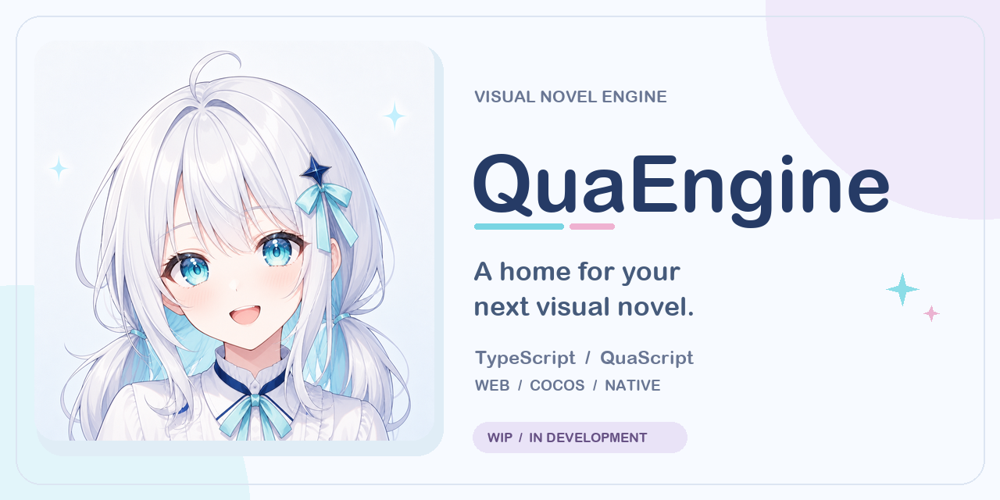
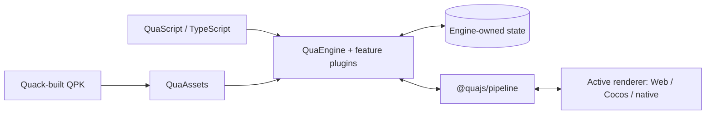

<p align="center">
  
</p>

<h1 align="center">QuaEngine</h1>

<p align="center">
  <strong>A home for your next visual novel.</strong><br />
  TypeScript · QuaScript · Web, Cocos &amp; native renderers
</p>

<p align="center">
  <a href="#current-progress"></a>
  <a href="https://github.com/QuaDevTeam/QuaEngine/actions/workflows/ci.yml"></a>
  <a href="LICENSE"></a>
</p>

<p align="center">
  <a href="#try-the-demo">Demo</a> ·
  <a href="#current-progress">Progress</a> ·
  <a href="#architecture">Architecture</a> ·
  <a href="#documentation">Documentation</a> ·
  <a href="#development">Contributing</a>
</p>

> [!IMPORTANT]
> **WIP — actively being built.** QuaEngine has working runtime, rendering, and authoring foundations, but has not reached a stable release. APIs, schemas, and package boundaries may change. Native parity, creator tooling, and demo production are still in progress.

QuaEngine is a TypeScript visual novel engine for Galgame-style projects. Write dialogue and branches in QuaScript, compose game features with plugins, and render the same engine-owned story state through different platforms. Quack packages assets and incremental content into QPK bundles.

## Current progress

Repository snapshot: **September 2026**. “Implemented” describes available code; it does not imply a stable API or complete platform parity.

| Area                 | Available today                                                                                                                                      | Status                                                                           |
| -------------------- | ---------------------------------------------------------------------------------------------------------------------------------------------------- | -------------------------------------------------------------------------------- |
| Narrative runtime    | Scenes, dialogue, choices, characters, checkpoints, save/load, story graphs, chapter selection, and engine-owned projections                         | Implemented                                                                      |
| Web renderers        | Shared DOM/WebAudio runtime, logical stage scaling, Vue reference adapter, and thin React/Svelte adapters                                            | Implemented                                                                      |
| Cocos                | Renderer plugins, Creator host bridge, and Cocos asset/store/security adapters; optional host capabilities use best-effort fallbacks                 | Implemented; parity ongoing                                                      |
| Native               | Rust + QuickJS + wgpu, QUI/TSX and QSS authoring, QPK sprite manifests, atlas layers, nine-slice borders, rich-text work, and sprite-layer animation | WIP; see [coverage and gaps](docs/reviews/native-sprite-animation-2026-09-07.md) |
| Feature plugins      | Backgrounds, audio, animation, sprites/UI skins, fonts, backlog, gallery, achievements, inventory, and settings                                      | Implemented                                                                      |
| Runtime QPKs         | Side-by-side loading, trust policies, scripts/plugins, story graph deltas, idempotent migrations, package-aware save/load, and guarded unload        | Implemented                                                                      |
| Authoring and builds | QuaScript compiler, HMR, Quack bundler, Vite integration, project manifests/inspection, language servers, VS Code extensions, and a Vue starter      | Implemented; expanding                                                           |
| Creator experience   | Visual editor, fuller tutorials, additional starters, and third-party plugin ecosystem                                                               | Planned                                                                          |

Recent native work connects sprite/atlas resources and layer timelines to GPU drawing, adds nine-slice border rendering, and reduces QuickJS bridge overhead. The [sprite/animation report](docs/reviews/native-sprite-animation-2026-09-07.md) and [QuickJS measurements](docs/reviews/native-quickjs-performance-2026-09-07.md) record the tested fixtures and limits. Full video decoding, broader typography/CSS parity, automatic UI-skin binding, and visible-window validation remain open; GPU readback results alone do not establish complete native parity.

## Try the demo

[**明天，请再一次呼唤我 — Call Me Again Tomorrow**](demo/README.md) is the in-development demo: a near-future coastal mystery about a sound archive, a radio station, and a broadcast arriving before it has been recorded.

The current rewrite includes a playable QuaScript story with multiple endings, Web/Vue and native entry points, a paper-and-sea-green UI, chapter navigation, save/load, reading settings, and backlog. Artwork and full audiovisual staging are still being produced; the gallery is not yet open in the current demo.

```bash
pnpm install
pnpm --filter demo dev
```

For the native development window, use `pnpm dev:native` after setting up the Rust/native prerequisites. See the [demo development guide](demo/README.md#开发) for build and validation commands.

The demo's story, characters, artwork, and other creative content are proprietary evaluation material; see [demo/LICENSE](demo/LICENSE).

## Write with QuaScript

QuaScript combines dialogue, choices, story metadata, and package-local decorators. For example, with the background and audio plugins enabled:

```qs
@SetBackground('images/bg/station-night.png', { transition: { type: 'fade', duration: 400 } })
@PlayBGM('audio/bgm/night-grid.ogg', { loop: true, fadeInMs: 600 })
Narrator: The station lights come back one row at a time.
```

Asset paths above are illustrative. Feature packages publish decorators through their own `./script-compiler` entries; the compiler handles import wiring and async narrative steps. See the [compiler guide](packages/build/script-compiler/README.md) and [Vue starter](packages/build/create-qua-game/README.md).

## Architecture



- **Logic owns state.** Scenes, progress, choices, audio intent, and feature projections belong to the engine/store. Renderers draw those projections and return user intents through `@quajs/pipeline`.
- **Web behavior is shared.** DOM projection, object URLs, WebAudio, stage math, and Web plugin factories live in `@quajs/renderer-web`; Vue, React, and Svelte adapt that runtime. Visual styles are explicitly imported.
- **Packages extend the story.** Dynamic and AI-generated content travels through QPK Runtime Packages. Production executable content requires verification; activation, migrations, save dependencies, and unload are engine-owned.
- **Each build selects one target.** Web, Cocos, and native have isolated bootstrap families. A target's bundle manifest drives its generated project and startup shell.

See the [Runtime QPK design](docs/design/dynamic-runtime-qpk.md) and [stage layout contract](docs/design/mobile-rendering-adaptation.md).

## Workspace map

| Directory                               | Responsibility                                                                           |
| --------------------------------------- | ---------------------------------------------------------------------------------------- |
| [packages/core](packages/core/)         | Engine, store, pipeline, platform-neutral assets, and plugin discovery                   |
| [packages/game](packages/game/)         | Character APIs and story graph                                                           |
| [packages/plugins](packages/plugins/)   | Independent game feature plugins                                                         |
| [packages/render](packages/render/)     | Universal render contracts; Web, Vue, React, Svelte, and Cocos renderers                 |
| [packages/platform](packages/platform/) | Web, Node, memory, and Cocos adapters and host integration                               |
| [packages/native](packages/native/)     | Native contracts/adapters, QuickJS runtime, wgpu renderer, UI compiler, and tooling      |
| [packages/build](packages/build/)       | Quack, QuaScript compiler, Vite plugin, project inspector, starter, and language tooling |
| [demo](demo/)                           | Shared Web/native visual novel demo                                                      |
| [ai/novel-writer](ai/novel-writer/)     | Independent SvelteKit writing workspace; separate from the engine runtime                |

## Development

Use **pnpm `12.3.4`**. Package manifests require Node.js `>=20`; **Node.js 22.6+** is needed for repository commands that use `--experimental-strip-types`. Native work also requires Rust and the relevant platform build tools.

```bash
pnpm install
pnpm run build
pnpm run test
pnpm run lint
pnpm run typecheck
```

For focused work:

```bash
pnpm --filter demo build
pnpm --filter create-qua-game test -- --run
pnpm --filter @quajs/renderer-vue test -- --run
pnpm native:verify
```

Contributions to runtime behavior, platform parity, plugins, examples, and documentation are welcome. Read [AGENTS.md](AGENTS.md) for architecture and validation rules. Feature changes should keep the matching package documentation and project skill current.

## Documentation

| Topic                        | Start here                                                                                                                                                                                                               |
| ---------------------------- | ------------------------------------------------------------------------------------------------------------------------------------------------------------------------------------------------------------------------ |
| Narrative APIs and plugins   | [Engine API](packages/core/engine/docs/global-api.md) · [Plugin system](packages/core/engine/docs/plugin-system.md) · [Story graph](packages/game/story-graph/README.md)                                                 |
| Rendering                    | [Web](packages/render/web/README.md) · [Vue](packages/render/vue/README.md) · [React](packages/render/react/README.md) · [Svelte](packages/render/svelte/README.md)                                                      |
| Assets and authoring         | [Quack](packages/build/quack/README.md) · [QuaScript](packages/build/script-compiler/README.md) · [PSD sprites and UI skins](docs/guides/psd-sprite-ui-skin.md)                                                          |
| Runtime content and security | [Dynamic QPKs](docs/design/dynamic-runtime-qpk.md) · [Web security](docs/security/web-security.md)                                                                                                                       |
| Native progress              | [Sprite and animation coverage](docs/reviews/native-sprite-animation-2026-09-07.md) · [UI authoring](docs/reviews/native-ui-authoring.md) · [QuickJS performance](docs/reviews/native-quickjs-performance-2026-09-07.md) |

## Brand and license

QuaEngine and QuaDevTeam share an original anime heroine identity. The [brand kit](assets/brand/README.md) includes the portrait, upload-ready avatars, project banner, and generation details.

Source packages use **Apache-2.0** unless stated otherwise. Names and brand artwork are reserved; the software license does not grant rights to reuse the mascot or logos. Demo creative content has its own proprietary terms. See [LICENSE](LICENSE), [NOTICE](NOTICE), [TRADEMARKS.md](TRADEMARKS.md), and [LEGAL.md](LEGAL.md).

<p align="center"><a href="https://github.com/QuaDevTeam">Made by QuaDevTeam</a></p>
