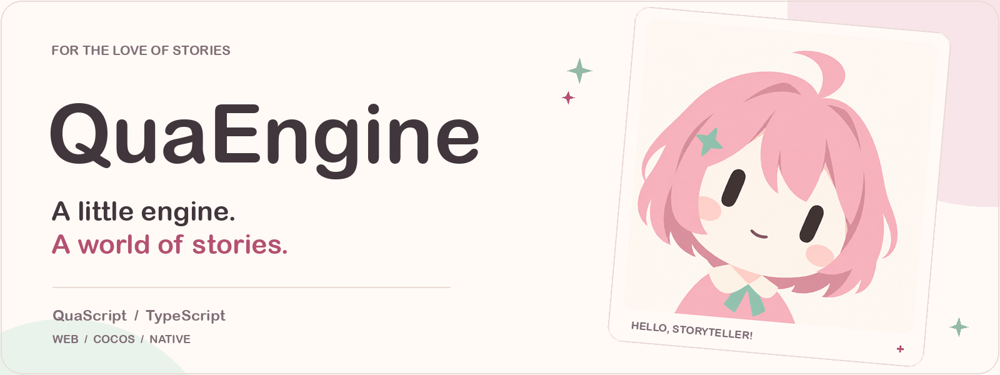
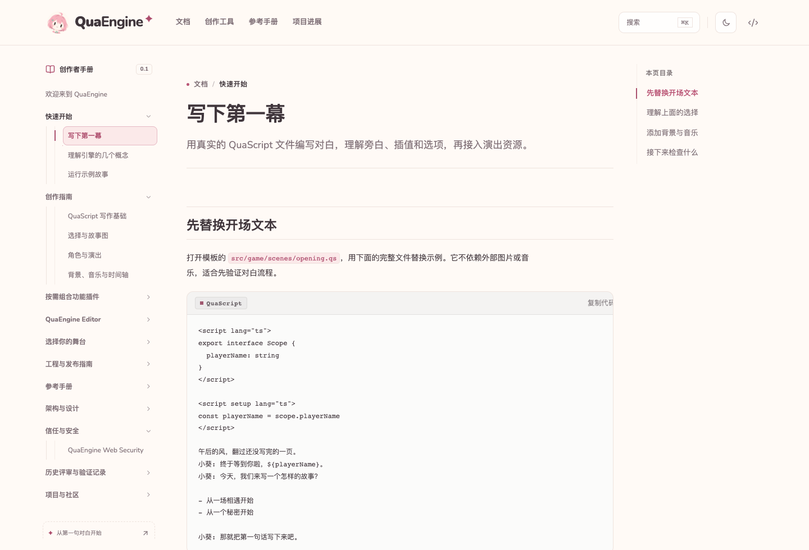
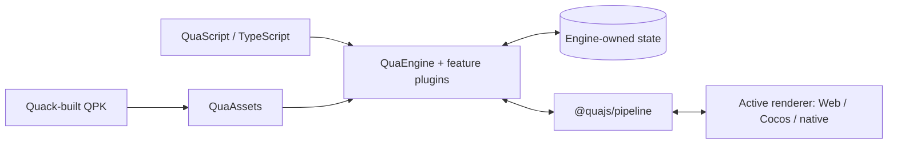

<h1 align="center">
  <picture>
    <source media="(prefers-color-scheme: dark)" srcset="assets/brand/quaengine-readme-dark.png" />
    
  </picture>
</h1>

<p align="center">
  <strong>Write the story. Set the scene. Make it yours.</strong><br />
  An open-source visual novel engine and creative workspace, built with TypeScript.
</p>

<p align="center">
  <a href="#current-progress"></a>
  <a href="https://github.com/QuaDevTeam/QuaEngine/actions/workflows/ci.yml"></a>
  <a href="LICENSE"></a>
  <a href="packages/editor/LICENSE"></a>
</p>

<p align="center">
  <a href="#start-creating">Quick start</a> &nbsp;·&nbsp;
  <a href="https://quaengine.com/docs/">Documentation</a> &nbsp;·&nbsp;
  <a href="#your-creative-workspace">Editor</a> &nbsp;·&nbsp;
  <a href="#try-the-demo">Demo</a> &nbsp;·&nbsp;
  <a href="#current-progress">Progress</a>
</p>

QuaEngine brings dialogue, branching stories, characters, and audiovisual staging into one project. Write in **QuaScript**, add behavior in **TypeScript**, and choose a **Web, Cocos, or native** renderer. The engine owns the story; plugins and renderers bring it to life.

<table>
  <tr>
    <td width="33%" valign="top">
      <h3>Write</h3>
      <p>Dialogue and choices. Powered by TypeScript.</p>
      <a href="docs/content/docs/authoring/quascript.md">QuaScript →</a>
    </td>
    <td width="33%" valign="top">
      <h3>Stage</h3>
      <p>Art, music, and motion. One logical stage.</p>
      <a href="docs/content/docs/authoring/staging.md">Scenes →</a>
    </td>
    <td width="33%" valign="top">
      <h3>Extend</h3>
      <p>Plugins and QPK. Room for new chapters.</p>
      <a href="docs/content/docs/guides/runtime-packages.md">Packages →</a>
    </td>
  </tr>
</table>

## Start creating

Create a Vue + QuaScript project:

```bash
pnpm create qua-game my-story
cd my-story
pnpm install
pnpm dev
```

Follow the [quick start](docs/content/docs/getting-started/index.md), then [write your first scene](docs/content/docs/getting-started/first-story.md). The starter includes the engine, renderer, script compiler, asset loading, and project configuration.

## Write with QuaScript

QuaScript combines dialogue, choices, story metadata, and package-local decorators. For example, with the background and audio plugins enabled:

```qs
@SetBackground('images/bg/station-night.png', { transition: { type: 'fade', duration: 400 } })
@PlayBGM('audio/bgm/night-grid.ogg', { loop: true, fadeInMs: 600 })
The station lights come back one row at a time.
```

Asset paths above are illustrative. Feature packages publish decorators through their own `./script-compiler` entries; the compiler handles import wiring and async narrative steps. See the [compiler guide](packages/build/script-compiler/README.md) and [Vue starter](packages/build/create-qua-game/README.md).

## Your creative workspace

The standalone **QuaEngine Editor** brings project files, authoring tools, and previews together:

- **Write and navigate:** Monaco language tools and visual QuaScript editing.
- **Arrange the scene:** character profiles, sprite resources, and animation timelines.
- **Preview and inspect:** embedded Web/Native previews, story navigation, and storage inspection.
- **Develop the idea:** built-in Novel Writer with project context and reviewed script drafts.

```bash
# From a checkout, after installing workspace dependencies:
pnpm dev:editor
```

[Editor setup and capabilities](packages/editor/README.md) · [Character editor](packages/editor/character/README.md) · [Animation editor](packages/editor/animation/README.md)

The plugin marketplace connects to the Cloudflare Workers + D1 registry at `registry.quaengine.com`. It includes npm ownership verification, automatic system / optional Jev review, scheduled sync, and editor publication. See the [publisher guide](services/plugin-registry/README.md) and [editor plugin contracts](docs/design/editor-plugins.md).

## Documentation

A creator handbook with a custom sakura-and-cream theme: tutorials, searchable package references, architecture guides, and machine-readable pages, built with **svedocs 0.2.1**.

**[Visit quaengine.com](https://quaengine.com)** · **[Read the handbook](https://quaengine.com/docs/)**

<a href="https://quaengine.com/docs/getting-started/first-story/">
  <picture>
    <source media="(prefers-color-scheme: dark)" srcset="assets/brand/quaengine-docs-dark.png" />
    
  </picture>
</a>

<p align="center"><sub>The real documentation UI, in your preferred light or dark theme.</sub></p>

[Quick start](docs/content/docs/getting-started/index.md) · [Authoring](docs/content/docs/authoring/index.md) · [Editor](docs/content/docs/editor/index.md) · [Platforms](docs/content/docs/platforms/index.md) · [Reference](docs/content/docs/reference/index.md)

```bash
pnpm --dir docs install --frozen-lockfile
pnpm docs:dev
# Check and produce the static site:
pnpm docs:check
pnpm docs:build
```

The site has its own pnpm workspace and builds without Rust or Electron. It supports local search, code copying, responsive layouts, dark mode, Markdown twins, and `llms.txt`. Tutorials live in `docs/content`; package references are generated from their original sources.

Static output is written to `docs/build/` and published to `quaengine.com` with Wrangler. See [site maintenance and deployment](docs/README.md) for local preview, production deployment, and live verification commands.

<details>
<summary><strong>Looking for a specific API or design document?</strong></summary>

| Topic | Start here |
| --- | --- |
| Narrative and plugins | [Engine API](packages/core/engine/docs/global-api.md) · [Plugin system](packages/core/engine/docs/plugin-system.md) · [Story graph](packages/game/story-graph/README.md) |
| Rendering | [Web](packages/render/web/README.md) · [Vue](packages/render/vue/README.md) · [React](packages/render/react/README.md) · [Svelte](packages/render/svelte/README.md) |
| Assets and authoring | [Quack](packages/build/quack/README.md) · [QuaScript](packages/build/script-compiler/README.md) · [PSD workflow](docs/guides/psd-sprite-ui-skin.md) |
| Dynamic content | [Runtime QPKs](docs/design/dynamic-runtime-qpk.md) · [Web security](docs/security/web-security.md) |
| Native | [JavaScriptCore runtime](docs/design/native-jsc-runtime.md) · [UI authoring](docs/reviews/native-ui-authoring.md) · [Migration verification](docs/reviews/native-jsc-migration-2026-09-21.md) |

</details>

## Try the demo

[**明天，请再一次呼唤我 — Call Me Again Tomorrow**](demo/README.md) is the in-development demo: a near-future coastal mystery about a sound archive, a radio station, and a broadcast arriving before it has been recorded.

The current rewrite includes a playable QuaScript story with multiple endings, Web/Vue and native entry points, a paper-and-sea-green UI, chapter navigation, save/load, reading settings, and backlog. Artwork and full audiovisual staging are still being produced; the gallery is not yet open in the current demo.

```bash
pnpm install
pnpm --filter demo dev
```

For the native development window, use `pnpm dev:native` after setting up the Rust/native prerequisites. See the [demo development guide](demo/README.md#开发) for build and validation commands.

The demo's story, characters, artwork, and other creative content are proprietary evaluation material; see [demo/LICENSE](demo/LICENSE).

## Current progress

**September 21, 2026 · Version 0.1.0.** These capabilities are implemented in the repository. APIs and package boundaries may still change; validate your game's target platforms before release.

| Area | Available today |
| --- | --- |
| Story runtime | Scenes, dialogue, choices, characters, checkpoints, save/load, story graphs, and chapter selection |
| Web | Shared DOM/WebAudio runtime, logical stage scaling, Vue reference adapter, and thin React/Svelte adapters |
| Cocos | Renderer plugins, Creator host bridge, and asset/store/security adapters; platform parity is ongoing |
| Native | Rust + JavaScriptCore + wgpu, QUI/TSX and QSS, sprite/atlas rendering, nine-slice borders, rich text, and layer animation |
| Feature plugins | Backgrounds, audio, animation, sprite/UI skins, fonts, backlog, gallery, achievements, inventory, settings, and asset loading |
| Runtime QPKs | Side-by-side packages, trust verification, dynamic scripts/plugins, graph deltas, migrations, and save dependencies |
| Creator tools | Electron editor, character/animation panels, visual script editing, previews, marketplace, and Novel Writer |
| Build and docs | QuaScript compiler, HMR, Quack, Vite, project inspection, language tools, Vue starter, and searchable svedocs handbook |

Native uses **JavaScriptCore** for both the resident engine and dynamic QPK modules; old QuickJS paths have been removed. The [migration report](docs/reviews/native-jsc-migration-2026-09-21.md) records macOS runtime/product checks and Windows cross-target checks. It distinguishes those results from Windows linking/JIT, Linux execution, visible-window acceptance, and Web/native visual parity. GPU readback alone does not prove complete parity.

[Current capability overview](docs/content/docs/project/status.md) · [Platform support](docs/content/docs/platforms/index.md)

## Architecture



- **Logic owns state.** Scenes, progress, choices, audio intent, and feature projections belong to the engine/store. Renderers draw those projections and return user intents through `@quajs/pipeline`.
- **Web behavior is shared.** DOM projection, object URLs, WebAudio, stage math, and Web plugin factories live in `@quajs/renderer-web`; Vue, React, and Svelte adapt that runtime. Visual styles are explicitly imported.
- **Packages extend the story.** Dynamic and AI-generated content travels through QPK Runtime Packages. Production executable content requires verification; activation, migrations, save dependencies, and unload are engine-owned.
- **Each build selects one target.** Web, Cocos, and native have isolated bootstrap families. A target's bundle manifest drives its generated project and startup shell.

See the [Runtime QPK design](docs/design/dynamic-runtime-qpk.md) and [stage layout contract](docs/design/mobile-rendering-adaptation.md).

## Development

Use **pnpm `12.3.4`**. Package manifests require Node.js `>=20`; **Node.js 22.12+** is recommended for both the repository’s type-stripping commands and the documentation site’s Vite 8 build. Native work also requires Rust and the relevant platform build tools.

```bash
pnpm install
pnpm run build
pnpm run test
pnpm run lint
pnpm run typecheck
```

For focused work:

```bash
pnpm --filter demo build
pnpm --filter create-qua-game test -- --run
pnpm --filter @quajs/renderer-vue test -- --run
pnpm native:verify
```

Contributions to runtime behavior, platform parity, plugins, examples, and documentation are welcome. Read [AGENTS.md](AGENTS.md) for architecture and validation rules. Feature changes should keep the matching package documentation and project skill current.

<details>
<summary><strong>Workspace map</strong></summary>

| Directory                               | Responsibility                                                                           |
| --------------------------------------- | ---------------------------------------------------------------------------------------- |
| [packages/core](packages/core/)         | Engine, store, pipeline, platform-neutral assets, and plugin discovery                   |
| [packages/game](packages/game/)         | Character APIs and story graph                                                           |
| [packages/plugins](packages/plugins/)   | Independent game feature plugins                                                         |
| [packages/render](packages/render/)     | Universal render contracts; Web, Vue, React, Svelte, and Cocos renderers                 |
| [packages/platform](packages/platform/) | Web, Node, memory, and Cocos adapters and host integration                               |
| [packages/native](packages/native/)     | Native contracts/adapters, JavaScriptCore runtime, wgpu renderer, UI compiler, and tooling      |
| [packages/build](packages/build/)       | Quack, QuaScript compiler, Vite plugin, project inspector, starter, and language tooling |
| [docs](docs/) | svedocs site, tutorials, generated package references, and theme |
| [demo](demo/)                           | Shared Web/native visual novel demo                                                      |
| [packages/editor/novel-writer](packages/editor/novel-writer/)     | Built-in AI writing plugin with project context and guarded QuaScript editing                |

</details>

## Brand and license

QuaEngine and QuaDevTeam share an original pink-haired chibi identity. The [brand kit](assets/brand/README.md) includes the portrait, upload-ready avatars, project and organization wordmarks, social previews, and reproducible generation details.

The standalone IDE's first-party source under `packages/editor/`, including its built-in Character Editor and Novel Writer, uses **[MPL-2.0](packages/editor/LICENSE)**. Other source packages use **Apache-2.0** unless stated otherwise. These are directory-specific licenses, not a choice of either license for IDE code.

We welcome [community contributions to the IDE](packages/editor/CONTRIBUTING.md). MPL permits commercial use and forks, while requiring distributed covered files and their modifications to remain available in source form under MPL. Contributing changes upstream is encouraged, not a license requirement. See the [IDE licensing guide](packages/editor/README.md#开源许可与社区共建) for scope and distribution obligations.

Names and brand artwork are reserved; the software licenses do not grant rights to reuse the mascot or logos. Demo creative content has its own proprietary terms. See [LICENSE](LICENSE), [NOTICE](NOTICE), [TRADEMARKS.md](TRADEMARKS.md), and [LEGAL.md](LEGAL.md).

<hr />

<p align="center">
  <br />
  <strong>A home for your next visual novel.</strong><br />
  <a href="https://github.com/QuaDevTeam">Made with care by QuaDevTeam</a>
</p>
